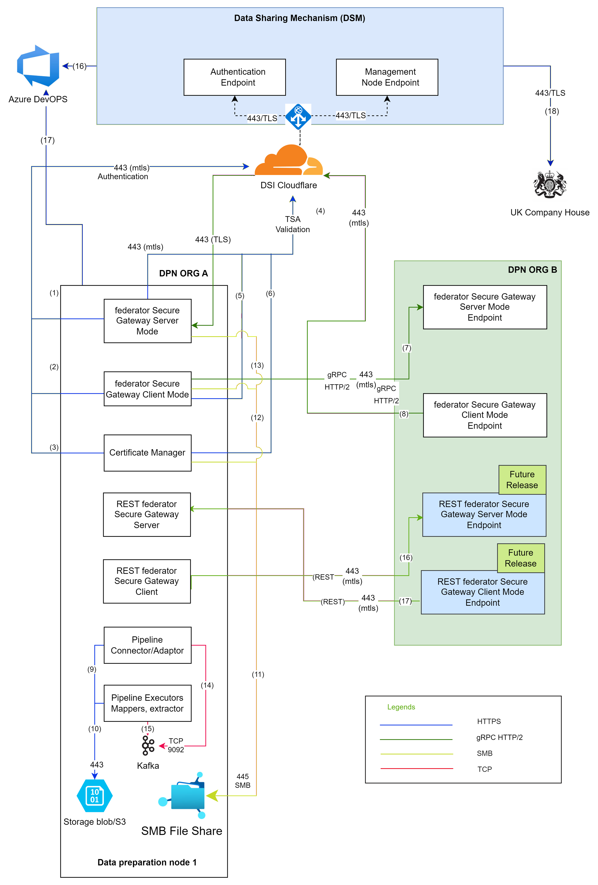

# DPN Deployment Configuration Guide

---

## Table of Contents

- [Overview](#overview)
  - [Continuous Integration (CI)](#continuous-integration-ci)
  - [Continuous Deployment (CD)](#continuous-deployment-cd)
- [Global and Generic Configuration](#global-and-generic-configuration)
  - [Step1: DSI DSM Endpoint Configuration](#step1-dsi-dsm-endpoint-configuration)
  - [Step2: Azure DevOps Configuration](#step2-azure-devops-configuration)
    - [Step2.1: Node Pool Set Up](#step21-node-pool-set-up)
    - [Step2.2: Azure Environment Configuration](#step22-azure-environment-configuration)
    - [Step2.3: AKS Namespace Configuration](#step23-aks-namespace-configuration)
  - [Step3: Secrets Configuration](#step3-secrets-configuration)
  - [Step4: Certificate Configuration](#step4-certificate-configuration)
  - [Step5: Network and Ports Configuration](#step5-network-and-ports-configuration)
- [Review Notes](#review-notes)

---

## Overview

Data Preparation Node (DPN) consists of the following components in the DSI package:


- **DPN Security Service**
  - Vault Service — Certificate regeneration for DSM communication and storage.
  - Digital Certificate Manager — Manages recycling of certificates at a predefined interval from the DSI Management Node.
  - Shared File Service — SMB-based shared file storage between the Federator Certificate Manager and Federator Gateway for storing certificate P12 files.
  - DPN File Scan Service - Cloud native file scan service for files arriving on Federator Gateway using Defender for Cloud Storage
- **DPN Data Pipelines** — Responsible for producing and consuming data products of an organisation.
- **DPN Data Store Service**
  - Storage — Contains storage accounts or S3 buckets to store files produced by DPN data pipelines, certificate P12 files, and Redis caching data.
  - Streaming Service — DPN uses Kafka as a streaming service for managing events and topics during data transmission.
- **DPN Federator Gateway** — Responsible for DSM and DPN authentication, and data transfer between DPN nodes.

DPN components on Azure are deployed using **Azure DevOps (ADO) pipelines**, as defined in the DPN repositories provided by DSI. These pipelines are organised into two stages:

- **Continuous Integration (CI)**
- **Continuous Deployment (CD)**

The CI pipeline builds the application artefacts, while the CD pipeline deploys them to the target infrastructure.

This document describes the configuration parameters required for deploying **DPN nodes on Azure Kubernetes Service (AKS)**. These parameters must be configured before running the deployment pipelines.

The configuration covers the following areas:

- DSI DSM endpoint configuration
- Azure DevOps configuration
- Secret configuration
- Helm chart configuration
- Network and ports configuration

---

### Continuous Integration (CI)

The **Continuous Integration (CI)** pipeline is optional. Participants can either use it to build container components from the provided DPN source code, or replace it entirely by obtaining pre-built DPN containers directly from the DSI-provided **GitHub Container Registry (GHCR)**.

The **Continuous Integration (CI)** pipeline performs the following activities:

1. Build the application source code.
2. Produce container image artefacts.
3. Tag the generated container images.
4. Push the images to a container registry.

The DSI Azure reference implementation uses **Azure Container Registry (ACR)** for storing container images in Azure, due to its seamless integration with Azure services and built-in security capabilities.

Organisations may use alternative container registries if permitted by their internal network and security policies. 

---

### Continuous Deployment (CD)

The **Continuous Deployment (CD)** pipeline deploys the container images to the **Azure Kubernetes Service (AKS)** cluster using Helm.

During deployment, the pipeline performs the following steps:

1. Authenticate with Azure using the configured service connection.
2. Retrieve credentials for the target AKS cluster.
3. Validate Helm charts using `helm lint`.
4. Perform a Helm **dry-run** validation.
5. Deploy the DPN platform using Helm.
6. Verify deployment status using Kubernetes rollout checks.

---
## Global and Generic Configuration

### Step1: DSI DSM Endpoint Configuration

DSI provides predefined endpoints to support the following environments:

- Development
- Integration Testing
- Pre-Production

These endpoints are publicly accessible to simplify integration and testing. Organisations must configure their pipelines to use the **appropriate endpoint for the corresponding deployment environment** as provided by DSI.

| Environment | Component | URL |
|-------------|-----------|-----|
| Pre Production-Dev (pdev) | Authentication | https://auth-mtls.dsm01.dsipreprod1.neso.energy |
| Pre Production-Dev (pdev)| Management Node | https://management.dsm01.dsipreprod1.neso.energy |
| Pre Production-Dev (pdev)| DSI DPN Producer | https://producer.dpn01.dsipreprod1.neso.energy |
| Pre Production-Test (ptest)| Authentication | https://auth-mtls.dsm01.dsipreprod2.neso.energy |
| Pre Production-Test (ptest)| Management Node | https://management.dsm01.dsipreprod2.neso.energy |
| Pre Production-Test (ptest)| DSI DPN Producer | https://producer.dpn01.dsipreprod2.neso.energy |
| Pre-Production-Uat (puat)| Authentication | https://auth-mtls.dsm01.dsipreprod3.neso.energy |
| Pre-Production-Uat (puat)| Management Node | https://management.dsm01.dsipreprod3.neso.energy |
| Pre-Production-Uat (puat)| DSI DPN Producer | https://producer.dpn01.dsipreprod3.neso.energy |

---

### Step2: Azure DevOps Configuration

The provided pipelines require the following configuration to perform **CI and CD operations**.

#### Step2.1: Node Pool Set Up

The provided pipelines are configured with the default Microsoft-hosted agent pool `ubuntu-latest` for pipeline execution.

However, DSI **recommends using a dedicated self-hosted agent pool**, which provides better control over:

- Security
- Network access
- Deployment environment management

Refer to the official Microsoft documentation for Linux node pool agent setup:
https://learn.microsoft.com/en-us/azure/devops/pipelines/agents/linux-agent

If a self-hosted agent pool is configured, update the pipeline definition as follows.

##### Existing Configuration

```yaml
pool:
  vmImage: 'ubuntu-latest'
```

##### Updated Configuration

```yaml
pool:
  name: '[agent-pool-name]'
```

---

#### Step2.2: Azure Environment Configuration

Each CD pipeline reads its Azure targeting from an environment-specific JSON config file under the repository's Azure Pipelines folder. **Update this file with your environment's values before running any pipeline.**

The config file naming differs slightly per repository:

- **Vault and Certificate Manager** (`dpn-federator-certificate-manager`): `config/<env>.json`
- **Federator Gateway** (`dpn-federator-gateway`): `config/<env>-<cluster>.json` (one per DPN cluster)

```text
Root-Repository/
└── .pipelines/
    └── azure-pipelines/
        └── config/
            └── <env>.json
```

| Key | Description | Example (placeholder) |
|-----|-------------|-----------------------|
| ENV_NAME | Deployment environment abbreviation | `<env>` |
| AZURE_SUBSCRIPTION_ID | Subscription ID where the infrastructure is deployed | `<subscription-id>` |
| RESOURCE_GROUP | Resource group containing the AKS cluster | `rg-<env>-uks-dpn-01` |
| AKS_CLUSTER | Name of the AKS cluster | `aks-<env>-uks-dpn-01` |
| NAMESPACE | Kubernetes namespace for the deployment | `ns-dpn-01` |
| KEY_VAULT_NAME | Azure Key Vault for secrets and certificates | `kv-dpn-<env>-<region>-<seq>` |
| BASE_REGISTRY | Base container registry URL | `<image-registry-url>` |
| CONTAINER_REGISTRY / CONTAINER_REGISTRY_URL | Registry name / URL | `<image-registry-url>`|

> **Note:** The **service connection**, **environment**, and (Federator Gateway only) **DPN cluster** are supplied as pipeline **runtime parameters** when you trigger a run — they are **not** keys in the JSON file. The Helm **values file** is derived from those parameters: `values-<env>.yaml` (Vault / Certificate Manager) or `values-<env>-<cluster>.yaml` (Federator Gateway).

---

#### Step2.3: AKS Namespace Configuration

Create the following Kubernetes namespaces in AKS. This setup needs to be done manually and one time in the Kubernetes cluster:

- ns-dpn-01
- ns-dpn-health-01

```bash
kubectl create namespace <NAMESPACE>    # e.g. ns-dpn-01
```

---

### Step3: Secrets Configuration

Sensitive credentials must **not be stored in source code repositories**. They must be stored securely in one of the following vaults:

- **HashiCorp Vault** — provided with the DSI DPN package
- **Azure Key Vault** — cloud-specific option for organisations using Azure

Organisations **must change the default values of secrets** — i.e. sample values such as `changeit`, `admin-password`, `admin-admin`, etc.

Organisations should rotate secrets at defined frequencies.
The secrets are described in the individual component sections of this document that follow.

---

### Step4: Certificate Configuration

During the organisation's onboarding process, an initial certificate package containing the certificate and CA chain files is provided during the bootstrap process from the DSM User Interface. Organisations must securely store these certificates in the vault service. The following certificate artefacts are included in the DPN package:

- The **P12/PFX certificate** issued by the DSI DSM Certificate Authority (keystore)
- The **DSI certificate chain pem file** (truststore)

Refer to the [DPN Federator Certificate Manager](03-configure-dpn-certificate-manager.md) section for detailed instructions on certificate lifecycle management.

The same certificate files are used across all DPN components that require integration with the Data Sharing Mechanism (DSM), specifically the Federator Gateway and Certificate Lifecycle Manager.

---

### Step5: Network and Ports Configuration

This section describes DPN connectivity requirements for ports and protocols, including agent pool requirements for building DPN code.



The following firewall rules must be applied by the organisation before installing DPN:

| Source IP Address | Source VNET | Source Subnet | Destination IP / Zone / URL | Destination VNET | Destination Subnet | Protocol | Port(s) | Traffic Flow |
|-------------------|-------------|---------------|-----------------------------|------------------|--------------------|----------|---------|--------------|
| Node pool agent VM IP | Node Pool VM VNET | Node Pool VM subnet | `packages.confluent.io/*` | N/A | N/A | TLS | 443 | Outbound |
| Node pool agent VM IP | Node Pool VM VNET | Node Pool VM subnet | `registry-1.docker.io/*`<br>`auth.docker.io/*`<br>`production.cloudflare.docker.com`<br>`index.docker.io/*` | N/A | N/A | TLS | 443 | Outbound |
| DPN Kubernetes subnet IP range | DPN Kubernetes VNET | DPN Kubernetes subnet | `auth-mtls.dsm01.dsi(xxx).neso.energy` | N/A | N/A | TLS | 443 | Outbound |
| DPN Kubernetes subnet IP range | DPN Kubernetes VNET | DPN Kubernetes subnet | `management.dsm01.dsi(xxx).neso.energy` | N/A | N/A | TLS | 443 | Outbound |
| DPN Kubernetes subnet IP range | DPN Kubernetes VNET | DPN Kubernetes subnet | Organisation-specific URL for DPN-to-DPN data sharing | N/A | N/A | TLS | 443 | Bi-directional |

> **Note:** The organisation-specific URL in the final row defines the target organisation with which data sharing will occur. These firewall rules must be opened from both organisations' network perspectives. The `dsi(xxx)` notation refers to the `pdev`, `ptest` and `puat` environments.

> **Note:** DPN uses HTTP/2 traffic over gRPC on port **443**. HTTP/2 traffic requires TCP passthrough to a Layer 4 load balancer; Layer 7 load balancing may not be supported for this traffic for most of the layer 7 load balancers

---

## Review Notes

| Review Date | Last Reviewed By | Status | Version |
|-------------|-----------------|--------|---------|
| 31-July-2026 | DSI Assurance | Final | V1.0.0 |
