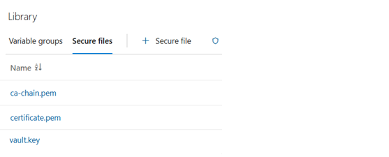

# DPN Vault Service Configuration

This section describes how to configure **DPN HashiCorp Vault service**. HashiCorp Vault is the secret store used by DPN Certificate Manager to hold Intermediate CA, CA chain, key pair, certificate, and keystore/truststore passwords. These secrets are used to build the certificate P12 files for mutual TLS (mTLS).

DSI provides an **automated method** (Azure DevOps pipelines) that generates the required CSR, certificate, and key material and configures Vault end to end. This is the preferred approach for organisations using ADO. A **manual fallback** is also provided for organisations that cannot run the automated pipelines due to certain limitations.

> **Single environment:** These instructions target **one environment** (referred to throughout as `<env>`). This `<env>` value should be substituted with a reference environment name used for deployment (e.g. `preprod` or `prod`) in the following files present in this location: 

 - config file `config/<env>.json` 
 - values file `values-<env>.yaml`)
 
 It is not advised to create multiple environment files.

---

## Table of Contents

- [Overview](#overview)
- [Automated Vault Configuration](#automated-vault-configuration)
  - [Step 1: Prerequisites (before Vault can be deployed)](#step-1-prerequisites-before-vault-can-be-deployed)
  - [Step 2: Reference Configuration Data (populate before deployment)](#step-2-reference-configuration-data-populate-before-deployment)
    - [Step 2a. Environment config JSON — `config/<env>.json`](#step-2a-environment-config-json--configenvjson)
    - [Step 2b. Vault Helm values — `charts/vault-https/values-<env>.yaml`](#step-2b-vault-helm-values--chartsvault-httpsvalues-envyaml)
  - [Step 3: Deployment Configuration](#step-3-deployment-configuration)
    - [Step 3A: Configure Bootstrap Vault TLS (`vault-tls-bootstrap-cd`)](#step-3a-configure-bootstrap-vault-tls-vault-tls-bootstrap-cd)
    - [Step 3B: Configuration to Initialise Vault (`vault-https-cd`)](#step-3b-configuration-to-initialise-vault-vault-https-cd)
    - [Step 3C: Configure Certificate Bundle (`vault-load-bundle-cd`)](#step-3c-configure-certificate-bundle-vault-load-bundle-cd)
- [Manual Vault Configuration (Fallback)](#manual-vault-configuration-fallback)
  - [Step1: Generate the Vault TLS material](#step1-generate-the-vault-tls-material)
  - [Step2: Publish the TLS material](#step2-publish-the-tls-material)
  - [Step3: Deploy Vault and enable KV v2](#step3-deploy-vault-and-enable-kv-v2)
  - [Step4: Load the certificate bundle](#step4-load-the-certificate-bundle)
- [Review Notes](#review-notes)

---

## Overview

HashiCorp Vault stores the cryptographic material the Certificate Manager needs to establish mTLS with the DSI DSM and other DPNs. Certificate Manager reads and writes the following KV v2 paths under the `pki-client` mount:

| Path (`pki-client/node-net/client/…`) | Content | Written by |
|---------------------------------------|---------|------------|
| `keypair` | Client RSA private + public key | Bundle load (Step 3C) |
| `certificate` | DSM-signed client certificate | Bundle load (Step 3C) |
| `ca-chain` | CA chain from DSM | Bundle load (Step 3C) |
| `intermediate-ca` | Intermediate CA certificate | Certificate Manager (renewal) |
| `keystore-password` | Password for the generated `keystore.p12` | Certificate Manager |
| `truststore-password` | Password for the generated `truststore.p12` | Certificate Manager |

Vault serves over **HTTPS (TLS 1.2+)** internally and uses **Azure Key Vault auto-unseal** in the automated approach, so it unseals itself on start-up. In case of manual process the unseal key needs to be created separately. DSI provides the community edition of the Vault container; organisations may substitute an enterprise edition per their licensing strategy.

Two Vault setup methods are available:

- **[Automated Vault Configuration](#automated-vault-configuration)** *(recommended)* — three ADO pipelines generate the TLS material, deploy and initialise Vault, and load the certificate bundle.

- **[Manual Vault Configuration (Fallback)](#manual-vault-configuration-fallback)** — the equivalent steps performed by hand with OpenSSL / `keytool` / `kubectl`.

---

## Automated Vault Configuration

The automated flow uses three pipelines from the `dpn-federator-certificate-manager` repository

| Order | Pipeline | Purpose |
|-------|----------|---------|
| 1 | `vault-tls-bootstrap-cd.yaml` | Generate the Vault server TLS certificate/key + Certificate Manager truststore, and publish them to Key Vault and Kubernetes |
| 2 | `vault-https-cd.yaml` | Deploy Vault via Helm, then initialise it and enable the KV v2 engine |
| 3 | `vault-load-bundle-cd.yaml` | Load the DSM-signed client certificate bundle into Vault |

All three are located in `dpn-federator-certificate-manager` repository

```text
Root-Repository/
└── .pipelines/
    └── azure-pipelines/
        └── cd-pipelines/
            ├── vault-tls-bootstrap-cd.yaml
            ├── vault-https-cd.yaml
            └── vault-load-bundle-cd.yaml
```

---

### Step 1: Prerequisites (before Vault can be deployed)

Ensure the following are in place **before** running any pipeline:

| # | Prerequisite | Notes |
|---|--------------|-------|
| 1 | **AKS cluster** provisioned and reachable | Target cluster for the deployment |
| 2 | **Azure Key Vault** provisioned | Stores the Vault TLS material, the auto-unseal key, and the Vault root token |
| 3 | **Auto-unseal key** `vault-unseal-key` created in the Key Vault | An RSA **key** (not a secret) used by Vault's Azure Key Vault seal to auto-unseal. Create once: `az keyvault key create --vault-name <KEY_VAULT_NAME> --name vault-unseal-key --kty RSA` |
| 4 | **User-assigned managed identity** with access to the Key Vault | Needs *get* on secrets and *wrap/unwrap* on the unseal key. Its client ID is used for both auto-unseal and the CSI driver |
| 5 | **Secrets Store CSI driver** (Azure provider) enabled on AKS | Vault mounts its TLS cert/key from Key Vault via CSI |
| 6 | **ADO service connection** to the subscription, and a **self-hosted agent** with `openssl`, `keytool`, `az`, `kubectl`, `kubelogin`, and `helm` | See [Prerequisites](../01-prerequisites/01-dpn-prerequisites.md) |
| 7 | **Environment config and values files populated** | See [Step 2](#step-2-reference-configuration-data-populate-before-deployment) |
| 8 | **DSM-signed client bundle available** | The client private key, DSM-signed certificate, and CA chain — loaded in [Step 3C](#step-3-deployment-configuration) |

> **Azure DevOps pipeline setup (one-time):** Before running any pipeline, complete [Azure DevOps Configuration](00-common-dpn-configuration.md#step2-azure-devops-configuration). In particular the pipelines **do not create the namespace** — create it first (`kubectl create namespace <NAMESPACE>`), set up the Azure **service connection**, populate `config/<env>.json`, and (for the bundle load) upload the Secure Files.

---

### Step 2: Reference Configuration Data (populate before deployment)

Two files must be populated for each environment. **Use your own values — the examples below are placeholders only.**

#### Step 2a. Environment config JSON — `config/<env>.json`

The pipelines resolve environment settings from this file (see [Azure Environment Configuration](00-common-dpn-configuration.md#step22-azure-environment-configuration)). Vault uses the following keys:

| Key | Description | Example (placeholder) |
|-----|-------------|-----------------------|
| `AZURE_SUBSCRIPTION_ID` | Subscription hosting the infrastructure | `<subscription-id>` |
| `RESOURCE_GROUP` | Resource group containing the AKS cluster | `rg-<env>-uks-dpn-01` |
| `AKS_CLUSTER` | AKS cluster name | `aks-<env>-uks-dpn-01` |
| `NAMESPACE` | Kubernetes namespace | `ns-dpn-01` |
| `KEY_VAULT_NAME` | Azure Key Vault for secrets and certificates | `kv-dpn-<env>-<region>-<seq>` |

#### Step 2b. Vault Helm values — `charts/vault-https/values-<env>.yaml`

Copy `values.yaml` (reference — do not edit directly) to `values-<env>.yaml` and set the values below. DSI proposes only these selective changes; other parameters may be customised if required.

```text
Root-Repository
  └── charts
        └── vault-https
              ├── values.yaml        <- Reference file; do not edit directly
              └── values-<env>.yaml  <- Your environment overrides
```

| Parameter | Purpose | Example (placeholder) |
|-----------|---------|-----------------------|
| `image.repository` | Complete URL of the Vault image | `<DSI public image repository>/hashicorp/vault` |
| `image.tag` | Vault image tag (also overridable at runtime) | `1.16` |
| `namespace` | Kubernetes namespace | `ns-dpn-01` |
| `seal.azureKeyVault.tenantId` | Tenant ID of the auto-unseal Key Vault | `<tenant-id>` |
| `seal.azureKeyVault.clientId` | Managed-identity client ID used for auto-unseal | `<managed-identity-client-id>` |
| `seal.azureKeyVault.keyVaultName` | Auto-unseal Key Vault name | `kv-dpn-<env>-<region>-<seq>` |
| `seal.azureKeyVault.keyName` | Auto-unseal key name | `vault-unseal-key` |
| `keyvault.tenantId` | Tenant ID of the TLS-cert Key Vault (CSI) | `<tenant-id>` |
| `keyvault.clientID` | Managed-identity client ID used by the CSI driver | `<managed-identity-client-id>` |
| `keyvault.name` | TLS-cert Key Vault name (CSI) | `kv-dpn-<env>-<region>-<seq>` |

> **Note:** Keep `replicaCount: 1` — Vault uses a `ReadWriteOnce` persistent volume. The Vault TLS certificate and key are **not** set here; they are generated and published to Key Vault in [Step 3A](#step-3-deployment-configuration) and mounted into the pod via the CSI driver.

---

### Step 3: Deployment Configuration

Configure the following three pipelines in order. Each takes the environment as a runtime parameter and resolves `config/<env>.json` and `values-<env>.yaml` automatically.

#### Step 3A: Configure Bootstrap Vault TLS (`vault-tls-bootstrap-cd`)

This pipeline generates a Root CA, the Vault server certificate/key, and the Certificate Manager truststore in a single run, then publishes them to Key Vault and Kubernetes.

Runtime parameters:

| Parameter | Description |
|-----------|-------------|
| `serviceConnection` | Azure service connection for your environment |
| `environment` | Your target environment (selects `config/<env>.json`) |
| `country` | CSR subject Country (C) — default `GB` |
| `org` | CSR subject Organisation (O) — default `DSI` |
| `sans` | Comma-separated DNS SANs for the Vault URL. **Must include the internal Kubernetes DNS name**, e.g. `vault-https.<namespace>.svc.cluster.local` |
| `truststorePassword` | Password published to Key Vault as `VAULT-TRUSTSTORE-PASSWORD` — default `changeit` |

On completion it publishes:
- `VAULT-TLS-CERT`, `VAULT-TLS-KEY`, `VAULT-TRUSTSTORE-PASSWORD` → Azure Key Vault
- `truststore.jks` → Kubernetes secret `cert-manager-truststore`

#### Step 3B: Configuration to Initialise Vault (`vault-https-cd`)

This pipeline configuration is used to deploy the `vault-https` Helm chart and runs four stages: **Validate** (`helm lint` + dry-run) → **Deploy** (`helm upgrade --install`, approval-gated) → **Verify** (pod/service/seal status) → **VaultInit** (initialise Vault, enable the KV v2 engine at `pki-client`, enable audit logging).

Runtime parameters:

| Parameter | Description |
|-----------|-------------|
| `serviceConnection` | Azure service connection for your environment |
| `environment` | Your target environment |
| `vaultImageTag` | Vault image tag (default `1.16`) |
| `runVaultInit` | Run the init stage (default `true`; idempotent — safe to re-run) |
| `storeRootTokenInAkv` | Store the Vault root token in Key Vault as `VAULT-TOKEN`. **Set `true` on the first deploy** so the bundle-load pipeline and the Certificate Manager can read it |

> **Important:** The init stage publishes the full init output (**root token + recovery keys**) as the `vault-init-output` pipeline artifact. Download it, store the recovery keys securely per Organisation's secrets policy, then delete the artifact.

#### Step 3C: Configure Certificate Bundle (`vault-load-bundle-cd`)

This pipeline is used to upload the DSM client bundle to Azure DevOps **Library → Secure Files** using these exact names, then run the pipeline:

| Secure File | Content |
|-------------|---------|
| `vault.key` | Your DPN client **private key** |
| `certificate.pem` | The **DSM-signed certificate** |
| `ca-chain.pem` | The **CA chain** from DSM |



The pipeline reads the Vault root token from Key Vault (`VAULT-TOKEN`) placed by the previous pipeline run already, resolves the Vault pod, and writes `pki-client/node-net/client/{keypair,certificate,ca-chain}`.

Runtime parameters: `serviceConnection`, `environment`.

> **Prerequisites for this step:** 

- Vault deployed and unsealed (Step 3B)
- `VAULT-TOKEN` present in Key Vault (from Step 3B with `storeRootTokenInAkv: true`)
- KV v2 enabled at `pki-client`
- Above secure Files uploaded in ADO

---

## Manual Vault Configuration (Fallback)

Use this method only if the organisation cannot run the automated pipelines. It requires manual execution to generate the Vault TLS material, publish it to Key Vault and Kubernetes, deploy Vault, then load the certificate bundle. Organisations may still deploy the chart with `vault-https-cd` (or `helm upgrade --install`) so that **auto-unseal remains in effect** — only the TLS-material generation and bundle load are done manually.

**Prerequisite Note**

- The organisation is required to set up the agent pool VM that can reach the private AKS environment.
- The agent pool VM requires `openssl`, `keytool`, `az`, and `kubectl` installed (see [Prerequisites](../01-prerequisites/01-dpn-prerequisites.md)).

### Step1: Generate the Vault TLS material

**Step 1a — Create the working directories:**

```bash
mkdir -p vault/ca vault/certs
cd vault
```

**Step 1b — Generate the Root CA key and certificate:**

```bash
openssl genrsa -out ca/rootCA.key 4096
openssl req -x509 -new -nodes -key ca/rootCA.key \
  -sha256 -days 3650 \
  -out ca/rootCA.crt \
  -subj "/C=<Your Country>/O=<Your Org>/CN=dpn-vault-root"
```

**Step 1c — Generate the Vault server key:**

```bash
openssl genrsa -out certs/vault.key 4096
```

**Step 1d — Create `certs/vault-openssl.cnf`.** The SANs must include the internal Kubernetes DNS name used to reach Vault:

```text
[ req ]
default_bits       = 4096
prompt             = no
default_md         = sha256
req_extensions     = req_ext
distinguished_name = dn

[ dn ]
C  = <Your Country>
O  = <Your Org>
CN = vault

[ req_ext ]
subjectAltName = @alt_names

[ alt_names ]
DNS.1 = vault-https.<namespace>.svc.cluster.local
DNS.2 = <vault.your-org.com>
```

**Step 1e — Create the CSR and sign it with the Root CA:**

```bash
openssl req -new -key certs/vault.key -out certs/vault.csr -config certs/vault-openssl.cnf

openssl x509 -req \
  -in certs/vault.csr \
  -CA ca/rootCA.crt -CAkey ca/rootCA.key -CAcreateserial \
  -out certs/vault.crt \
  -days 825 -sha256 \
  -extensions req_ext -extfile certs/vault-openssl.cnf
```

**Step 1f — Build the PKCS12 truststore from the Root CA:**

```bash
keytool -import -trustcacerts -noprompt -alias ca \
  -file ca/rootCA.crt \
  -keystore truststore.jks -storetype PKCS12 -storepass <truststore-password>
```

### Step2: Publish the TLS material

**Step 2a — Publish the Vault certificate, key, and truststore password to Key Vault:**

```bash
az keyvault secret set --vault-name <KEY_VAULT_NAME> --name VAULT-TLS-CERT --file certs/vault.crt
az keyvault secret set --vault-name <KEY_VAULT_NAME> --name VAULT-TLS-KEY  --file certs/vault.key
az keyvault secret set --vault-name <KEY_VAULT_NAME> --name VAULT-TRUSTSTORE-PASSWORD --value <truststore-password>
```

**Step 2b — Publish the truststore to the Kubernetes secret consumed by the Certificate Manager:**

```bash
kubectl create secret generic cert-manager-truststore \
  --namespace <namespace> \
  --from-file=truststore.jks=truststore.jks \
  --dry-run=client -o yaml | kubectl apply -f -
```

### Step3: Deploy Vault and enable KV v2

**Step 3a — Deploy the chart** (auto-unseal applies; Vault mounts the TLS material from Key Vault via CSI):

```bash
helm upgrade --install vault-https charts/vault-https \
  --namespace <namespace> \
  -f charts/vault-https/values-<env>.yaml \
  --set image.tag=1.16 --wait --timeout 5m
```

**Step 3b — Initialise Vault and enable the KV v2 engine.** With auto-unseal, `init` returns **recovery keys** and Vault unseals itself — there is **no `vault operator unseal` step**:

```bash
VPOD=$(kubectl get pod -n <namespace> -l app=dpn-vault-https -o jsonpath='{.items[0].metadata.name}')

kubectl -n <namespace> exec $VPOD -- \
  sh -c 'VAULT_ADDR=https://127.0.0.1:8200 VAULT_SKIP_VERIFY=true vault operator init'
# store the Root Token and Recovery Keys securely from the output

kubectl -n <namespace> exec $VPOD -- \
  sh -c 'VAULT_ADDR=https://127.0.0.1:8200 VAULT_SKIP_VERIFY=true VAULT_TOKEN=<RootToken> \
         vault secrets enable -path=pki-client kv-v2'
```

Optionally store the root token in Key Vault so the Certificate Manager can read it:

```bash
az keyvault secret set --vault-name <KEY_VAULT_NAME> --name VAULT-TOKEN --value <RootToken>
```

### Step4: Load the certificate bundle

**Step 4a — Load the client key pair, CA chain, and certificate into Vault.** The bundle contains `<orgname>.key`, `ca-chain.pem`, and `certificate.pem`:

```bash
kubectl -n <namespace> exec $VPOD -- env VAULT_TOKEN=<RootToken> VAULT_ADDR=https://127.0.0.1:8200 VAULT_SKIP_VERIFY=true \
  vault kv put pki-client/node-net/client/keypair \
    privateKey="$(cat <orgname>.key)" \
    publicKey="$(openssl rsa -in <orgname>.key -pubout 2>/dev/null)"

kubectl -n <namespace> exec $VPOD -- env VAULT_TOKEN=<RootToken> VAULT_ADDR=https://127.0.0.1:8200 VAULT_SKIP_VERIFY=true \
  vault kv put pki-client/node-net/client/ca-chain chain="$(cat ca-chain.crt)"

kubectl -n <namespace> exec $VPOD -- env VAULT_TOKEN=<RootToken> VAULT_ADDR=https://127.0.0.1:8200 VAULT_SKIP_VERIFY=true \
  vault kv put pki-client/node-net/client/certificate certificate="$(cat certificate.crt)"
```

Verify that the client key pair, CA chain, and certificate paths are populated in Vault under `pki-client/node-net/client/`.

---

## Review Notes

| Review Date | Last Reviewed By | Status | Version |
|-------------|-----------------|--------|---------|
| 31-July-2026 | DSI Assurance | Final | V1.0.0 |
