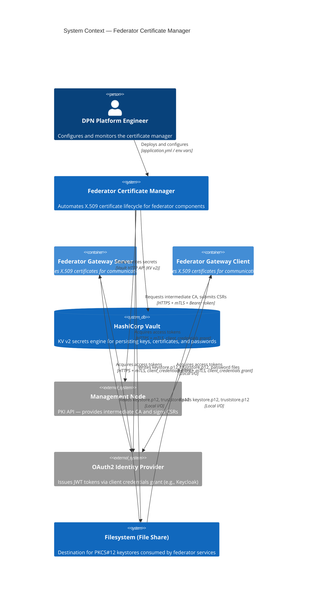
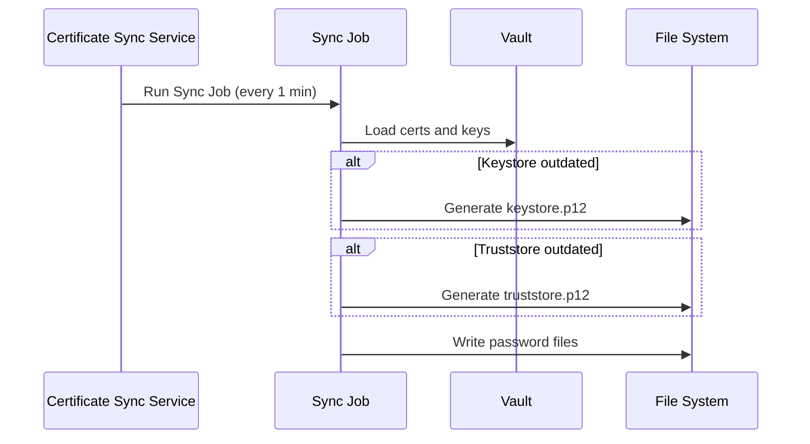
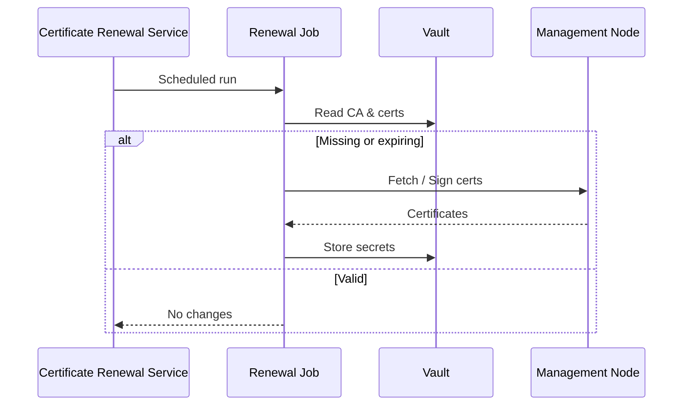

# DPN Installation Process

---

# Table of Contents

- [Overview](#overview)
- [Architecture Overview](#architecture-overview)
- [Installation Prerequisites](#installation-prerequisites)
- [1. Clone and Prepare Source Repositories](#1-clone-and-prepare-source-repositories)
- [2. Prepare Infrastructure and Application Prerequisites](#2-prepare-infrastructure-and-application-prerequisites)
- [3. Certificate Preparation](#3-certificate-preparation)
- [4. Pipeline Repository Structure](#4-pipeline-repository-structure)
- [Part 1 — DPN Federator Gateway Installation](#part-1--dpn-federator-gateway-installation)
- [Step 1 — Configure Maven Settings](#step-1--configure-maven-settings)
- [Step 2 — Setup Keystore and Truststore](#step-2--setup-keystore-and-truststore)
- [Step 3 — Configure Federator CI Pipelines](#step-3--configure-federator-ci-pipelines)
- [Step 4 — Execute Federator CI Pipelines](#step-4--execute-federator-ci-pipelines)
- [Step 5 — Configure Federator CD Pipeline](#step-5--configure-federator-cd-pipeline)
- [Step 6 — Execute Federator CD Pipeline](#step-6--execute-federator-cd-pipeline)
- [Post Deployment Verification](#post-deployment-verification)
- [Part 2 — DPN Data Pipeline Integration](#part-2--dpn-data-pipeline-integration)
- [Step 1 — Configure Storage Access](#step-1--configure-storage-access)
- [Step 2 — Configure Kafka Topics](#step-2--configure-kafka-topics)
- [Step 3 — Configure Data Pipeline CI Pipeline](#step-3--configure-data-pipeline-ci-pipeline)
- [Step 4 — Execute Data Pipeline CI Pipeline](#step-4--execute-data-pipeline-ci-pipeline)
- [Step 5 — Configure Data Pipeline CD Pipeline](#step-5--configure-data-pipeline-cd-pipeline)
- [Step 6 — Execute Data Pipeline CD Pipeline](#step-6--execute-data-pipeline-cd-pipeline)
- [Post Deployment Verification](#deployment-verification)
- [Troubleshooting](#troubleshooting)

---

## Overview

This document provides step-by-step instructions for installing and deploying **DPN components** using **Azure DevOps (ADO) pipelines**.

The deployment uses the following repositories:

- https://github.com/energy-dsi/dpn-deployment
- https://github.com/energy-dsi/dsi-data-pipelines

The deployment process consists of:

- **Continuous Integration (CI)** – builds container images
- **Continuous Deployment (CD)** – deploys images into **Azure Kubernetes Service (AKS)**

The following flow diagram explains the installation process steps.


---

## DPN Data Pipelines Architecture Overview

The following diagram illustrates the high-level architecture blocks of the **DPN Data Exchange platform** between a Data Producer and Data Consumer using file integration pathway and Federator gateway.


The architecture consists of following logical componenets:

**DPN Federator Gateway**
This component is responsible for file transmission over GRPC Connection, communication with DSM Keycloak and management node services.

**DPN Federtor Gaeteway Server Mode**
- Receives Federator Client requests
- Authenticate with DSM service
- Receives Producer and consumer configuration from management node
- Connects to the kafka topic based on the client request on data product
- Initiates GRPC based file streaming service with Federator client

**DPN Federator Gateway Client Mode**
- Initiates Federator server request based on a scheduled job
- Authenticate with DSM service
- Receives Producer and consumer configuration from management node
- Initiates GRPC based file streaming service with Federator server
- Places the file in storage container

**DPN Certificate Manager**
This Component is responsible for issuing bootstrap certificates to initiate connection with managment node. This component renews the certificates with management node and stores in a P12 storage. Federator server and client uses the location to point the certificate files for initiating mutual TLS with DSM and other DPNs.

**DPN P12 Shared Storage**
This is a file share component which is shared betweeen Federator Certificate Manager and Federator Gateway to use the same keystore and truststore P12 certificate generated by DPN vault after the Vault is configured with the crt, ca chain, private and public key files.

**DPN Data Pipeline Producer**
- File extracted from organization source storage location automatically on a schedule basis
- Processed by adaptor and mapper components
- Published to Kafka topics with final file location
- Published to the target storage location

**DPN Data Pipeline Consumer**
- Federator Client receives file in a consumer specific storage account or bucket
- Checksum and hashes validation are performed on the received file(s)
- File is taken for processing by the extractor service and placed into another target container
- Mapper components perform schema validation based on the schema type mentioned in the file name.
- Processed file is stored in the consumer target storage container or bucket
- A Kafka based streaming message is sent to a destination kafka topic to mark end of the data pipleline process

**DPN Streaming Service - Kafka**
This component is responsible for event emission and storing locations of the data product files produced by Data Pipeline producer. Also it helps in signaling events occured between adaptor, mapper and extractor processes. The Kafka service also provides an UI to monitor the topics and messages inside it. This is packaged along with Federator component.

**DPN Caching Service**
This component uses redis caching to store the kafka offsets for various topics, caching of tokens as necessary for federator server and clients. This is also bundled with Federator gateway package

**DPN Vault Servie**
This component uses Hashicorp Vault set up for storing of secrets used by the individual components. This is also packaged with Federator Gatway package.

---
## Installation Prerequisites

The following steps 

### 1. Clone and Prepare Source Repositories

Clone the official repositories from GitHub.

```bash
git clone https://github.com/energy-dsi/dpn-federator-certificate-manager.git
git clone https://github.com/energy-dsi/dpn-federator.git
git clone https://github.com/energy-dsi/dpn-federator-certificate-manager.git
git clone https://github.com/energy-dsi/dpn-data-pipelines.git
```

Switch to the desired branch.

```bash
git checkout main
```

or

```bash
git checkout release/<version>
```

Push the code to the organization's Azure DevOps repository.

```bash
git remote add ado https://dev.azure.com/<org>/<project>/_git/<repository>
git push -u ado main
```

---

### 2. Prepare Infrastructure and Application Prerequisites

Ensure the following prerequisites are completed before deployment:

- Infrastructure prerequisites
- Software prerequisites
- Network prerequisites
- Security prerequisites
- Certificate prerequisites

[Refer to the **Prerequisites** and **Configuration** documentation for details](01-prerequisites.md)

---

### 3. Certificate Preparation & CSR Generation

- Generate an RSA Private Key for the Organization DPN.
```text
openssl genrsa -out dpn-dev-01.key 2048
```

- Generate the CSR for the Organization with above Key file and Submit the CSR to DSI DSM through the UI.
```text
openssl req -new -key dpn-dev-01.key -out dpn-dev-01.csr -subj "/CN=dpn-dev-01/O=DPN Dev Server/C=UK"
```

Organizations receive a **signed certificate from DSI DSM** based on their submitted CSR.

#### Certificate Files from DSI
Organizations to receive a certificate package post upload of CSR files. The package would contain the certificate.crt and the ca_chain.crt files from DSI.The following is an example list of files to be provided to DPNs during DPN connection.

| File            | Description |
|-----------------|-------------|
| certificate.crt | Certificate signed by DSI DSM |
| ca_chain.crt    | Intermediate certificate chain provided by DSI DSM |

---

### 4. Identify Pipeline Repository Structure

Each DPN code repositories are provided with necessary CI and CD pipelines in the following folder structure as reference. 

```
Root-Repository/
└── .pipelines/
    └── azure-pipelines/
        ├── ci-pipelines/
        └── cd-pipelines/
```

---

## Installation Steps

The DPN is presently comprises of following components. 

* DPN Vault and P12 File Share
* DPN Federator Certificate Manager
* DPN Federator Gateway
* DPN Data Pipeline
* DPN Data Store

The installation steps are outlined below for each of the components separately. 

### PART 1 - DPN Certificate Life Cycle Manager Installation (CI/CD)

#### System Context Diagram

The system context shows how the Certificate Manager interacts with external actors and systems.



##### Narrative

| System                      | Protocol               | Authentication                 | Purpose                                                                |
|-----------------------------|------------------------|--------------------------------|------------------------------------------------------------------------|
| **HashiCorp Vault**         | HTTP/HTTPS (Vault API) | Vault token                    | Persist and retrieve key pairs, certificates, CA chains, and passwords |
| **Management Node**         | HTTPS with mTLS        | OAuth2 Bearer token            | Fetch intermediate CA certificate; sign certificate signing requests   |
| **OAuth2 IdP**              | HTTPS with mTLS        | Client credentials (client_id) | Obtain JWT access tokens for Management Node API calls                 |
| **Filesystem (File Share)** | Local I/O              | OS-level permissions           | Write PKCS#12 keystores and password files for federator consumption   |

Certificate Lifecycle Manager deployment includes the following components and shown as individual containers when deployed.

| Component           | Purpose                                                                                         |
|---------------------|-------------------------------------------------------------------------------------------------|
| Certificate Manager | Core component responsible for Federator Certificate's lifecycle management                     |
| Vault               | Securely stores Certificates (Intermediate and Leaf), CA Chain, Key pair and keystore passwords |
| File Share          | Common storage used by federator components for accessing the Keystore.p12, Trustore.p12 files  |

---

#### Step 1 — Configure Storage and Containers

##### For CI-CD Pipeline Configuration:

For the pipelines to run, 
- the following parameters need to be updated in the **<env>-dpn01.json** file under azure pipelines folder. Refer the file as below.

```text
Root-Repository/
└──.pipelines/ 
     └──azure-pipelines/
          └── config/
                └── <env>-dpn01.json
```

| Parameter              | Description                                                       | Example Value                                            |
|------------------------|-------------------------------------------------------------------|----------------------------------------------------------|
| AZURE_SUBSCRIPTION_ID  | Azure subscription ID where the infrastructure is deployed        | `<A valid Azure subscription ID>`                        |
| ENV_NAME               | Environment for the particular configuration json                 | `<A valid environment indicator e.g. dev>`               |
| RESOURCE_GROUP         | Azure resource group containing the AKS cluster                   | `<A valid resource group name e.g. rg-prd-uks-dpn-01>`   |
| AKS_CLUSTER            | Name of the Azure Kubernetes Service cluster                      | `<AKS cluster name e.g. aks-prd-uks-dpn-01>`             |
| NAMESPACE              | Name of the Kubernetes cluster namespace for container deployment | `<A valid namespace name e.g.ns-dpn-01>`                 |
| KEY_VAULT_NAME         | Azure Key Vault used to store secrets and certificates            | `<A valid Azure Key Vault name e.g. akv-prd-uks-dpn-01>` |
| CONTAINER_REGISTRY_URL | Base registry URL used by deployment images                       | `<image-registry-url e.g. acrdpndevuks01.azurecr.io>`    |
| CONTAINER_REGISTRY     | Base registry used by deployment images                           | `<image-registry e.g acrdpndevuks01>`                    |

- the following parameters need to be updated in the **<env>-vault.yaml** file under azure pipelines folder. Refer the file as below.

```text
Root-Repository/
└──.pipelines/ 
     └──azure-pipelines/
          └── config/
                └── <env>-vault.yaml
```

| Parameter                  | Description                                                       | Example Value |
|----------------------------|-------------------------------------------------------------------|---------------|
| server.dev.enabled         | Whether Vault server is running in dev mode                       | `<false>`     |
| server.ha.enabled          | Whether High availability is enabled in the Vault server          | `<false>`     |
| server.dataStorage.enabled | Whether Persistent storage to be allocated for the files in Vault | `<true>`      |
| server.dataStorage.size    | Size of the Persistent storage to be allocated                    | `<10Gi>`      |

##### For Helm Chart Configuration:
[Go to Helm Chart Configuration for DPN Security Services](02-configuration-parameters.md#helm-configuration-2)

**Note:**  Before running pipelines, make sure the File share storage is provisioned as per [Helm Chart Configuration for DPN P12 Shared Storage Service](02-configuration-parameters.md#secrets-configuration-4)

#### Step 2 - Certificate Lifecycle flows

The Certificate manager maintains lifecycle of the tls certificates by running mainly 2 major flows or Jobs run at scheduled intervals specified by below Helm chart Values params.

| Flow                | Schedule Parameter | Default value |
|---------------------|--------------------|---------------|
| Certificate Sync    | cert.syncRateMs    | 1 minute      |
| Certificate Renewal | cert.renewalRateMs | 1 hour        |

The **Certificate Sync** flow is depicted in the sequence diagram below.



The sequence diagram of **Certificate Renewal** flow is as below.



#### Step 3 — Configure Certificate Manager CI Pipeline

Prepare a new Azure DevOPS Pipeline by reading the CI pipeline yaml file from the below location under ci-pipelines.

```
Root-Repository/
└── .pipelines/
    └── azure-pipelines/
        └── ci-pipelines/
            └── certificate-manager-ci.yaml
```
##### CI Pipeline Parameters

CI pipeline accepts the following runtime parameters. These are selected when manually triggering a pipeline run.

| Parameter           | Default          | Allowed Values                                                              | Description                                                          |
|---------------------|------------------|-----------------------------------------------------------------------------|----------------------------------------------------------------------|
| `serviceConnection` | `sc-dpn-dev-001` | `sc-dpn-dev-001`, `sc-dpn-sit-001`, `sc-dpn-preprod-001`, `sc-dpn-prod-001` | Azure service connection for the target environment                  |
| `environment`       | `dev`            | `dev`, `devtest`, `sit`, `preprod`, `prod`                                  | Target deployment environment                                        |
| `cluster`           | `dpn01`          | `dpn01`, `dpn02`                                                            | Target DPN cluster                                                   |
| `enablePIT`         | `false`          | `true`, `false`                                                             | Enables PIT mutation testing (slow — leave `false` for routine runs) |

*** Note*** This above mentioned parameters need to be configured as per existing infrastructure provisioned and configuration of cluster.

The pipeline runs three sequential stages:

| Stage                        | What Happens                                                                                                                                                                                            |
|------------------------------|---------------------------------------------------------------------------------------------------------------------------------------------------------------------------------------------------------|
| **Stage 1 — CheckMarx Scan** | Runs an Infrastructure-as-Code (IaC) security scan on pipeline YAML and Helm chart files using CheckMarx One.                                                                                           |
| **Stage 2 — Unit Tests**     | Sets up Java 21, injects Maven credentials, logs into DockerHub, runs all unit tests (`mvn clean verify`), publishes test results, code coverage (JaCoCo), and performs SonarQube static code analysis. |
| **Stage 3 — Build & Push**   | Builds Docker images for the Federator Certificate Manager (`docker/Dockerfile`), pushes it to ACR, signs it using Cosign, and scans it with JFrog Xray.                                                |


#### Step 4 — Execute Certificate Manager CI Pipelines

Execute the CI pipeline and verify by checking the image registry updated with the image tag.

List all repositories in the registry:

```bash
az acr repository list --name <acr-name>
```

Verify the image tag for a specific image:

```bash
az acr repository show-tags --name <acr-name> --repository <image-name>
```

Replace `<acr-name>` with the registry name (e.g. `acrdpndevuks01`) and `<image-name>` with the image being checked (e.g. `dpn-federator-certificate-manager`).

> **Note:** The Build ID generated by a successful `certificate-manager-ci.yaml` run is used as the `imageTag` parameter when executing the CD pipeline in Step 6.

---

#### Step 5 — Configure Certificate Manager CD Pipeline

Prepare new Azure DevOPS Pipeline by reading the CD pipeline yaml files from the below location under cd-pipelines.

```
Root-Repository/
└── .pipelines/
    └── azure-pipelines/
        └── cd-pipelines/
            └── certificate-manager-cd.yaml
            └── vault-cd.yaml
```
##### CD Pipeline Parameters

| Parameter           | Default          | Allowed Values                                                         | Description                                         |
|---------------------|------------------|------------------------------------------------------------------------|-----------------------------------------------------|
| `ServiceConnection` | `sc-dpn-dev-001` | `sc-dpn-dev-001`, `sc-dpn-dev-002`, `sc-dpn-sit-001`, `sc-dpn-sit-002` | Azure service connection for the target environment |
| `environment`       | `dev`            | `dev`, `devtest`, `sit`, `preprod`, `prod`                             | Target deployment environment                       |
| `dpncluster`        | _(required)_     | `dpn01`, `dpn02`                                                       | Target DPN cluster                                  |
| `imageTag`          | _(required)_     | Build ID from `certificate-manager-ci.yaml` run                        | Docker image tag to deploy (e.g. `1042`)            |


#### Step 6 — Execute Certificate Manager CD Pipeline

With all images built (Steps 3–4), the CD pipeline configured (Step 5), execute the CD pipeline to deploy both Certificate Manager and Hashicorp Vault to the AKS cluster.

##### Directions to Run the CD Pipeline

1. Go to **Pipelines** in your Azure DevOps project.
2. Click on the `certificate-manager-cd` pipeline.
3. Click **Run Pipeline**.
4. Fill in the parameters:
    - **ServiceConnection**: select the correct service connection for the target environment.
    - **environment**: e.g. `dev`
    - **dpncluster**: e.g. `dpn01`
    - **imageTag**: the Build ID from the successful `certificate-manager-ci.yaml` run (e.g. `1042`). This can be found in the pipeline run history.
5. Click **Run** and monitor the pipeline log.

If the pipeline completes successfully, the following message will appear at the end of the deployment stage:

```
Certificate Manager deployed successfully
```

#### Step 7 — Post Deployment Verification

Once the CD pipeline completes, verify the deployment using the following commands. Replace `<namespace>` with the target namespace (e.g. `ns-dpn-01`).

Check that both certificate-manager and vault pods are in a `Running` state:

```bash
kubectl get pods -n <namespace>
```

Check that vault service is exposed:

```bash
kubectl get svc -n <namespace>
```

Check both deployments are healthy (READY should match DESIRED, e.g. `1/1`):

```bash
kubectl get deployments -n <namespace>
```

View logs for a specific pod and verify that they are clean:

```bash
kubectl logs <pod-name> -n <namespace>
```

Check the common Keystore and Trustore P12 file location (eg: /tls) using following commands and verify these files are created along with their password files (as specified here [Certificate P12 Storage as File Share](02-configuration-parameters.md#certificate-p12-storage-as-file-share)).
```bash
kubectl -n <namespace> exec <pod-name> -- ls /tls
```


---


### PART 2 — DPN Data Pipeline Installation with File based Integration Pathway (CI/CD)


DPN Data Pipeline is a series of data validation through the adaptor and mappers process as outlined in the architecture overview above. 

---

#### Step 1 — Configure Storage and Containers

##### For Pipeline Configuration:
For the pipelines to run, the following parameters need to be updated in the **config.json** file under azure pipelines folder. Refer the config.json file as below. 

```text
Root-Repository/
└──.pipelines/ 
     └──azure-pipelines/
          └── config/
                └── config.json
```

| Parameter | Description | Example Value |
|-----------|-------------|---------------|
| AZURE_SUBSCRIPTION | Azure subscription ID where the infrastructure is deployed | `<A valid Azure subscription ID>` |
| SERVICE_CONNECTION | Service connection name for deployment | `<A valid Azure subscription ID>` |
| RESOURCE_GROUP | Azure resource group containing the AKS cluster | `<A valid resource group name e.g. rg-prd-uks-dpn-01>` |
| AKS_CLUSTER | Name of the Azure Kubernetes Service cluster | `<AKS cluster name e.g. aks-prd-uks-dpn-01>` |
| NAMESPACE | Name of the Kubernetes cluster namespace for container deployment | `<A valid namespace name e.g.ns-dpn-01>` |
| KEY_VAULT_NAME | Azure Key Vault used to store secrets and certificates | `<A valid Azure Key Vault name e.g. akv-prd-uks-dpn-01>` |
| BASE_REGISTRY | Base registry path used by deployment images | `<image-registry-url>` |
| cloudProviderType | Defines the code to run on azure, aws or gcp | `<A valid cloud provider values. e.g Azure>` |
  
##### For Helm Chart Configuration:
[Go to Helm Chart Configuration for DPN Data Pipeline](02-configuration-parameters.md#helm-chart-configuration)

#### Data Pipeline Repository Structure

The DPN-data-pipeline has following structure which defines a list of blueprints for both producer and consumers.DSI has provided reference blueprints of types below.DPN organization should refer the blueprint templates or they can bring their own blueprint templates. 

The repository structure follows /blueprint/producer/{integration pathway} and /blueprint/consumer/{integration pathway}. 

```
Root-Repository/
└── .docs/
    └── .pipelines
└── packages/
└── producer/ {DPN Needs to add this folder manaually. The existing repo will onle provide blueprint}
    ├── file/
    │   ├── eq-prod-1/  {eq-prod-1 is a reference from EQ blueprint type and should be placed exactly here}
    │   │   ├── adaptor/
    │   │   ├── schema-mapper/    
    │   ├── dl-dp-3/  {dl-dp-3 is a reference from dl blueprint type and should be placed exactly here}
    │   │   ├── adaptor/
    │   │   ├── schema-mapper/ 
└── cosnumer/ {DPN Needs to add this folder manaually. The existing repo will onle provide blueprint}
    ├── file/
    │   ├── eqbd-con-1/  {eqbd-con-1 is a reference from EQBD blueprint type and should be placed exactly here}
    │   │   ├── extractor/
    │   │   ├── schema-mapper/    
    │   ├── ssh-dp-2/  {ssh-dp-2 is a reference from ssh blueprint type and should be placed exactly here}
    │   │   ├── adaptor/
    │   │   ├── schema-mapper/ 
└── consumer/
└── blueprints/
    ├── producer/
    │   ├── file/
    |   │   ├── eq/
    │   │   │   ├── adaptor/
    │   │   │   ├── schema-mapper/    
    │   │   ├── eqbd/
    │   │   └── dl/
    │   │   └── ssh/
    ├── consumer/
    │   ├── file/
    |   │   ├── eq/
    │   │   │   ├── extractor/
    │   │   │   ├── schema-mapper/    
    │   │   ├── eqbd/
    │   │   └── dl/
    │   │   └── ssh/
└── smoke-test/
└── tests/
README.md

```
**Note the following**

- There is a 1:1 relation ship between the data product type folder name under producer and consumer in the pipeline. The name of the folder should be exactly the same as productType when running the CI and CD pipelines. 
- The repository will not contain producer and consumer folders in it. DPNs are required to create this exact structure while preparing for a data product. 
- DPNs should copy a product type from blueprint i.e. lets say /blueprint/producer/file/eq folder and copy to /producer/file/eq with all it's contents.
- DPNs may rename the eq to anything meaningful for the data product of type eq. However, the same name should be provided as productType during CI and CD pipeline execution.
- The same step should be repeated while building the consumer. A new folder should be created as /consumer under the root repository and point the integration pathway and data product type under it. 
---

#### Supported Energy Data Schemas

DSI provided adaptors with following schema types belonging to energy industry. Organizations are supposed to verify and augment any new schema type following the DSM data template definition and bring their own adaptor and mapper components accordingly. 


| Schema | Description |
|------|-------------|
| DL | Diagram Layout |
| EQ | Equipment |
| EQBD | Equipment Boundary |
| SSH | Steady State Hypothesis |

---

#### Step 3 — Configure Data Pipeline CI Pipeline

Prepare a new Azure DevOPS Pipeline by reading the CI pipeline yaml file from the below location under ci-pipelines.

```
Root-Repository/
└── .pipelines/
    └── azure-pipelines/
        └── ci-pipelines/
            └── dsi-data-pipelines-ci.yaml
```

---

#### Step 4 — Execute Data Pipeline CI Pipeline

Execute the CI pipelines and verify by checking the image registry updated with the image tag.

```bash
az acr repository list --name <acr-name>
```

##### Directions to Run the CI Pipeline
The CI pipeline is designed to support both Producer and Consumer configurations. While triggering the pipeline, parameters must be selected carefully, as the required inputs vary depending on the selected configuration type.

###### Common Parameters (Required for Both Producer and Consumer)

- Pipeline Version: Select the appropriate branch or tag (for example, devops).
- Environment: Choose the target environment (e.g., dev).
- DPN Cluster: Select the DPN instance (dpn01 or dpn02).
- Service Connection: Select the Azure service connection corresponding to the chosen environment.

###### Consumer Configuration
When Config Type = <b>consumer</b> is selected:

- Process Type: Not required (selection is ignored by the pipeline).
- Schema Type: Not required.
The pipeline proceeds with consumer-specific configuration and deployment only.

###### Producer Configuration
When Config Type = <b>producer</b> is selected:

- Process Type: Mandatory. Currently supported value: file. (This may be extended in future MVC versions.)
- Schema Type: Mandatory. Currently supported values: eq, dl, eqbd, ssh. (This list is extensible in future releases.)
- Product Type: Mandatory and must be provided to correctly parameterize the producer pipeline.

Failure to provide Process Type and Schema Type when running the pipeline in producer mode will result in an invalid or incomplete execution.

**Notes**
- The same CI pipeline is used for both producer and consumer, with behavior controlled entirely by parameter selection.
- Schema Type and Process Type are validated only when producer is selected.
- Future enhancements may introduce additional schema types and process types without changing the overall pipeline structure.
---

#### Step 5 — Configure Data Pipeline CD Pipeline

Prepare new Azure DevOPS Pipelines by reading the CD pipeline yaml files from the below location under cd-pipelines.

```
Root-Repository/
└── .pipelines/
    └── azure-pipelines/
        └── cd-pipelines/
            └── dsi-data-pipelines-cd.yaml
 
```

**Note** Organizations need to decide which data template will they require to process. The pipelines are made generic to process specific type (producer or consumer), integration pathway (file, topic, api), cloud provider type (azure, aws,gcp) and based on consumer ID.


---

#### Step 6 — Execute Data Pipeline CD Pipeline

Execute the CD pipelines and verify the containers are deployed on the Azure Kubernetes platform. There should be following 2 containers running per data product file produced of template DL, EQ , EQBD or SSH at each integration pathway level in producer side. The convention to be as followed.
  
  a) producer-{integration type}-adaptor-{dataproducttype}-xxxxxxxx <br>
  b) producer-{integration type}-mapper-{dataproducttype}-yyyyyyyy

Similarly the following containers will be deployed in consumer side at each data product consumer ID subscribed for a spcific data product type 

  a) consumer-{integration type}-extractor-{dataproducttype}-{consumer ID}-xxxxxxxx <br>
  b) consumer-{integration type}-mapper-{dataproducttype}-{consumer ID}-xxxxxxxx

Example container post deployment:

- producer-file-adaptor-eqbd-xxxxxxxx
- producer-file-mapper-eqbd-xxxxxxxx
- consumer-file-extractor-xxxxxxxx
- consumer-file-mapper-xxxxxxxx

---
#### Step 7 - Deployment Verification

Once a succesful deployment happens, the DPN Kubernetes cluster should show an example of list of containers like below. This example is taken only selective eq and dl producer sample data product in producer side and an Organization receiving the two data products using the schema type and org name.

```text
- product type - eq-sample-1, dl-sample-1
- schema type - eq and dl
- cloud type - azure
- process type - file
```


```bash
kubectl get pods -n <namespace>
```

Verify clean logs inside the container

```bash
kubectl logs <pod-name> -n <namespace>
```

---

### PART 3 — DPN Federator Gateway Installation (CI/CD)
<Anik>

Federator deployment includes the following components and shown as individual containers when deployed.

| Component | Purpose |
|----------|---------|
| Zookeeper Src | Coordination service for Kafka producer cluster |
| Zookeeper Dest | Coordination service for Kafka consumer cluster |
| Kafka Src | Source Kafka cluster |
| Kafka Dest | Target Kafka cluster |
| Kafka UI | Kafka monitoring interface |
| Redis | Stores Kafka offsets |
| Kafka Topic Creator | Optional topic creation job |
| Kafka Topic Populator | Optional sample data loader |
| Federator Server | Sends data via gRPC |
| Federator Client | Receives data and writes to Kafka |
| Vault Service    | Secret Store |

---
#### Pipeline Variable Groups

Before running any pipeline, ensure the following **Azure DevOps Variable Groups** are created and populated. Variable groups store credentials and shared configuration values that are referenced by all Federator pipelines.

##### Variable Group: `dockerhub-creds`

| Variable Name | Description |
|---------------|-------------|
| `DOCKERHUB_USERNAME` | DockerHub username used to pull base images during CI builds |
| `DOCKERHUB_PASSWORD` | DockerHub password or access token |

##### Variable Group: `federator-ci`

| Variable Name | Description |
|---------------|-------------|
| `GITHUB_MAVEN_USERNAME` | GitHub username with access to the GitHub Maven Package Registry |
| `GITHUB_MAVEN_TOKEN` | GitHub Personal Access Token (PAT) with `read:packages` scope |
---

#### Step 1 — Configure Maven Settings

The Federator is a Java application built using Maven. Some of its dependencies are hosted in the **GitHub Maven Package Registry**, which requires authentication. This step ensures the CI pipeline can authenticate with GitHub when downloading those dependencies.

The following credentials must be set in the `federator-ci` pipeline variable group:

```
GITHUB_MAVEN_USERNAME=<GitHub username>
GITHUB_MAVEN_TOKEN=<GitHub PAT token>
```

The CI pipeline automatically injects these values into a `settings.xml` file at runtime, located at:

```
Root-Repository/
└── .m2/
    └── settings.xml
```

The relevant section of the generated `settings.xml` is shown below for reference. **Do not commit credentials directly into this file.**

```xml
<settings>
  <servers>
    <server>
      <id>github</id>
      <username>${env.GITHUB_ACTOR}</username>
      <password>${env.GH_PACKAGES_PAT}</password>
    </server>
  </servers>
</settings>
```
> **Note:** The `GITHUB_MAVEN_TOKEN` must have the `read:packages` scope. Using a token without this scope will cause the Maven build to fail with an authentication error.

---

#### Step 2 — Setup Keystore and Truststore locations

The Federator Server and Client communicate over **mutual TLS (mTLS)** using gRPC. Both sides must present valid certificates to establish a secure connection. The following certificate files, generated during the certificate preparation step (see [Section 3 — Certificate Preparation]

| File | Purpose |
|------|---------|
| `keystore.jks` | Contains the component's private key and certificate. Used to prove the component's own identity during TLS handshake. |
| `truststore.jks` | Contains trusted Certificate Authority (CA) certificates. Used to verify the identity of the remote party. |

Place the following files in a secure location (TBD) that is created above in the certificate generation step.


```
keystore.jks
truststore.jks
```

---

#### Step 3 — Configure Federator CI Pipelines

The following CI pipelines are present in the dpn-federator repository. Prepare new Azure DevOPS Pipelines by reading the CI pipeline yaml files from the below location under ci-pipelines.

```
Root-Repository/
└── .pipelines/
    └── azure-pipelines/
        └── ci-pipelines/
            ├── DPN-Federator-CI.yaml
            ├── DPN-Kafka-Common-CI.yaml
            ├── DPN-Kafka-Topic-Creator-CI.yaml
            ├── DPN-Kafka-Topic-Populator-CI.yaml
            ├── DPN-Redis-Common-CI.yaml
            └── DPN-Zookeeper-Common-CI.yaml
```
##### How to Create Each Pipeline in Azure DevOps

1. Go to **Pipelines** in your Azure DevOps project and click **New Pipeline**.
2. Select the source repository (e.g. Azure Repos Git or GitHub).
3. Choose the `dpn-federator` repository.
4. Select **Existing Azure Pipelines YAML file**.
5. Point to the relevant YAML file path from the list above.
6. Click **Save** (do not run yet — parameters must be provided at runtime).
7. Repeat for all six YAML files.

##### CI Pipeline Parameters

Each CI pipeline accepts the following runtime parameters. These are selected when manually triggering a pipeline run.

| Parameter | Default | Allowed Values | Description |
|-----------|---------|----------------|-------------|
| `serviceConnection` | `sc-dpn-dev-001` |  `sc-dpn-dev-001`, `sc-dpn-sit-001`, `sc-dpn-preprod-001`, `sc-dpn-prod-001` | Azure service connection for the target environment |
| `environment` | `dev` | `dev`, `devtest`, `sit`, `preprod`, `prod` | Target deployment environment |
| `cluster` | `dpn01` | `dpn01`, `dpn02` | Target DPN cluster |
| `enablePIT` | `false` | `true`, `false` | Enables PIT mutation testing (slow — leave `false` for routine runs) |

*** Note*** This above mentioned parameters need to be configured as per existing infrastructure provisioned and configuration of cluster.

##### What the Main Federator CI Pipeline Does (`federator-ci.yaml`)

The main pipeline runs three sequential stages:

| Stage | What Happens |
|-------|-------------|
| **Stage 1 — CheckMarx Scan** | Runs an Infrastructure-as-Code (IaC) security scan on pipeline YAML and Helm chart files using CheckMarx One. |
| **Stage 2 — Unit Tests** | Sets up Java 21, injects Maven credentials, logs into DockerHub, runs all unit tests (`mvn clean verify`), publishes test results, code coverage (JaCoCo), and performs SonarQube static code analysis. |
| **Stage 3 — Build & Push** | Builds Docker images for the Federator Server (`Dockerfile.server`) and Federator Client (`Dockerfile.client`), pushes both to ACR, signs them using Cosign, and scans them with JFrog Xray. |

##### What the Other CI Pipelines Do

The remaining five pipelines follow a simpler build-and-push pattern (no unit tests or code analysis). Each uses a fixed image version tag.

| Pipeline | Image Name | Image Tag |
|----------|-----------|-----------|
| `kafka-common-ci.yaml` | `dpn-kafka` | `7.5.3` |
| `zookeeper-common-ci.yaml` | `dpn-zookeeper` | `7.5.3` |
| `redis-common-ci.yaml` | `dpn-redis` | `7.2` |
| `kafka-topic-creator-ci.yaml` | `kafka-topic-creator` | `v2` |
| `kafka-topic-populator-ci.yaml` | `kafka-topic-populator` | `v2` |

---

#### Step 4 — Execute Federator CI Pipelines

Run the CI pipelines in the following recommended order. The infrastructure pipelines have no interdependencies but this order is recommended for clarity.

1. `zookeeper-common-ci.yaml`
2. `kafka-common-ci.yaml`
3. `redis-common-ci.yaml`
4. `kafka-topic-creator-ci.yaml`
5. `kafka-topic-populator-ci.yaml`
6. `federator-ci.yaml` (run last)

Execute the CI pipelines and verify by checking the image registry updated with the image tag.

List all repositories in the registry:

```bash
az acr repository list --name <acr-name>
```

Verify the image tag for a specific image:

```bash
az acr repository show-tags --name <acr-name> --repository <image-name>
```

Replace `<acr-name>` with the registry name (e.g. `acrdpndevuks01`) and `<image-name>` with the image being checked (e.g. `dpn-federator-client`).

> **Note:** The Build ID generated by a successful `federator-ci.yaml` run is used as the `imageTag` parameter when executing the CD pipeline in Step 7.

---

#### Step 5 — Configure Federator CD Pipeline

Prepare new Azure DevOPS Pipeline by reading the CD pipeline yaml file from the below location under cd-pipelines. 

```
Root-Repository/
└── .pipelines/
    └── azure-pipelines/
        └── cd-pipelines/
            └── azure-dpn-cd.yaml
```
##### CD Pipeline Parameters

| Parameter | Default | Allowed Values | Description |
|-----------|---------|----------------|-------------|
| `ServiceConnection` | `sc-dpn-dev-001` | `sc-dpn-dev-001`, `sc-dpn-dev-002`, `sc-dpn-sit-001`, `sc-dpn-sit-002` | Azure service connection for the target environment |
| `environment` | `dev` | `dev`, `devtest`, `sit`, `preprod`, `prod` | Target deployment environment |
| `dpncluster` | _(required)_ | `dpn01`, `dpn02` | Target DPN cluster |
| `imageTag` | _(required)_ | Build ID from `federator-ci.yaml` run | Docker image tag to deploy (e.g. `1042`) |

##### Environment Configuration Files

The CD pipeline reads its environment-specific values from a JSON configuration file in the repository. The file used depends on the `environment` and `dpncluster` parameters selected at runtime.

```
Root-Repository/
└── .pipelines/
    └── azure-pipelines/
        └── config/
            ├── dev-dpn01.json
            ├── dev-dpn02.json
            ├── devtest-dpn01.json
            └── devtest-dpn02.json
```

Each configuration file contains the following values:

| Key | Example Value | Description |
|-----|---------------|-------------|
| `ENV_NAME` | `dev` | Environment label |
| `CONTAINER_REGISTRY` | `acrdpndev` | Short name of the Azure Container Registry |
| `CONTAINER_REGISTRY_URL` | `acrdpndev.azurecr.io` | Full URL used to pull images |
| `BASE_REGISTRY` | `acrdpndev.azurecr.io` | Base registry used during image builds |
| `AZURE_SUBSCRIPTION_ID` | `bbbdbd83-...` | Azure Subscription ID of the target environment |
| `RESOURCE_GROUP` | `rg-aks-dpn-dev-01` | Resource Group containing the AKS cluster |
| `AKS_CLUSTER` | `aks-dpn-dev-01` | Name of the AKS cluster to deploy to |
| `NAMESPACE` | `ns-dpn-01` | Kubernetes namespace where components are deployed |
| `KEY_VAULT_NAME` | `kv-dpn-dev-01` | Key Vault from which secrets are retrieved at deployment time |
---

> **Note:** To deploy to a new environment, create a new JSON config file following the same structure as the examples above, and ensure the corresponding Azure service connection is configured in Azure DevOps.
---
##### What the CD Pipeline Does

The CD pipeline executes the following steps automatically:

1. Loads the environment configuration JSON file based on the selected parameters.
2. Authenticates with Azure using the selected Service Connection.
3. Retrieves AKS credentials for the target cluster.
4. Fetches the following secrets from Azure Key Vault:
   - `IDP-CLIENT-SECRET`
   - `IDP-TRUSTSTORE-PASSWORD`
   - `IDP-KEYSTORE-PASSWORD`
5. Runs `helm lint` to validate the Helm chart before deploying.
6. Runs a Helm dry-run to verify the deployment configuration without making changes.
7. Runs `helm upgrade --install` to deploy or upgrade all Federator components in the target namespace.
8. Verifies each core deployment has successfully rolled out using `kubectl rollout status`.
9. Prints a summary of all running pods and services in the namespace.

---

#### Step 6 — Configure Vault
---
In progress
---


#### Step 7 — Execute Federator CD Pipeline

With all images built (Steps 3–4), the CD pipeline configured (Step 5), and Vault secrets in place (Step 6), execute the CD pipeline to deploy all Federator components to the AKS cluster.

##### Directions to Run the CD Pipeline

1. Go to **Pipelines** in your Azure DevOps project.
2. Click on the `azure-dpn-cd` pipeline.
3. Click **Run Pipeline**.
4. Fill in the parameters:
   - **ServiceConnection**: select the correct service connection for the target environment.
   - **environment**: e.g. `dev`
   - **dpncluster**: e.g. `dpn01`
   - **imageTag**: the Build ID from the successful `federator-ci.yaml` run (e.g. `1042`). This can be found in the pipeline run history.
5. Click **Run** and monitor the pipeline log.

If the pipeline completes successfully, the following message will appear at the end of the deployment stage:

```
DPN DEPLOYMENT COMPLETE
```

---

#### Post Deployment Verification

Once the CD pipeline completes, verify the deployment using the following commands. Replace `<namespace>` with the target namespace (e.g. `ns-dpn-01`).

Check that all pods are in a `Running` state:

```bash
kubectl get pods -n <namespace>
```

Check that all services are exposed:

```bash
kubectl get svc -n <namespace>
```

Check that all deployments are healthy (READY should match DESIRED, e.g. `1/1`):

```bash
kubectl get deployments -n <namespace>
```

View logs for a specific pod:

```bash
kubectl logs <pod-name> -n <namespace>
```

---

#### Kafka UI Verification
To verify Kafka topics, DPN deployment is provided with a User Interface. To access this UI, the Windows Azure Virtual Machine mentioned in the prerequisites will be required as it is only accessible inside the Azure Network and not outside.

```
http://kafka-ui:8085
```

This interface allows the following capabilities:

- Viewing Kafka clusters deployed in DPN
- Inspecting topics in the clusters
- Publishing test messages to verify
- Verifying data transmission between organizations

After publishing a test message on the source Kafka cluster topic, check the corresponding topic on the destination Kafka cluster. If the Federator is working correctly, the message should appear within seconds.

---

#### Troubleshooting

##### CI Pipeline Failure

Possible causes:

- Incorrect GitHub PAT token or missing `read:packages` scope
- Maven repository authentication failure — verify `GITHUB_MAVEN_USERNAME` and `GITHUB_MAVEN_TOKEN` in the `federator-ci` variable group
- Docker login failure — verify `DOCKERHUB_USERNAME` and `DOCKERHUB_PASSWORD` in the `dockerhub-creds` variable group
- ACR login failure — verify the service principal used by the Service Connection has the `AcrPush` role on the Container Registry

Verify pipeline logs and ensure credentials are correct.


---

##### Container Image Not Found

Check whether the CI pipeline pushed images to the registry.

```bash
az acr repository list --name <acr-name>
```

If the expected repository is not listed, re-run the relevant CI pipeline and ensure it completes without errors before proceeding to the CD pipeline.

---

##### Pods Not Starting

Check pod events to identify scheduling or image pull issues.

```bash
kubectl describe pod <pod-name> -n <namespace>
```

Review the `Events` section at the bottom of the output. Common causes include insufficient node resources, missing Persistent Volume Claims, or image pull errors due to incorrect ACR credentials.


---

##### Container CrashLoopBackOff

A `CrashLoopBackOff` status means the container starts, crashes, and Kubernetes repeatedly attempts to restart it. Check the logs to identify the root cause.

```bash
kubectl logs <pod-name> -n <namespace>
```

Common causes:

- Invalid or missing environment variables — check the Helm values file for typos or missing entries
- Missing secrets or incorrect SAS Token for Blob storage — verify all required secrets exist in Azure Key Vault with the correct names and values
- Kafka topic is not pre-populated — run the Kafka Topic Creator job or manually create topics via the Kafka UI


---

##### Kafka Topic Issues

Verify Kafka topics using Kafka UI.

```
http://kafka-ui:8085
```

Check that:

- The topic exists in both the source and destination Kafka clusters
- The topic name in the Federator configuration matches exactly (topic names are case-sensitive)
- There are no consumer group errors shown in the Kafka UI for the Federator consumer group
---
##### Certificate Renewaljob Failing

At the first time when the CD Pipeline is run and the pods are started for the 1st time, in the log verification Step here [Certificate Manager post deployment verification](#step-7--post-deployment-verification) there could be errors related to vault access in the log due to vault configuration not done at this stage.
Make sure to restart both vault and certificate manager pods after configuring the vault as mentioned here [Hashicorp Vault configuration](02-configuration-parameters.md#vault-configuration) 
Step to restart below
```bash
kubectl -n <namespace> delete po/<pod_id>
```
**Note: In case the renewal job is failing suddenly after the pods are restarted significant amount of stopage time which exceeds the renewal frequency (cert.renewalRateMs), then the organization DPN admin need to raise a request with a new CSR to the DSM to get a new certificate bundle to be loaded in the DPN vault using steps mentioned here [Certificate load steps in vault](02-configuration-parameters.md#certificate-load-steps-in-vault)**

---

##### Certificate Sync job Failing

If the Sync job is failing with below error
```text
INFO  u.g.d.n.f.c.m.s.KeyStoreSyncServiceImpl [] - Synchronizing keystores to filesystem...
ERROR u.g.d.n.f.c.m.job.CertificateSyncJob [] - Error during certificate synchronization job execution: Failed to create keystore
uk.gov.dbt.ndtp.federator.certificate.manager.exception.KeyStoreCreationException: Failed to create keystore
        at uk.gov.dbt.ndtp.federator.certificate.manager.service.pki.KeyStoreService.createKeyStore(KeyStoreService.java:62)
Caused by: java.security.KeyStoreException: Certificate chain is not valid        
```
please check if the ca-chain, intermediate-ca, certificate and keypair files stored in vault are in sync i.e all are linked to the same CSR and root CA. If not please raise a new certificates bundle request using a new CSR.

---
##### Federator Connection Failing

<Anik - Please update title with the error message, I forgot the message>

```
<u.g.d.n.f.c.s.i.IdpTokenServiceMtlsImpl - No cached token in Redis for default management node, fetching from IDP
15:15:34.346 [main] DEBUG u.g.d.n.f.c.s.i.IdpTokenServiceMtlsImpl - attempting to fetch token for management node>
```

---
##### Invalid Client Credential

Sometimes due to mismatch in IDP client secret (OAUTH2-CLIENT-SECRET) possibly due to periodic rotation carried out at DSM side leading to the secret invali at DPN end, the error "Invalid client credetial" can arise.
```
Recommended fix: Get the updated client secret for the Client Id from DSM by raising request for it. 
```

---
## Review Notes

| Review Date | Last Reviewed By | Status | Semver Version (Major.Minor.Patch) |
|-------------|------------------|--------|----------|
| 15-Mar-2026 | DSI Assurance   | Draft  | V0.1.0 |

---