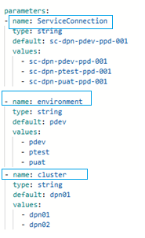

# DPN Monitoring Service Installation Process

---

## Table of Contents

- [Overview](#overview)
- [Prerequisites](#prerequisites)
- [Installation Steps](#installation-steps)
  - [Step1: Run `monitoring-master-cd.yaml`](#step1-run-monitoring-master-cdyaml)
    - [Step1a: Prepare runtime parameters](#step1a-prepare-runtime-parameters)
    - [Step1b: Execute CD Pipeline](#step1b-execute-cd-pipeline)
    - [Step1c: Approve Stage's Deployment Gate](#step1c-approve-stages-deployment-gate)
  - [Step2: Post Deployment Verification](#step2-post-deployment-verification)
- [Step3: Troubleshooting](#step3-troubleshooting)
  - [Config File Not Found for Specific Environment](#config-file-not-found-for-specific-environment)
  - [Deployed Resources Show the Wrong Environment Label](#deployed-resources-show-the-wrong-environment-label)
  - [Kafka/Zookeeper Image Pull Fails](#kafkazookeeper-image-pull-fails)
- [Step4: Containerized Deployment Using DSI Provided Container Images](#step4-containerized-deployment-using-dsi-provided-container-images)
  - [Step4a. Configure GHCR Image Access](#step4a-configure-ghcr-image-access)
  - [Step4b. Verify Image Pull Capability](#step4b-verify-image-pull-capability)
  - [Step4c. Execute CD Pipeline](#step4c-execute-cd-pipeline)
  - [Step4d. Verify CD Pipeline](#step4d-verify-cd-pipeline)
- [Review Notes](#review-notes)

---

## Overview

This describes installation using pipeline structure (`environment`+`cluster` parameters, `monitoring-master-cd.yaml`'s 11-stage orchestration, the OTEL Collector HPA) against `release-internal`'s three real environments — `pdev`, `ptest`, `puat` — each treated as its own single-cluster (`dpn01`) deployment under that structure.

## Prerequisites

- An AKS cluster matching the target environment's config (see [Step1a: Prepare runtime parameters](#step1a-prepare-runtime-parameters) for the corrected values), with `ns-dpn-health-01` already created.
- The Azure DevOps Service Connection for the target environment.
- Access to the environment-specific ACR for Kafka/Zookeeper images, and to Docker Hub/Quay.io for everything else.
- The `dsi-ppd` Environment resource (or the per-environment split recommended in the Configuration Guide) configured with its approval check.
- A **freshly generated** `.htpasswd` for the dashboard proxy — do not reuse anything currently committed in `release-internal`.
- The real Thanos storage account name/SAS Token for the target environment.
- SMTP relay details and an alert recipient address.
- The metrics-server running in the cluster (standard on AKS) — required for the OTEL Collector's HPA.

---

## Installation Steps

### Step1: Run `monitoring-master-cd.yaml`

#### Step1a: Prepare runtime parameters

The CD Pipeline provided needs to be modified in the following places to point to the Organisation's service connection and environment.

| Parameter | Value |
|-----------|-------|
| `ServiceConnection` | `A given Service Connection able to deploy the services` |
| `environment` | `environment abbreviation` |
| `cluster` | `dpn01` (DSI provides two dpn configurations per environment. Organisations may keep only one such as dpn01 to run a single DPN cluser)` |



**Note:** Organisations must review the CD Pipeline code for the following. 

- The agent pool name has been modified to Organisation required agent pool name
- There should not be any `<<Your specific value>>` in the parameters. The DSI package has provided this specific paramter to ensure configuration is modified by Organisations
- The container image is appropriate and referred from GHCR repository unless Organisation plans to use a separate image repository on their own
- The environment parameters are pointing to correct deployment environment
- The DSM endpoints are correctly pointing to respective pdev, ptest or puat environments
- Required Firewall rules are applied

#### Step1b: Execute CD Pipeline

Create and run CD Pipeline for monitoring service from the following CD pipeline yaml file

```text
Root-Repository/
└── .pipelines/
    └── azure-pipelines/
        └── cd-pipelines/
            └── monitoring-master-cd.yaml
```
---

#### Step1c: Approve Stage's Deployment Gate

Organisations should maintain an approval gate for the deployment. The CD Pipleine prompts for the approval under dsi-ppd environment.The environment needs to be created by Organisation to allow only authorised personnel to perform deployment. 

---

### Step2: Post Deployment Verification

1. Confirm all pods `Running`.
2. Confirm the init pods completed the job
2. Confirm resource labels reflect the correct environment name 

**Note: The nginx pod may appear in error state initially as it also grants access to kafka-ui under federator service. Once federator service is up, the nginx will automatically be in run state. If not then the issue to be investigated.

---

## Step3: Troubleshooting

Every troubleshooting entry (Kafka naming-regression checks in `kafka-cd.yaml`, the OTel→Kafka dependency check, CrashLoop from a missing `health_check` extension, HPA `<unknown>` targets) applies unchanged, since it's chart-level logic. Additional entries specific to this reconciliation:

### Config File Not Found for Specific Environment

Confirm `values-{environment}-{cluster}.json` actually exist under this exact naming — they don't ship with either branch as-is; Step 1 creates them.

### Deployed Resources Show the Wrong Environment Label

Confirm Step 1 used the **corrected** `ENV_NAME` values

### Kafka/Zookeeper Image Pull Fails

Confirm `BASE_REGISTRY` in the config file hosted under .pipelines root folder must uses a fully-resolved hostname like `acrdpnXXXX.azurecr.io`,, not a literal like only `acrdpnXXXX` placeholder 

---

## Step4: Containerized Deployment Using DSI Provided Container Images

This section covers deployment using **custom and 3rd party open source container images** published by DSI to `ghcr.io/energy-dsi`. Organisations using this approach pull DSI-provided images directly rather than building from source via CI pipelines.

The Health Monitoring service 3rd party platform images are found in GHCR with following names

| Purpose | GHCR Path |
|---|---|
| OTel Collector | `ghcr.io/energy-dsi/opentelemetry-collector-contrib:<latest or DSI provided stable version>` |
| Kafka (health) | `ghcr.io/energy-dsi/dpn-kafka:<latest or DSI provided stable version>` |
| Zookeeper (health) | `ghcr.io/energy-dsi/dpn-zookeeper:<latest or DSI provided stable version>` |
| Data Prepper | `ghcr.io/energy-dsi/data-prepper:<latest or DSI provided stable version>` |
| OpenSearch | `ghcr.io/energy-dsi/opensearch:<latest or DSI provided stable version>` |
| Jaeger Collector | `ghcr.io/energy-dsi/jaeger-collector:<latest or DSI provided stable version>` |
| Jaeger Ingester | `ghcr.io/energy-dsi/jaeger-ingester:<latest or DSI provided stable version>` |
| Jaeger Query | `ghcr.io/energy-dsi/jaeger-query:<latest or DSI provided stable version>` |
| Prometheus | `ghcr.io/energy-dsi/prometheus:<latest or DSI provided stable version>` |
| Grafana | `ghcr.io/energy-dsi/grafana:<latest or DSI provided stable version>` |
| StatsD Exporter | `ghcr.io/energy-dsi/statsd-exporter:<latest or DSI provided stable version>` |
| Perses | `ghcr.io/energy-dsi/perses:<latest or DSI provided stable version>` |
| Nginx (dashboard proxy) | `ghcr.io/energy-dsi/nginx:<latest or DSI provided stable version>` |

 **Note:** The health monitoring stack deploys its own dedicated Kafka and Zookeeper instances within `ns-dpn-health-01`. These are separate from the DPN data Kafka in `ns-dpn-01` and run on different ports.

---

### Step4a. Configure GHCR Image Access

All custom and third-party images are pulled from `ghcr.io/energy-dsi`.

Even though the `energy-dsi` GHCR packages are **public**, GitHub Container Registry still requires authentication (a GitHub username and Personal Access Token) to pull images reliably. Unauthenticated pulls are subject to strict rate limits and may fail in automated environments.

Create a GitHub Personal Access Token with `read:packages` scope. Once the token is available, create a kubernetes secret from the same.This secret will be used during the image pull.

```bash
kubectl create secret docker-registry ghcr-pull-secret \
     --docker-server=ghcr.io \
     --docker-username=<github-username-or-bot-account> \
     --docker-password=<GitHub PAT with read:packages scope> \
     -n <namespace>
```

---

### Step4b. Verify Image Pull Capability

Confirm the cluster nodes have outbound HTTPS access to `ghcr.io`, then test a pull:

```bash
kubectl run ghcr-pull-test --rm -it \
  --image=ghcr.io/energy-dsi/opentelemetry-collector-contrib:<version> \
  --namespace=<namespace> \
  --command -- echo "Image pull successful"
```

---

### Step4c. Execute CD Pipeline

Create a CD pipeline from the following yaml file. The CD Pipeline is already pointing to GHCR repository. This CD pipeline fetches the latest image. In case Organisation need to use a specific version then it should be modified inside the CD pipeline.

```text
Root-Repository/
└── .pipelines/
    └── azure-pipelines/
        └── cd-pipelines/
            └── monitoring-master-ghcr-cd.yaml
```
The CD Pipeline would require the following run time parameters. 

| Parameter | Value |
|-----------|-------|
| `ServiceConnection` | `A given Service Connection able to deploy the services` |
| `environment` | `environment abbreviation` |
| `cluster` | `dpn01` (DSI provides two dpn configurations per environment. Organisations may keep only one such as dpn01 to run a single DPN cluser)` |
| `imageTag` | Provides the release version or image tag to be pulled from GHCR , default is 0.95.0 |

Execute this CD Pipeline to perform deployment.

---

### Step4d. Verify CD Pipeline

Follow the same verification steps mentioned in step2c and step2d as above.

---


## Review Notes

| Review Date | Last Reviewed By | Status | Semver Version (Major.Minor.Patch) |
|-------------|------------------|--------|-------------------------------------|
| 31-July-2026 | DSI Assurance    | Final  | V1.0.0 |
