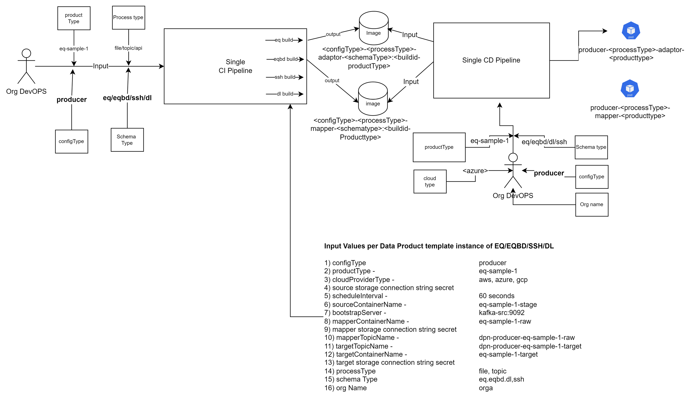
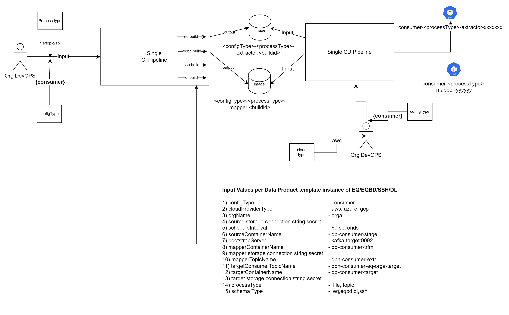
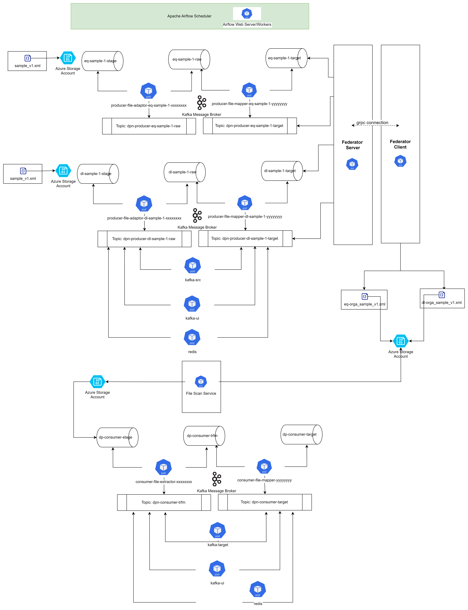

# DPN Data Pipeline Installation Process

---

## Table of Contents

- [Overview](#overview)
- [Step1: Installation Prerequisites](#step1-installation-prerequisites)
  - [Step1a. Clone and Prepare Source Repositories](#step1a-clone-and-prepare-source-repositories)
  - [Step1b. Prepare Infrastructure and Application Prerequisites](#step1b-prepare-infrastructure-and-application-prerequisites)
  - [Step1c. Identify Pipeline Repository Structure](#step1c-identify-pipeline-repository-structure)
  - [Step1d. Configure Environment Approval Gates](#step1d-configure-environment-approval-gates)
- [Step2: Install DPN Data Pipeline](#step2-install-dpn-data-pipeline)
  - [Step2a. Configure Data Pipeline CI Pipeline](#step2a-configure-data-pipeline-ci-pipeline)
  - [Step 2b. Execute Data Pipeline CI Pipeline](#step-2b-execute-data-pipeline-ci-pipeline)
  - [Step2c. Validate Data Pipeline CI Pipeline](#step2c-validate-data-pipeline-ci-pipeline)
  - [Step2d. Configure Data Pipeline CD Pipeline](#step2d-configure-data-pipeline-cd-pipeline)
  - [Step2e. Execute Data Pipeline CD Pipeline](#step2e-execute-data-pipeline-cd-pipeline)
  - [Step2f. Validate Data Pipeline CD Pipeline](#step2f-validate-data-pipeline-cd-pipeline)
- [Step3: (Optional) Deploy the Scheduler Backend Using Apache Airflow](#step3-optional-deploy-the-scheduler-backend-using-apache-airflow)
  - [Step3a. Verify Prerequisites](#step3a-verify-prerequisites)
  - [Step3b. Execute Airflow CD Pipeline](#step3b-execute-airflow-cd-pipeline)
  - [Step3c. Verify CD Pipeline Execution](#step3c-verify-cd-pipeline-execution)
- [Step4: Troubleshooting](#step4-troubleshooting)
  - [CI Pipeline Failure](#ci-pipeline-failure)
  - [Container Image Not Found](#container-image-not-found)
  - [Image Pull Failures](#image-pull-failures)
  - [Data Pipeline Image Tag Malformed](#data-pipeline-image-tag-malformed)
  - [Pods Not Starting](#pods-not-starting)
  - [Data Pipeline Pod Overwritten by Its Sibling Stage](#data-pipeline-pod-overwritten-by-its-sibling-stage)
  - [Container CrashLoopBackOff](#container-crashloopbackoff)
  - [HPA Not Scaling](#hpa-not-scaling)
  - [Kafka Topic Issues](#kafka-topic-issues)
- [Step5: Containerized Deployment Using DSI Provided Container Images](#step5-containerized-deployment-using-dsi-provided-container-images)
  - [Step5a. Configure GHCR Image Access](#step5a-configure-ghcr-image-access)
- [Review Notes](#review-notes)

---

## Overview

This document provides step-by-step instructions for installing and deploying **DPN Data Pipeline component** using **Azure DevOps (ADO) pipelines**.

The deployment uses the following repositories:

- https://github.com/energy-dsi/dpn-data-pipelines.git

The deployment process consists of:

- **Continuous Integration (CI)** — builds container images
- **Continuous Deployment (CD)** — deploys images into **Azure Kubernetes Service (AKS)**

---

## Step1: Installation Prerequisites

The following prerequisites must be completed before beginning the installation process.

### Step1a. Clone and Prepare Source Repositories

Clone the official repositories from GitHub.

```bash
git clone https://github.com/energy-dsi/dpn-data-pipelines.git
```

Switch to the desired branch.

```bash
git checkout main
```

or

```bash
git checkout release/<version>
```

Push the code to the organisation's Azure DevOps repository.

```bash
git remote add ado https://dev.azure.com/<org>/<project>/_git/<repository>
git push -u ado main
```

---

### Step1b. Prepare Infrastructure and Application Prerequisites

Ensure the following prerequisites are completed before deployment:

- AKS cluster provisioned and accessible, with the **metrics-server** running (required for HPA — enabled by default on AKS)
- DPN Streaming Service (Kafka) deployed, with the required topics pre-created (see [DPN Streaming Service (Kafka)](../02-configuration/05-configure-dpn-data-pipelines.md#step9b-configure-streaming-service-kafka) in the Configuration Guide)
- DPN Health Monitoring Service deployed and OTEL collector container is in running state
- Blob/S3 storage containers provisioned for the `file` integration pathway (see [Storage Blob / S3 Configuration](../02-configuration/05-configure-dpn-data-pipelines.md#step9a-storage-blob--s3-configuration))
- Kubernetes secrets provisioned for producer/consumer storage connection strings (see [Secrets Configuration](../02-configuration/05-configure-dpn-data-pipelines.md#step8-configure-secrets))
- Network and firewall rules applied as described in [Network and Ports Configuration](../02-configuration/00-common-dpn-configuration.md#step5-network-and-ports-configuration), including outbound access to `ghcr.io`
- Software prerequisites (Azure DevOps access, GHCR access — see Step 4 below)

[Refer to the **Prerequisites** and **Configuration** documentation for details](../01-prerequisites/01-dpn-prerequisites.md)

---

### Step1c. Identify Pipeline Repository Structure

Each DPN code repository includes the necessary CI and CD pipelines in the following folder structure for reference.

```
Root-Repository/
└── .pipelines/
    └── azure-pipelines/
        ├── ci-pipelines/
        └── cd-pipelines/
```

---

### Step1d. Configure Environment Approval Gates

Before running the CD pipeline against any environment, confirm the corresponding Azure DevOps Environment has its approval check configured.

--

## Step2: Install DPN Data Pipeline

The DPN Data Pipeline is a series of data validation stages processed through the adaptor and mapper components as outlined in the architecture overview above.

The following diagram represents an overview of DPN Producer Data Pipeline CI/CD architecture. 



The following diagram represents an overview of DPN Consumer Data Pipeline CI/CD architecture. 




---

### Step2a. Configure Data Pipeline CI Pipeline

Create a new Azure DevOps Pipeline from the CI pipeline YAML file located at the following path:

```
Root-Repository/
└── .pipelines/
    └── azure-pipelines/
        └── ci-pipelines/
            └── dsi-data-pipelines-ci.yaml
```

---

### Step 2b. Execute Data Pipeline CI Pipeline

The CI pipeline is designed to support both Producer and Consumer configurations. When triggering the pipeline, parameters must be selected carefully, as the required inputs vary depending on the selected configuration type.

##### Common Parameters (Required for Both Producer and Consumer)

- **Pipeline Version** — Select the appropriate branch(e.g. `release`)
- **Environment** — Choose the target environment (e.g. `dev`)
- **Service Connection** — Select the Azure service connection corresponding to the chosen environment

##### Consumer Configuration

When **Config Type = `consumer`** is selected:

- **Process Type** — Not required (selection is ignored by the pipeline)
- **Schema Type** — Not required

The pipeline proceeds with consumer-specific configuration and deployment only.

##### Producer Configuration

When **Config Type = `producer`** is selected:

- **Process Type** — Mandatory. Currently supported value: `file`. (This may be extended in future releases.)
- **Schema Type** — Mandatory. Remove 'Default' before providing currently supported values: `eq`, `dl`, `eqbd`, `ssh`. (This list is extensible in future releases.)
- **Product Type** — Mandatory. Remove 'Default' before providing supoorted values. Must be provided to correctly parameterise the producer pipeline.

Failure to provide Process Type and Schema Type when running the pipeline in producer mode will result in an invalid or incomplete execution.

> **Notes:**
> - The same CI pipeline is used for both producer and consumer, with behaviour controlled entirely by parameter selection.
> - Schema Type and Process Type are validated only when `producer` is selected.
> - Future enhancements may introduce additional schema types and process types without changing the overall pipeline structure.

---

#### Step2c. Validate Data Pipeline CI Pipeline

Verify that image registry has been updated with the expected image tag.

---

#### Step2d. Configure Data Pipeline CD Pipeline

Create a new Azure DevOps Pipeline from the CD pipeline YAML file located at the following path:

```
Root-Repository/
└── .pipelines/
    └── azure-pipelines/
        └── cd-pipelines/
            └── dsi-data-pipelines-cd.yaml
```

> **Notes:**
> - Organisations must determine which data templates they require for processing. The pipelines are designed to be generic, processing a specific type (producer or consumer), integration pathway (file, topic), cloud provider type (Azure, AWS, GCP), and consumer ID.
> - before running this pipeline, confirm the `SCHEDULER_BACKEND` value set on each product's `values.yaml` (`kafka-trigger` for automated, software-triggered scheduling, or `airflow` for orchestrator-driven scheduling

---

#### Step2e. Execute Data Pipeline CD Pipeline

Execute the CD pipeline and verify that the containers are deployed on the Azure Kubernetes platform. There should be the following two containers running per data product file produced, for each template type (`DL`, `EQ`, `EQBD`, or `SSH`) at each integration pathway level on the producer side:

```
producer-{integration type}-adaptor-{data product type}-xxxxxxxx
producer-{integration type}-mapper-{data product type}-yyyyyyyy
```

Similarly, the following containers will be deployed on the consumer side for each data product consumer ID subscribed to a specific data product type:

```
consumer-{integration type}-extractor-{data product type}-{consumer ID}-xxxxxxxx
consumer-{integration type}-mapper-{data product type}-{consumer ID}-xxxxxxxx
```

Example container names post-deployment:

```
producer-file-adaptor-eqbd-xxxxxxxx
producer-file-mapper-eqbd-xxxxxxxx
consumer-file-extractor-xxxxxxxx
consumer-file-mapper-xxxxxxxx
```

The remaining pipeline parameters are same as per CI pipeline run above.
---

#### Step2f. Validate Data Pipeline CD Pipeline

Once a successful deployment has completed, the DPN Kubernetes cluster should show an output similar to the example below. This example uses selective `eq` and `dl` producer sample data products on the producer side, and an organisation receiving two data products using the schema type and organisation name.

```text
- Product type  : eq-sample-1, dl-sample-1
- Schema type   : eq and dl
- Cloud type    : azure
- Process type  : file
```



```bash
kubectl get pods -n <namespace>
```

Verify clean logs inside the container:

```bash
kubectl logs <pod-name> -n <namespace>
```

---

## Step3: (Optional) Deploy the Scheduler Backend Using Apache Airflow

### Step3a. Verify Prerequisites

- Verify the `SCHEDULER_BACKEND` is set as `kafka-trigger` (automated, software-triggered scheduling using Apache Airflow)
- Airflow environment configuration must be made for the deployment environment in the following location.

```
Root-Repository/
└── charts/
    └── airflow/
        ├── values-<env>-dpn01.yaml   <- Environment-specific Airflow overrides
        └── dags/
              └── {product_type}.py   <- One DAG per data product using the airflow backend
```

- Confirm a DAG file exists under `charts/airflow/dags/` for every product using `SCHEDULER_BACKEND: kafka-trigger`

### Step3b. Execute Airflow CD Pipeline

Deploy Airflow using `dpn-data-pipeline-airflow-cd.yaml` pipeline. The CD Pipeline provided needs to be modified in the following places to point to the Organisation's service connection and environment.

| Parameter | Value |
|-----------|-------|
| `ServiceConnection` | `A given Service Connection able to deploy the services` |
| `environment` | `environment abbreviation` |
| `cluster` | `dpn01` (DSI provides two dpn configurations per environment. Organisations may keep only one such as dpn01 to run a single DPN cluser)` |

### Step3c. Verify CD Pipeline Execution

- Verify the webserver, scheduler, triggerer, worker, Postgres, and Redis pods are all `Running`:
  
   ```bash
   kubectl get pods -n <namespace> -l app.kubernetes.io/part-of=airflow
   ```

- Confirm each product's DAG is visible in the Airflow UI/webserver

---

## Step4: Troubleshooting

### CI Pipeline Failure

Possible causes:

- Image Registry Authentication/push failure — verify the CI pipeline's credentials have `write:packages` scope on the image registry

- Missing or incorrect Process Type / Schema Type / Product Type parameters when triggering a producer run (see [Producer Configuration](#producer-configuration))

Verify pipeline logs and ensure all credentials and parameters are correct.

---

### Container Image Not Found

Check whether the CI pipeline pushed the image to correct image repository.

If the expected package/tag is not listed, re-run the relevant CI pipeline and ensure it completes without errors before proceeding to the CD pipeline.

---

### Image Pull Failures

If pods show `ImagePullBackOff` or `ErrImagePull`:

- If the image digest is private, confirm the `imagePullSecrets` referenced by the chart exists in the target namespace and contains a valid, non-expired GitHub PAT with `read:packages`.

- Confirm the AKS node pool has correct access to the image registry to pull the images

- Confirm the image reference (`imageRegistry`/`imageName`/`imageTag`) matches an actual published tag — a typo here produces the same failure as a genuine access issue.

---

### Data Pipeline Image Tag Malformed

If a data pipeline image tag or repository name is missing its schema/product segment (e.g. it ends in a trailing `-` or `:` instead of the expected `<buildId>-<productType>`), the product's `values.yaml` most likely has `productType` and/or `schemaType` left blank.

Check the affected product's `values.yaml` for both the adaptor and schema_mapper charts:

```bash
grep -E "^productType:|^schemaType:" producer/{file|topic}/<product_type>/{adaptor,schema_mapper}/charts/values.yaml
```
---

### Pods Not Starting

Check pod events to identify scheduling or image pull issues:

```bash
kubectl describe pod <pod-name> -n <namespace>
```

Review the `Events` section at the bottom of the output. Common causes include insufficient node resources, missing Persistent Volume Claims, or image pull errors due to incorrect image credentials

---

### Data Pipeline Pod Overwritten by Its Sibling Stage

If only one pod appears for a product where two are expected (adaptor and schema_mapper), check whether both charts' `values.yaml` files use the same final `name`/`imageName`:

```bash
grep -E "^name:|^imageName:" producer/{file|topic}/<product_type>/{adaptor,schema_mapper}/charts/values.yaml
```

If they match, the two Helm releases are colliding on the same Kubernetes resource name and one is overwriting the other. Give the schema_mapper chart a distinct `-mapper`-suffixed `name`/`imageName` and re-run the CD pipeline for that product.

---

### Container CrashLoopBackOff

A `CrashLoopBackOff` status means the container starts, crashes, and Kubernetes repeatedly attempts to restart it. Check the logs to identify the root cause:

```bash
kubectl logs <pod-name> -n <namespace>
```

Common causes:

- Invalid or missing environment variables — check the Helm values file for typographical errors or missing entries
- Missing secrets or incorrect SAS Token for Blob storage — verify all required secrets exist as Kubernetes secrets with the correct names and values
- Kafka topic is not pre-populated — run the Kafka Topic Creator job or manually create topics via the Kafka UI

---

### HPA Not Scaling

If `kubectl get hpa` shows `<unknown>` under `TARGETS`:

- Confirm metrics-server is running: `kubectl get deployment metrics-server -n kube-system`.
- Confirm the affected pods have CPU/memory `requests` set in their Deployment spec — HPA cannot compute a percentage without a request baseline.

If metrics are available but replica count never changes, confirm `hpa.minReplicas`/`hpa.maxReplicas` allow room to scale, and that current load is actually crossing the configured `targetCPUUtilizationPercentage`/`targetMemoryUtilizationPercentage` threshold.

---

### Kafka Topic Issues

Verify Kafka topics using the Kafka UI:

```
http://kafka-ui:8085
```

Check that:

- The topic exists in both the source and destination Kafka clusters
- The topic name in the data pipeline configuration matches exactly (topic names are case-sensitive)
- There are no consumer group errors shown in the Kafka UI for the data pipeline's consumer group(s)
- For the `topic` pathway specifically, `srcGroupId` values are unique per product and free of stray environment/test suffixes

---

## Step5: Containerized Deployment Using DSI Provided Container Images

<<Tamanna to update>>

### Step5a. Configure GHCR Image Access

All custom and third-party images are pulled from `ghcr.io/energy-dsi` — see [Container Image Configuration](../02-configuration/05-configure-dpn-data-pipelines.md) in the Configuration Guide for the full list.

1. Confirm whether the `energy-dsi` GHCR packages required for this deployment are public or private.
2. If private, create an `imagePullSecrets`-referenced Kubernetes secret in the target namespace **before** running the CD pipeline:
   ```bash
   kubectl create secret docker-registry ghcr-pull-secret \
     --docker-server=ghcr.io \
     --docker-username=<github-username-or-bot-account> \
     --docker-password=<GitHub PAT with read:packages scope> \
     -n <namespace>
   ```
3. Ensure the CI pipeline's service connection/credentials have `write:packages` scope if this deployment will also be building and publishing images to GHCR, not just pulling pre-built ones.


## Review Notes

| Review Date | Last Reviewed By | Status | Semver Version (Major.Minor.Patch) |
|-------------|------------------|--------|-------------------------------------|
| 31-July-2026 | DSI Assurance    | Final  | V1.0.0 |
