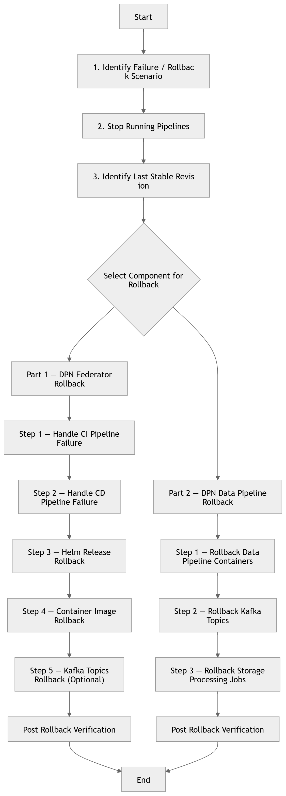

# DPN Rollback and Recovery Process

---

# Table of Contents

- [Overview](#overview)
- [Rollback Strategy](#rollback-strategy)
- [Rollback Scenarios](#rollback-scenarios)
- [Part 1 — DPN Federator Rollback](#part-1--dpn-federator-rollback)
- [Rollback During CI Pipeline Failure](#rollback-during-ci-pipeline-failure)
- [Rollback During CD Pipeline Failure](#rollback-during-cd-pipeline-failure)
- [Helm Release Rollback](#helm-release-rollback)
- [Container Image Rollback](#container-image-rollback)
- [Rollback Kafka Topics (Optional)](#rollback-kafka-topics-optional)
- [Part 2 — DPN Data Pipeline Rollback](#part-2--dpn-data-pipeline-rollback)
- [Rollback Data Pipeline Containers](#rollback-data-pipeline-containers)
- [Rollback Kafka Topics for Data Pipelines](#rollback-kafka-topics-for-data-pipelines)
- [Rollback Storage Processing Jobs](#rollback-storage-processing-jobs)
- [Post Rollback Verification](#post-rollback-verification)
- [Disaster Recovery Considerations](#disaster-recovery-considerations)

---

# Overview

This document describes the rollback and recovery procedures for **DPN deployments** in the event of a failed installation or unsuccessful deployment.

<p align="center">
  
  <br>
  <em>Fig 1: DPN Installation Rollback Flow</em>
</p>


The rollback procedures apply to deployments performed using:

- **Azure DevOps CI/CD pipelines**
- **Azure Container Registry (ACR)**
- **Azure Kubernetes Service (AKS)**
- **Helm based deployments**

The objective of the rollback procedure is to restore the platform to the **last known stable state** with minimal service disruption.

---

# Rollback Strategy

The DPN deployment rollback strategy follows the layered architecture of the deployment:

| Layer | Rollback Method |
|------|----------------|
| CI Pipeline | Re-run pipeline with previous commit or tag |
| Container Registry | Deploy previous container image tag |
| Helm Deployment | Use Helm rollback to previous revision |
| Kubernetes Deployment | Restart or redeploy pods |
| Kafka Topics | Recreate or purge incorrect messages if required |

Rollback operations should always follow this order:

1. Stop failed pipeline execution
2. Identify the last successful deployment revision
3. Roll back Helm release to the previous stable revision
4. Verify container and service status
5. Validate Kafka topics and application logs

---

# Rollback Scenarios

Rollback procedures may be required under the following scenarios:

| Scenario | Description |
|--------|-------------|
| CI Pipeline Failure | Image build failed or artifact corrupted |
| CD Pipeline Failure | Deployment failed during Helm installation |
| Container Startup Failure | Pods crash after deployment |
| Kafka Processing Failure | Topics not created or data pipeline failing |
| Configuration Error | Incorrect secrets, environment variables, or certificates |

---

# PART 1 — DPN Federator Rollback

The Federator deployment includes the following services:

- Zookeeper Source
- Zookeeper Target
- Kafka Source
- Kafka Target
- Kafka UI
- Redis
- Federator Server
- Federator Client

---

# Rollback During CI Pipeline Failure

If the **CI pipeline fails**, no deployment rollback is required because containers are not deployed.

Recommended actions:

1. Review CI pipeline logs in Azure DevOps
2. Fix build or dependency issues
3. Re-run the CI pipeline

Example checks:

```bash
az acr repository list --name <acr-name>
```

Verify if new container images were pushed successfully.

---

# Rollback During CD Pipeline Failure

If the **CD pipeline fails during deployment**, Kubernetes resources may be partially deployed.

Steps:

1. Identify the current Helm release.

```bash
helm list -n <namespace>
```

2. Check Helm revision history.

```bash
helm history dpn-platform -n <namespace>
```

3. Identify the last successful revision.

---

# Helm Release Rollback

Use Helm rollback to restore the previous working version.

```bash
helm rollback dpn-platform <revision-number> -n <namespace>
```

Example:

```bash
helm rollback dpn-platform 2 -n ns-dpn
```

Verify deployment status.

```bash
kubectl get pods -n <namespace>
```

---

# Container Image Rollback

If the failure is caused by a faulty container image:

1. Identify previous image tag in ACR.

```bash
az acr repository show-tags --name <acr-name> --repository dpn-federator
```

2. Update the Helm values file to use the previous tag.

Example:

```yaml
image:
  repository: <acr-url>/dpn-federator
  tag: v1.0.2
```

3. Re-run the CD pipeline.

---

# Rollback Kafka Topics (Optional)

If Kafka topics were incorrectly created or corrupted:

1. Access Kafka UI.

```
http://kafka-ui:8085
```

2. Delete incorrect topics.

3. Recreate topics using the Kafka topic creation pipeline or manually.

---

# PART 2 — DPN Data Pipeline Rollback

The Data Pipeline deployment includes the following components per schema:

- adaptor
- schema-assurance-producer
- security-labels-producer
- schema-assurance-consumer
- extractor-consumer

---

# Rollback Data Pipeline Containers

If a data pipeline container fails:

1. Identify failing pods.

```bash
kubectl get pods -n <namespace>
```

2. Review logs.

```bash
kubectl logs <pod-name> -n <namespace>
```

3. Roll back the Helm deployment or redeploy using the previous container tag.

---

# Rollback Kafka Topics for Data Pipelines

Kafka topics may contain invalid data during a failed pipeline run.

Possible actions:

- Delete invalid messages
- Recreate topic
- Restart consumer pipeline

Kafka UI can be used to verify message flows.

---

# Rollback Storage Processing Jobs

If a file processing job fails:

1. Delete failed Kubernetes job.

```bash
kubectl delete job <job-name> -n <namespace>
```

2. Re-trigger the adaptor CD pipeline.

This will restart the file ingestion process.

---

# Post Rollback Verification

After performing rollback procedures, verify system health.

Check Kubernetes resources.

```bash
kubectl get pods -n <namespace>
```

Check services.

```bash
kubectl get svc -n <namespace>
```

Verify logs.

```bash
kubectl logs <pod-name> -n <namespace>
```

Verify Kafka cluster and topics using Kafka UI.

---

# Disaster Recovery Considerations

For critical deployment failures, the following recovery actions may be required:

- Restore Kubernetes deployment from previous Helm revision
- Rebuild container images from last stable Git commit
- Restore Kafka topics if data corruption occurs
- Restart CI/CD pipelines with corrected configuration

Organizations should maintain:

- versioned Helm charts
- versioned container images
- tagged Git releases

This ensures rollback operations can be performed quickly and safely.

---

# Review Notes

| Review Date | Last Reviewed By | Status | Semver Version (Major.Minor.Patch) |
|-------------|------------------|--------|----------|
| 15-Mar-2026 | DSI Assurance   | Draft  | V0.1.0 |

---