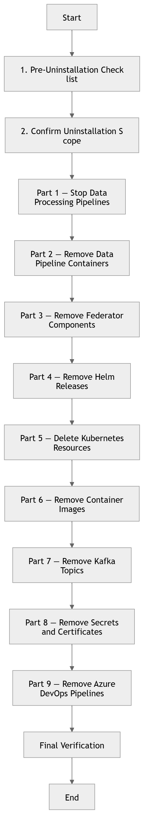

# DPN Uninstallation Process

---

# Table of Contents

- [Overview](#overview)
- [Uninstallation Scope](#uninstallation-scope)
- [Pre-Uninstallation Checklist](#pre-uninstallation-checklist)
- [Part 1 — Stop Data Processing Pipelines](#part-1--stop-data-processing-pipelines)
- [Part 2 — Remove Data Pipeline Containers](#part-2--remove-data-pipeline-containers)
- [Part 3 — Remove Federator Components](#part-3--remove-federator-components)
- [Part 4 — Remove Helm Releases](#part-4--remove-helm-releases)
- [Part 5 — Delete Kubernetes Resources](#part-5--delete-kubernetes-resources)
- [Part 6 — Remove Container Images](#part-6--remove-container-images)
- [Part 7 — Remove Kafka Topics](#part-7--remove-kafka-topics)
- [Part 8 — Remove Secrets and Certificates](#part-8--remove-secrets-and-certificates)
- [Part 9 — Remove Azure DevOps Pipelines](#part-9--remove-azure-devops-pipelines)
- [Final Verification](#final-verification)

---

# Overview

This document describes the procedure for **completely uninstalling the DPN platform** from an organization’s environment.

<p align="center">
  
  <br>
  <em>Fig 1: DPN Un-Installation Process Flow</em>
</p>

The uninstallation process removes the following components:

- DPN Federator services
- Kafka clusters
- Zookeeper services
- Redis service
- Data Pipeline containers
- Kubernetes resources
- Helm releases
- Container images
- Azure DevOps pipelines

The goal of the procedure is to ensure that **all components of the DPN node are safely removed** without leaving orphaned infrastructure resources.

---

# Uninstallation Scope

The following components are removed during this procedure.

| Component | Description |
|----------|-------------|
| Federator Server | Handles outgoing data transmission |
| Federator Client | Handles incoming data reception |
| Kafka Src | Source Kafka cluster |
| Kafka Dest | Target Kafka cluster |
| Zookeeper Src | Zookeeper for source Kafka |
| Zookeeper Dest | Zookeeper for destination Kafka |
| Kafka UI | Kafka management interface |
| Redis | Stores Kafka offsets |
| Data Pipeline Containers | Data transformation pipelines |

---

# Pre-Uninstallation Checklist

Before starting the uninstallation process, confirm the following.

- All data exchanges with partner organizations have been stopped.
- No active files are currently being processed.
- Kafka topics do not contain unprocessed messages.
- Pipeline executions are stopped.
- Necessary backups have been taken if required.

---

# Part 1 — Stop Data Processing Pipelines

Disable all **Azure DevOps pipelines** related to the DPN deployment.

Pipelines to stop include:

- Federator CI pipelines
- Federator CD pipelines
- Data pipeline CI pipelines
- Data pipeline CD pipelines

These pipelines are located in:

```
Root-Repository/
└── .pipelines/
    └── azure-pipelines/
        ├── ci-Pipelines/
        └── cd-Pipelines/
```

Disable pipeline triggers in Azure DevOps to prevent further deployments.

---

# Part 2 — Remove Data Pipeline Containers

Identify running data pipeline containers.

```bash
kubectl get pods -n <namespace>
```

Delete the deployments.

```bash
kubectl delete deployment adaptor -n <namespace>
kubectl delete deployment schema-assurance-producer -n <namespace>
kubectl delete deployment security-labels-producer -n <namespace>
kubectl delete deployment schema-assurance-consumer -n <namespace>
kubectl delete deployment extractor-consumer -n <namespace>
```

Delete Kubernetes jobs.

```bash
kubectl delete job adaptor-job -n <namespace>
```

---

# Part 3 — Remove Federator Components

Delete federator containers.

```bash
kubectl delete deployment federator-server -n <namespace>
kubectl delete deployment federator-client -n <namespace>
```

Delete Redis service.

```bash
kubectl delete deployment redis -n <namespace>
```

Delete Kafka UI.

```bash
kubectl delete deployment kafka-ui -n <namespace>
```

---

# Part 4 — Remove Helm Releases

List Helm releases.

```bash
helm list -n <namespace>
```

Uninstall the Helm release.

```bash
helm uninstall dpn-platform -n <namespace>
```

This removes all Helm-managed Kubernetes resources.

---

# Part 5 — Delete Kubernetes Resources

Delete remaining Kubernetes resources.

Delete services.

```bash
kubectl delete svc --all -n <namespace>
```

Delete persistent resources.

```bash
kubectl delete pvc --all -n <namespace>
```

Delete namespace if no longer required.

```bash
kubectl delete namespace <namespace>
```

---

# Part 6 — Remove Container Images

Remove container images from Azure Container Registry if no longer required.

List repositories.

```bash
az acr repository list --name <acr-name>
```

Delete repository.

```bash
az acr repository delete \
--name <acr-name> \
--repository <image-name>
```

Repeat for:

- federator images
- kafka images
- redis images
- data pipeline images

---

# Part 7 — Remove Kafka Topics

Open Kafka UI.

```
http://kafka-ui:8085
```

Delete topics created for the DPN node.

Typical topic names include:

- dpn-producer-<filetype>-raw
- dpn-producer-<filetype>-valid-schema
- dpn-producer-<filetype>-knowledge
- dpn-consumer-<filetype>-valid-schema
- dpn-consumer-<filetype>-valid-schema-knowledge

---

# Part 8 — Remove Secrets and Certificates

Delete Kubernetes secrets.

```bash
kubectl delete secrets --all -n <namespace>
```

Remove keystore and truststore files.

```
keystore.jks
truststore.jks
```

Remove certificates from secure storage if no longer required.

---

# Part 9 — Remove Azure DevOps Pipelines

Delete Azure DevOps pipelines associated with DPN.

These include:

- Federator CI pipelines
- Federator CD pipelines
- Data pipeline CI pipelines
- Data pipeline CD pipelines

Pipeline definitions are located in:

```
Root-Repository/
└── .pipelines/
    └── azure-pipelines/
```

Pipelines can be removed through the **Azure DevOps pipeline management interface**.

---

# Final Verification

Ensure the following conditions are met.

| Verification | Command |
|-------------|---------|
| No pods running | `kubectl get pods -n <namespace>` |
| No services remaining | `kubectl get svc -n <namespace>` |
| No deployments | `kubectl get deployments -n <namespace>` |
| No Helm releases | `helm list -n <namespace>` |

If all commands return **no resources**, the DPN platform has been successfully removed.

---

# Review Notes

| Review Date | Last Reviewed By | Status | Semver Version (Major.Minor.Patch) |
|-------------|------------------|--------|----------|
| 15-Mar-2026 | DSI Assurance   | Draft  | V0.1.0 |
---