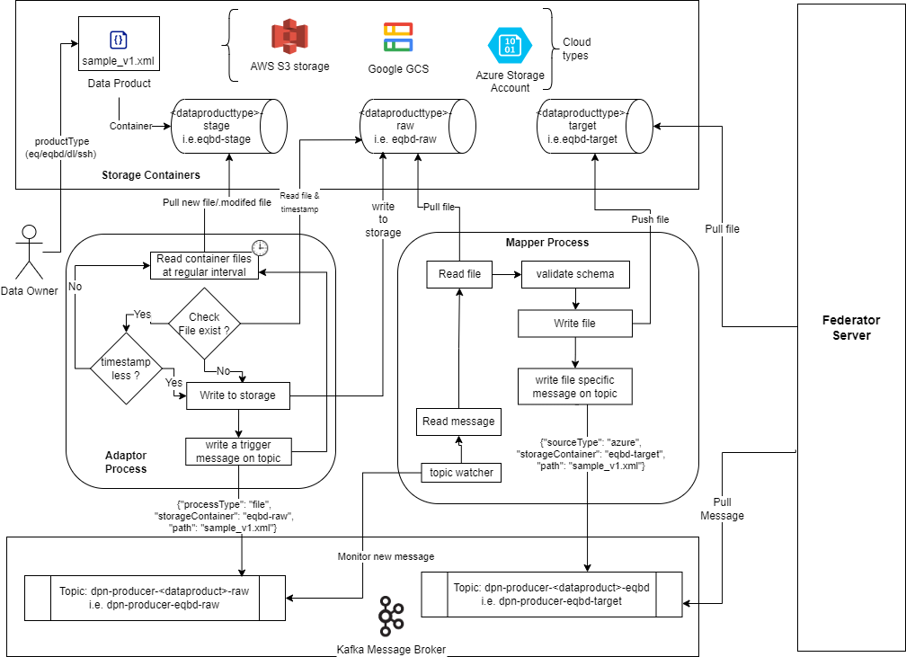
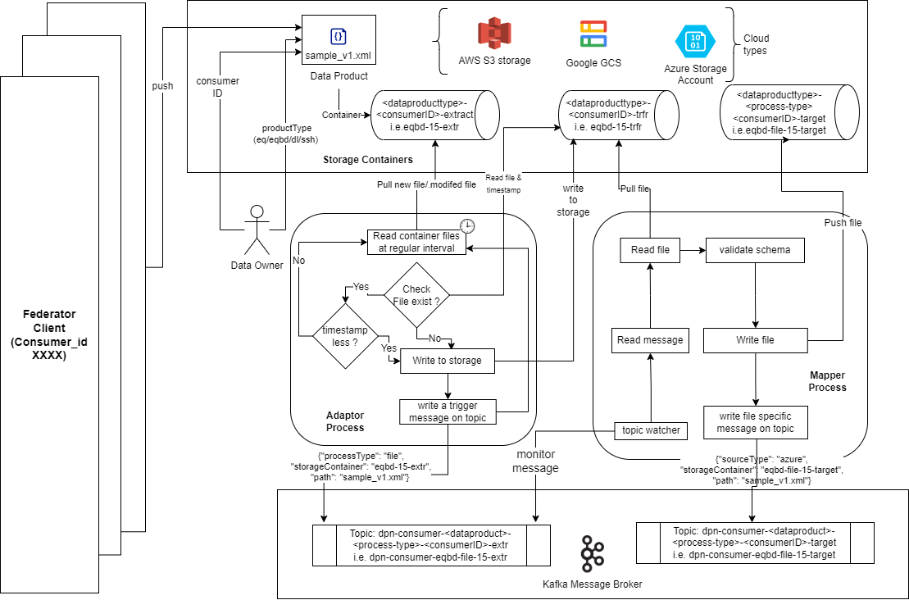

<h1 align='center'>
    <strong> DPN Data Pipelines Architecture </strong>
</h1>

    A collection of data pipelines for the DSI (Data Sharing Infrastructure).

## Overview

Data pipelines are a collection of components that perform a set of operations over a data source with the purpose of transforming it into a desired output.

This repo contains a collection of data pipelines that perform different operations over the data.

### **Background Knowledge**

It's important to take into account that pipelines can be built by using two different components: `data producer` and `data consumer`.

#### **Data Producer**

This component is responsible for the ingestion of data from an external source.The architecture of producer is described below. 

The producer is again divided into two primary sub components.

##### **Adaptor**

This component can be used in a multitude of use cases as long as you duly adapt the code to the specificities of the data source. Up until this point, we've used this component to do a file based transmission to destination and includes the following. 

- Continuously poll for any update or arrival of a new file from a predefined storage location
- Supports Azure, AWS and GCP cloud based containers and buckets to read file from
- Stores the files to a target storage location
- Insert a message in Kafka predefined topic to signal the mapper process

##### **Mapper**

This component is responsible for performing transformations on the data.

The way this component work is by embedding the following capabilities:
- consume data from a specific storage container/bucket;
- perform transformations on the data obtained; 
- sink the transformed data into a specific storage container/bucket.
- Inserts a message in the predefined Kafka Topic so that federator server can identify the specific storage location to pick the file from.

Any transformation can be performed as long as it's encoded in the Python code and duly reflected in a mapping function.

#### **Data Consumer**

This component is responsible for the extraction of data from multiple Organization data pipeline over Federator gateway.The architecture of consumer is described below. 

The consumer is again divided into two primary sub components.

##### **Extractor**

This component can be used in a multitude of use cases as long as you duly adapt the code to the specificities of the data source. Up until this point, we've used this component to do a file based data acquisition from a  source storage location and includes the following. 

- Continuously poll for any update or arrival of a new file from a predefined storage location set for a specific consumer ID/Organization data product subscribed to.
- Supports Azure, AWS and GCP cloud based containers and buckets to read file from
- Stores the files to a target storage location
- Insert a message in Kafka predefined topic to signal the next mapper process.

##### **Mapper**

This component is responsible for performing transformations on the data.

The way this component work is by embedding the following capabilities:
- consume data from a specific storage container/bucket;
- perform transformations on the data obtained; 
- sink the transformed data into a specific storage container/bucket.
- Inserts a message in the predefined Kafka Topic so that successive processing can identify the specific storage location to pick the file from.

Any transformation can be performed as long as it's encoded in the Python code and duly reflected in a mapping function.

#### **Integration with Federator**

The integration with Federator server happens asynchronously over Kafka where the outcome of producer mappers place the relevant file information in the source kafka topic. This topic is preset and registered with management node which the consumer organization able to fetch and request data from. The federator server pulls the information from Kafka topic and establish communication to destination Organization Federator client.

Once the data arrives at the consumer organization, the federator client places the relevant data in a storage container as defined by the specific consumer ID of the data product it is subscribed to. The consumer mappers reads from the predefined kafka topic and pulls the file for further schema validation from the storage location.

The relationship between Federator client to Data Product subscribed is defined by **consumer ID**. When an Organization subscribes for a data product, a new consumer ID is generated and distributed the DPN organization. The Organization should use the consumer ID in the Federator client gateway to pull the specific file from Federator server to client.

Refer the architecture diagram below.  
 

## Project Tree

This project is structured as follows:

- [`/pipelines`](./pipelines): contains pre-configured code both for a GitHub Actions pipeline as well as for an Azure DevOps pipeline;
- [`/producer`](./producer): contains the code as well the configuration files for the deployment of the producer side components, i.e. Adaptor and Mapper;
- [`/consumer`](./consumer): contains the code as well the configuration files for the deployment of the consumer side components.i.e. Extractor and Mapper;  
- [`/blueprints`](./blueprints): contains the blueprints for the multiple components of the pipeline and for every data procuct (i.e. `EquipmentBoundary`, `EquipmentCore`, `DiagramLayout`, and `SteadyStateHypothesis`) at each differnt integration pathways such as file, topic etc.
- [`/tests`](./tests): contains the tests performed on the additional code;
- [`/smoke-test`](./smoke-test): contains the code for the smoke test performed on the pipelines, as well as the data that will be used to test the pipelines. Additionally, it contains the instructions to perform the smoke test;

For more details refer the 03-dpn-application-deployment folder with instruction on installation steps.

---
## Review Notes

| Review Date | Last Reviewed By | Status | Semver Version (Major.Minor.Patch) |
|-------------|------------------|--------|----------|
| 15-Mar-2026 | DSI Assurance   | Draft  | V0.1.0 |

---