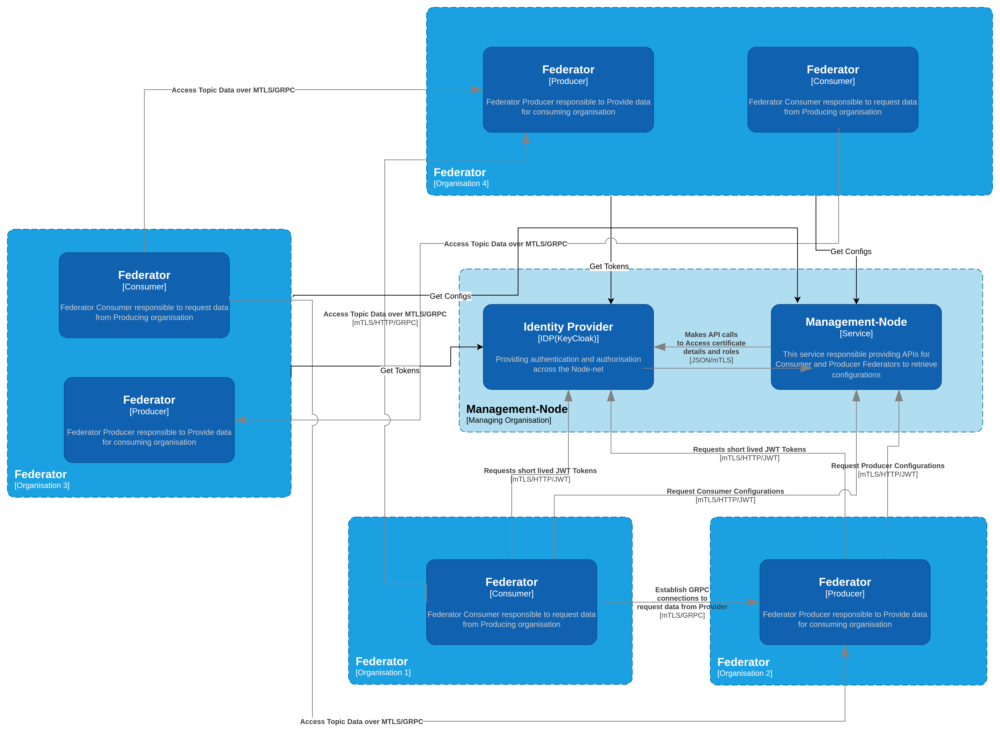
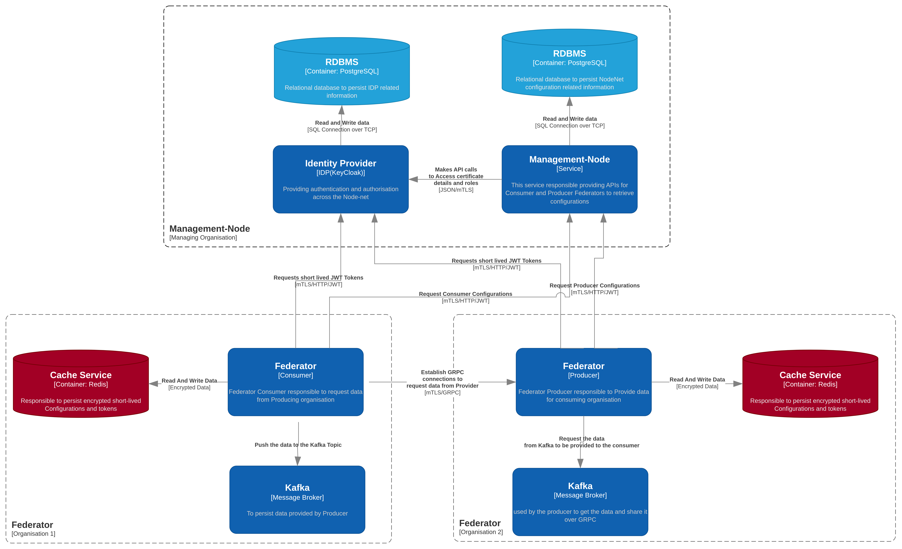

<h1 align='center'>
    <strong> DPN Federator Architecture </strong>
</h1>

    A collection of components and services for communication with other Organizations and DSI Data Sharing Mechanism (DSM).

---
## Overview

DPN Federator component is the communication gateway across Organizations in the Data Sharing Infrastrcture ecosystem.The diagram below shows how the Federator can be used to exchange data between other DPN Nodes that are running within many different organisations.
Each organisation could typically run many servers (producers) and many clients (consumers) to exchange data between their Integration Architecture Nodes.

For example within the above diagram:

- Organisation 2 (Org 2) is shown to be running two servers, with one named "Producer Node A1" that is sending messages to the topic named "DP1"
- Organisation 1 (Org 1) is shown to be running a client called "Consumer Node B2" which is reading the messages from the topic named "DP1"

It should be further noted that this diagram shows that many servers (or producers) and many clients (or consumers) can be configured
within each organisation to exchange data between their Integration Architecture Nodes.

Additional note on connectivity and security:
- Multiple Federator Producers and Consumers can exchange data across organisations using gRPC over mTLS.
- As long as they are configured to talk to the same Management-Node, they will obtain compatible configuration (topics, roles, filters, endpoints) required for their data exchange.
- The Management-Node, together with the Identity Provider, issues the certificates/credentials and tokens that enable mutual TLS and authorisation.
- This means any number of Producers and Consumers can safely share data so long as their exchange requirements are defined in, and served by, the Management-Node.

---
## Exchange data between DPN nodes

The Federator is designed to allow data exchange between DPN Nodes across organizations.  Kafka brokers are used as both a source of data and a target of data that is to be moved between Integration Architecture nodes. It is run in a distributed manner with multiple servers and clients.

A simplistic view of the federator service is described below:

### Server (Producer)

1. A server (producer) reads messages from a knowledge topic within the source Kafka broker.
2. The server is configured so that it has a list of clients and the topics that they are allowed to read the messages from.
3. The server also has a configurable filter that is used to decide if a message should be sent to a client.
4. The server filters the messages based on the security label in the message header.
5. The server streams the selected filtered messages to the client(s) using the gRPC protocol over a network.

### Client (Consumer)

1. A client (consumer) connects and then authenticates with its known server(s) using the gRPC protocol.
2. A client requests the list of topics that it is allowed to read from the server.
3. The client then requests the messages from the server for given topic(s).
4. The client reads the messages and then writes them to a target Kafka broker to a topic name that is prefixed with 'federated'

The underlying communication protocol is [gRPC](https://grpc.io/) which is used to communicate between the server and client at the network level.

---
## Architecture

### Federator Server (Producer)

This app starts the data federation server that starts a gRPC service.

This process contains the federator service supplying two RPC endpoints that are called by the client:

- Get Kafka Topics (obtain topics)
- Get kafka Consumer (consume topic)

#### Obtain Topics

1. Is passed a user request (a client-id and key)
2. Authenticate the given credentials
3. Returns the topics that have been assigned to the given user.

#### Consume Topic

1. Is passed a topic request (client-id, key, topic & offset)
2. Validates the given details.
3. Creates a message conductor to process the topic.
4. Consumes and returns messages until stopped.

### Federator Client (Consumer)

A somewhat simple app it does the following:

1. Obtains topic(s) from the Server
2. Checks with Redis to see what the offset is for given topic
3. Obtain kafka consumer from the Server
4. Process messages from consumer, adding to destination topic and update Redis offset count.
5. Continue (4) until stopped.
   If configured, it will repeat 1-5 upon failures

Please refer to this context diagram as an overview of the federator service and its components:

This diagram illustrates the main components involved in a typical deployment:
- Federator Producer and Federator Consumer communicating over gRPC (mTLS).
- Kafka clusters used by producers and consumers.
- Redis cache used for short‑lived configuration and offsets/tokens.
- Management-Node service that provides configuration to Federators.
- Identity Provider (e.g., Keycloak) used for authentication and authorisation.
- Postgres databases used by the Management-Node and Identity Provider.

---
## Review Notes

| Review Date | Last Reviewed By | Status | Semver Version (Major.Minor.Patch) |
|-------------|------------------|--------|----------|
| 15-Mar-2026 | DSI Assurance   | Draft  | V0.1.0 |

---