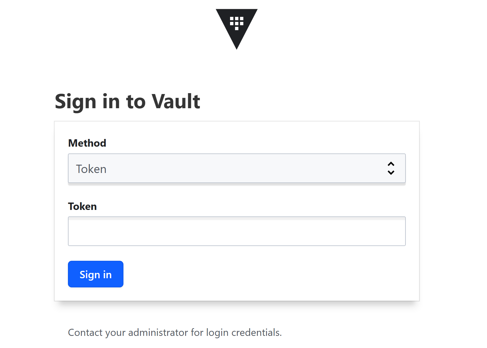
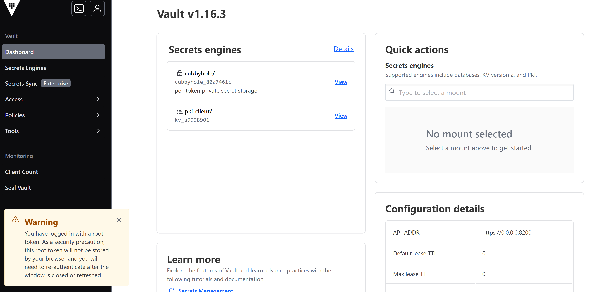
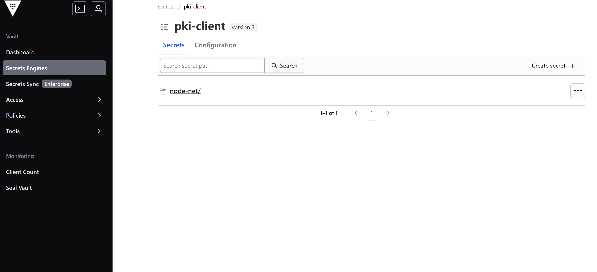
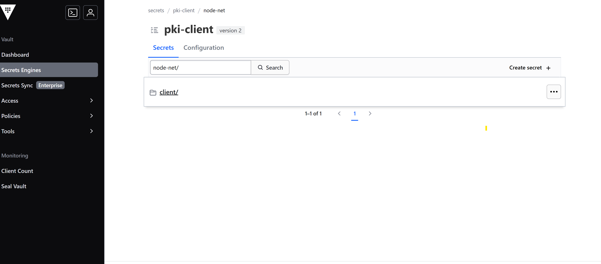
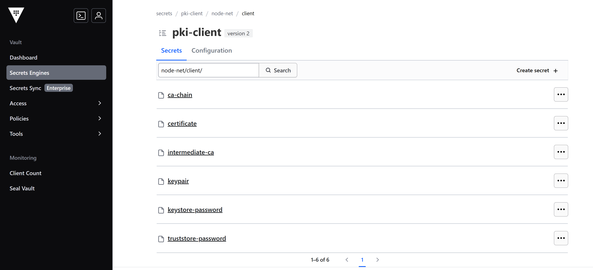
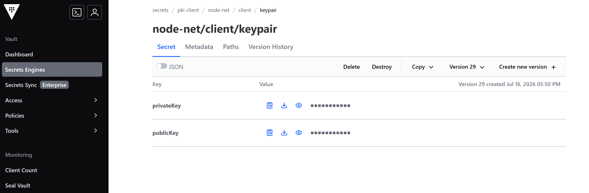
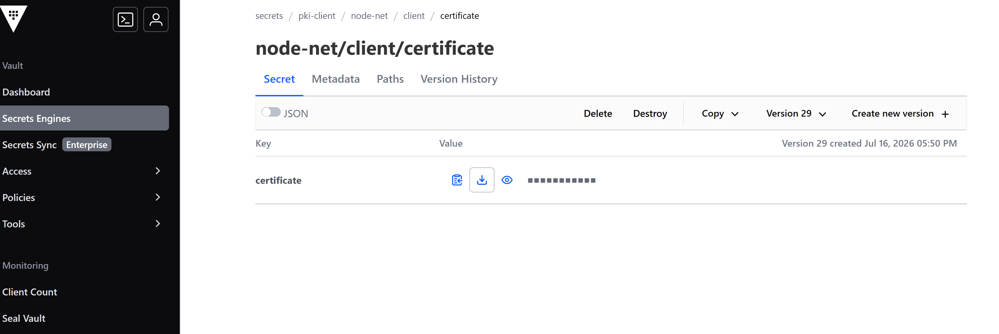
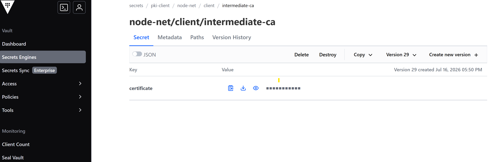
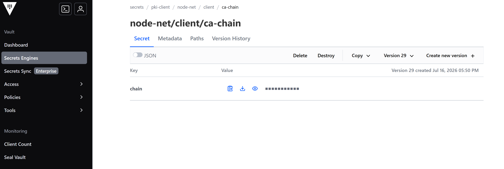

# DPN Vault Service User Interface Guide

This section represents the user interfaces of Hashicorp Vault service to refer for certificate management

---

## Table of Contents

- [Overview](#overview)
  - [Step 1 — Sign in to Vault](#step-1--sign-in-to-vault)
  - [Step 2 — Land on the Dashboard](#step-2--land-on-the-dashboard)
  - [Step 3 — Open the pki-client Secrets Engine](#step-3--open-the-pki-client-secrets-engine)
  - [Step 4 — Open the node-net Folder](#step-4--open-the-node-net-folder)
  - [Step 5 — Inside node-net/client/](#step-5--inside-node-netclient)
  - [Step 6 — Retrieve the Keypair](#step-6--retrieve-the-keypair)
  - [Step 7 — Retrieve the Certificate](#step-7--retrieve-the-certificate)
  - [Step 8 — Retrieve the Intermediate CA](#step-8--retrieve-the-intermediate-ca)
  - [Step 9 — Retrieve the CA Chain](#step-9--retrieve-the-ca-chain)
  - [Getting the value out](#getting-the-value-out)
  - [Quick reference](#quick-reference)
- [Review Notes](#review-notes)

---

## Overview

This user guide section shows how to operate with Vault web UI to reach the `node-net` client certificate material — the private/public key pair, the leaf certificate, the intermediate CA certificate, and the CA chain — stored under the `pki-client` KV v2 engine.


### Step 1 — Sign in to Vault

Open the Vault UI in your browser. Leave the **Method** dropdown set to **Token**, paste your Vault token into the **Token** field, and click **Sign in**.



The Vault UI operates on kubernetes internal cluster dns. This is accessible from a virtual machine inside the private network where Vault is deployed

```text
https://`<vault load balancer IP address>`.ns-dpn-01.svc.cluster.local:8200
```

---

### Step 2 — Land on the Dashboard

After signing in you land on the Vault dashboard. The **Secrets engines** panel lists every engine mounted on this Vault server. The one you need is **pki-client** — click it (or use **Secrets Engines** in the left sidebar).



### Step 3 — Open the pki-client Secrets Engine

Clicking **pki-client** opens its secret list. Inside it there is a single top-level folder: **node-net**. Click **node-net/** to go deeper.



### Step 4 — Open the node-net Folder

Inside **node-net** there is one folder: **client/**. That folder holds every certificate-related secret for this client.



### Step 5 — Inside node-net/client/

The **client/** folder contains four secrets. Open each one the same way — click its name from the list — and each shows a Key/Value table on its **Secret** tab:

- **keypair** — holds `privateKey` and `publicKey`
- **certificate** — holds the client's leaf certificate
- **intermediate-ca** — holds the intermediate CA certificate
- **ca-chain** — holds the full trust chain



### Step 6 — Retrieve the Keypair

Path: `pki-client/node-net/client/keypair`



### Step 7 — Retrieve the Certificate

Path: `pki-client/node-net/client/certificate`



### Step 8 — Retrieve the Intermediate CA

Path: `pki-client/node-net/client/intermediate-ca`



### Step 9 — Retrieve the CA Chain

Path: `pki-client/node-net/client/ca-chain`




### Getting the value out

On every **Secret** tab, each row has three icons next to the masked value:

- **Clipboard** — copies the value straight to your clipboard.
- **Download** — downloads the value as a file.
- **Eye** — reveals (unmasks) the value on-screen without copying or downloading.

Toggling **JSON** (top-left of the table) switches the same data to a raw JSON view, useful when you need to copy several fields at once.

### Quick reference

| Secret | Key(s) | Full path |
|--------|--------|-----------|
| keypair | `privateKey`, `publicKey` | `pki-client/node-net/client/keypair` |
| certificate | `certificate` | `pki-client/node-net/client/certificate` |
| intermediate-ca | `certificate` | `pki-client/node-net/client/intermediate-ca` |
| ca-chain | `chain` | `pki-client/node-net/client/ca-chain` |

---

## Review Notes

| Review Date | Last Reviewed By | Status | Version |
|-------------|-----------------|--------|---------|
| 31-July-2026 | DSI Assurance | Final | V1.0.0 |