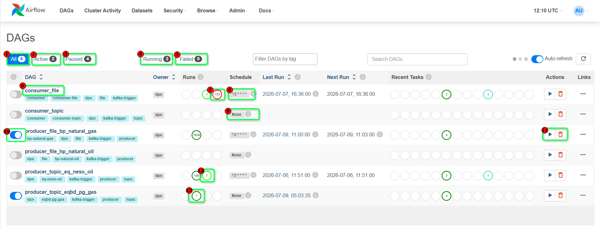
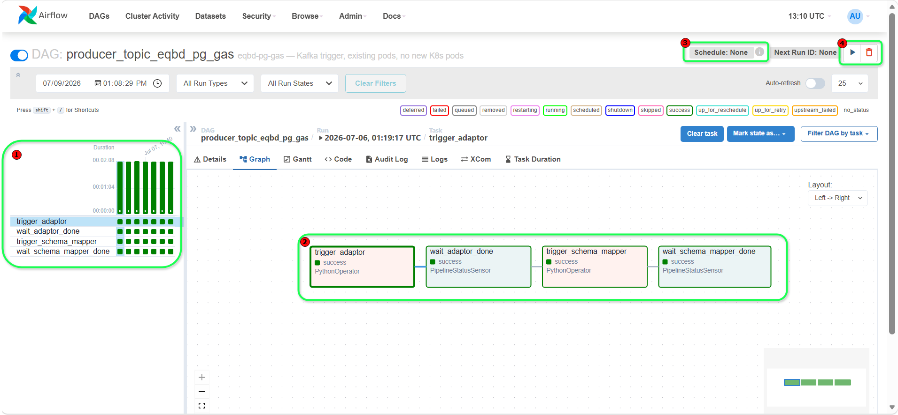
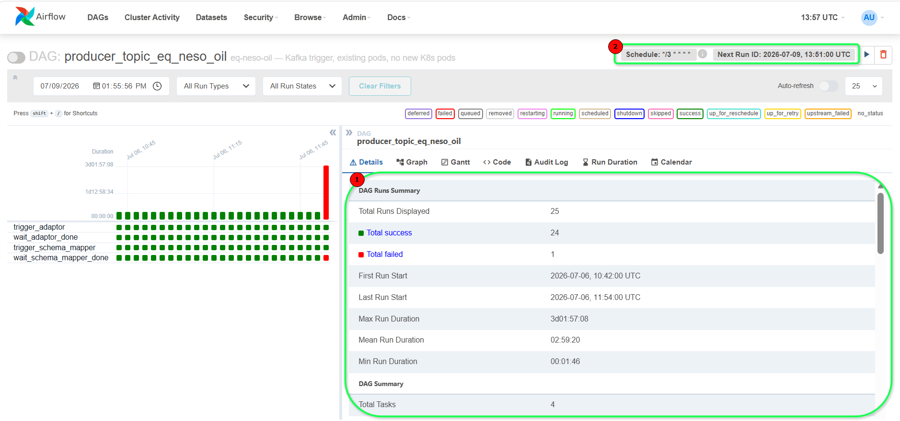

# Apache Airflow User Interface Guidance for DPN Pipelines

## Table of Contents

- [Purpose](#purpose)
- [Figure 1: Airflow Home Screen](#figure-1-airflow-home-screen)
  - [Purpose](#purpose-1)
  - [Figure 1 - Point 1: All DAGs](#figure-1---point-1-all-dags)
  - [Figure 1 - Point 2: Active DAGs](#figure-1---point-2-active-dags)
  - [Figure 1 - Point 3: Paused DAGs](#figure-1---point-3-paused-dags)
  - [Figure 1 - Point 4: Running DAGs](#figure-1---point-4-running-dags)
  - [Figure 1 - Point 5: Failed DAGs](#figure-1---point-5-failed-dags)
  - [Figure 1 - Point 6: DAG Name](#figure-1---point-6-dag-name)
  - [Figure 1 - Point 7: DAG Run Statistics](#figure-1---point-7-dag-run-statistics)
  - [Figure 1 - Point 8: Schedule Configuration](#figure-1---point-8-schedule-configuration)
  - [Figure 1 - Point 9: No Schedule Defined](#figure-1---point-9-no-schedule-defined)
  - [Figure 1 - Point 10: Pause / Unpause Toggle](#figure-1---point-10-pause--unpause-toggle)
  - [Figure 1 - Point 11: DAG Actions](#figure-1---point-11-dag-actions)
  - [Figure 1 - Point 12: Latest Run Indicator](#figure-1---point-12-latest-run-indicator)
  - [Figure 1 - Point 13: Run Count Indicator](#figure-1---point-13-run-count-indicator)
  - [Additional Information Visible in the Airflow Home Screen](#additional-information-visible-in-the-airflow-home-screen)
    - [Owner](#owner)
    - [Last Run](#last-run)
    - [Next Run](#next-run)
    - [Recent Tasks](#recent-tasks)
    - [Tags](#tags)
- [Figure 2: Airflow DAG Graph](#figure-2-airflow-dag-graph)
  - [Purpose](#purpose-2)
  - [How the DPN Producer Pipeline Works](#how-the-dpn-producer-pipeline-works)
  - [Figure 2 - Point 1: Task Instance History and Status Panel](#figure-2---point-1-task-instance-history-and-status-panel)
  - [Figure 2 - Point 2: DAG Workflow Graph](#figure-2---point-2-dag-workflow-graph)
  - [Figure 2 - Point 3: Schedule Information and Next Run Status](#figure-2---point-3-schedule-information-and-next-run-status)
  - [Figure 2 - Point 4: DAG Control Actions](#figure-2---point-4-dag-control-actions)
- [Figure 3: Airflow DAG Details View](#figure-3-airflow-dag-details-view)
  - [Purpose](#purpose-3)
  - [Figure 3 - Point 1: DAG Run Summary](#figure-3---point-1-dag-run-summary)
- [Troubleshooting Workflow](#troubleshooting-workflow)
  - [Step 1: Verify DAG Availability](#step-1-verify-dag-availability)
  - [Step 2: Verify Workflow Execution](#step-2-verify-workflow-execution)
  - [Step 3: Verify DAG Statistics](#step-3-verify-dag-statistics)
  - [Step 4: Review Task Execution](#step-4-review-task-execution)
- [Quick Validation Checklist](#quick-validation-checklist)
- [Review Notes](#review-notes)

---

## Purpose

This playbook explains how to use Apache Airflow to:

- Monitor pipeline execution
- Verify DAG execution status
- Review workflow dependencies
- Monitor Producer and Consumer pipelines
- Troubleshoot failed executions
- Analyse run history and performance metrics
- Manage DAG execution and scheduling

In addition to explaining Airflow UI usage, this document provides high-level context on how DPN pipelines are orchestrated within Airflow.

---

# Figure 1: Airflow Home Screen



## Purpose

This screen provides a consolidated view of all configured DAGs and their operational status.

Use this screen to:

- View all available DAGs
- Monitor workflow status
- Review execution statistics
- Verify scheduling configuration
- Trigger DAG executions
- Identify failed workflows

---

## Figure 1 - Point 1: All DAGs

### What Is It?

Displays the total number of DAGs available within the Airflow environment.

**Current Value:** `6`

### Airflow Usage

Use this section to:

- Verify DAG deployment
- Confirm DAG availability
- Validate workflow registration

### Verification

Expected:

- All required DAGs are visible
- DAG count matches deployed workflows

---

## Figure 1 - Point 2: Active DAGs

### What Is It?

Displays the number of DAGs that are currently enabled and available for scheduling.

**Current Value:** `2`

### Airflow Usage

Use this section to:

- Verify active workflows
- Confirm scheduler availability
- Validate enabled DAG configurations

### Verification

Expected:

- Active DAG count reflects operational workflows
- Required DAGs are enabled

---

## Figure 1 - Point 3: Paused DAGs

### What Is It?

Displays the number of DAGs that are currently paused.

**Current Value:** `4`

### Airflow Usage

Use this section to:

- Identify disabled workflows
- Review workflow availability

### Verification

Expected:

- Paused DAGs align with operational requirements

---

## Figure 1 - Point 4: Running DAGs

### What Is It?

Displays the number of DAGs with active running executions.

**Current Value:** `2`

### Airflow Usage

Use this section to:

- Monitor active executions
- Validate scheduler activity

### Verification

Expected:

- Running DAG count reflects current execution activity

---

## Figure 1 - Point 5: Failed DAGs

### What Is It?

Displays the number of DAGs with failed executions.

**Current Value:** `0`

### Airflow Usage

Use this section to:

- Identify workflow failures
- Monitor workflow health

### Verification

Expected:

- Failed DAG count is reviewed regularly
- Failed workflows are investigated

---

## Figure 1 - Point 6: DAG Name

Example:

```text
consumer_file
```

### What Is It?

Identifies a workflow configured within Airflow.

Selecting the DAG name opens additional workflow details and monitoring information.

### Airflow Usage

Use this section to:

- Open DAG details
- Review execution status
- Analyse workflow history

### Verification

Expected:

- DAG information is accessible
- Workflow details are displayed

---

## Figure 1 - Point 7: DAG Run Statistics

### What Is It?

Displays execution-related metrics associated with the DAG.

Example Value:

```text
153
```

### Airflow Usage

Use this section to:

- Review execution frequency
- Monitor workflow activity
- Analyse historical runs

### Verification

Expected:

- Run statistics are populated
- Values align with execution history

---

## Figure 1 - Point 8: Schedule Configuration

### What Is It?

Displays the configured DAG scheduling settings.

### Airflow Usage

Use this section to:

- Verify scheduling configuration
- Confirm execution frequency

### Verification

Expected:

- Schedule reflects the intended execution pattern

---

## Figure 1 - Point 9: No Schedule Defined

Example:

```text
None
```

### What Is It?

Indicates that the DAG is not scheduled for automatic execution.

### Airflow Usage

Use this section to:

- Identify manually triggered workflows
- Verify event-driven workflows

### Verification

Expected:

- DAG execution method aligns with operational requirements

---

## Figure 1 - Point 10: Pause / Unpause Toggle

### What Is It?

Controls whether the scheduler can execute the DAG.

### Airflow Usage

Use this section to:

- Enable DAG execution
- Pause workflows during maintenance
- Prevent automatic scheduling

### Verification

Expected:

- Blue indicates enabled
- Grey indicates paused

---

## Figure 1 - Point 11: DAG Actions

### What Is It?

Provides operational management actions for the DAG.

Available actions may include:

- Trigger DAG Run
- Delete DAG

### Airflow Usage

Use this section to:

- Execute workflows
- Perform operational management activities

### Verification

Expected:

- Actions are available according to assigned permissions

---

## Figure 1 - Point 12: Latest Run Indicator

### What Is It?

Displays the execution status of the most recent DAG run.

### Airflow Usage

Use this section to:

- Verify workflow success
- Identify failed executions

### Verification

Expected:

- Green indicates successful completion
- Failed executions are investigated

---

## Figure 1 - Point 13: Run Count Indicator

Example:

```text
7
```

### What Is It?

Displays additional run metrics associated with the DAG.

### Airflow Usage

Use this section to:

- Review execution activity
- Monitor workflow usage

### Verification

Expected:

- Run count aligns with execution history

---

## Additional Information Visible in the Airflow Home Screen

### Owner

Displays the owner associated with the DAG.

Example:

```text
dpn
```

### Last Run

Displays the timestamp of the most recent execution.

### Next Run

Displays the next scheduled execution time.

### Recent Tasks

Provides a visual summary of recent task status.

- Green = Success
- Red = Failed
- Blue/Cyan = Running or Queued
- Grey = No Recent Activity

### Tags

Used for workflow classification and filtering.

Examples:

- consumer
- producer
- file
- topic
- kafka-trigger
- dpn

---

# Figure 2: Airflow DAG Graph



## Purpose

This screen provides a visual representation of workflow execution, task dependencies, and DAG orchestration.

Use this screen to:

- Monitor task execution
- Review workflow dependencies
- Troubleshoot failed tasks
- Analyse DAG behaviour
- Review execution order

---

## How the DPN Producer Pipeline Works

```text
trigger_adaptor
        │
        ▼
wait_adaptor_done
        │
        ▼
trigger_schema_mapper
        │
        ▼
wait_schema_mapper_done
```

### Pipeline Execution

1. Airflow executes the `trigger_adaptor` task.
2. A control message is sent to `dpn-pipeline-control`.
3. The adaptor process begins execution.
4. Airflow executes `wait_adaptor_done`.
5. The sensor waits for a status message from `dpn-pipeline-status`.
6. After successful completion, Airflow executes `trigger_schema_mapper`.
7. A control message is sent to `dpn-pipeline-control`.
8. The Schema Mapper begins execution.
9. Airflow executes `wait_schema_mapper_done`.
10. The sensor waits for a completion status from `dpn-pipeline-status`.
11. Airflow updates the DAG execution result.

---

## Figure 2 - Point 1: Task Instance History and Status Panel

### What Is It?

Displays historical execution status and runtime trends for tasks within the DAG.

### Airflow Usage

Use this section to:

- Review historical executions
- Identify failed tasks
- Analyse runtime performance

### Verification

Expected:

- Task history is visible
- Status information is populated
- Runtime metrics are available

---

## Figure 2 - Point 2: DAG Workflow Graph

### What Is It?

Displays the task execution flow and dependencies within the DAG.

### Airflow Usage

Use this section to:

- Review execution order
- Verify task dependencies
- Monitor workflow progress

### Verification

Expected:

- Workflow structure is displayed
- Task dependencies are visible
- Task status is correctly represented

---

## Figure 2 - Point 3: Schedule Information and Next Run Status

### What Is It?

Displays DAG scheduling and upcoming execution information.

### Airflow Usage

Use this section to:

- Verify scheduling configuration
- Review next planned execution

### Verification

Expected:

- Schedule information is populated
- Next run information is available when applicable

---

## Figure 2 - Point 4: DAG Control Actions

### What Is It?

Provides operational controls for DAG execution and management.

### Airflow Usage

Use this section to:

- Trigger DAG execution
- Manage DAG lifecycle

### Verification

Expected:

- Actions are available
- User permissions allow execution where appropriate

---

# Figure 3: Airflow DAG Details View



## Purpose

This screen provides execution statistics, scheduling information, and performance metrics for DAG runs.

Use this screen to:

- Monitor workflow reliability
- Analyse execution history
- Identify performance issues
- Review operational metrics

---

## Figure 3 - Point 1: DAG Run Summary

### What Is It?

Provides aggregated execution statistics for recent DAG runs.

### Airflow Usage

Use this section to:

- Review success rates
- Monitor failures
- Analyse runtime performance
- Assess workflow health

### Verification

Expected:

- Run statistics are populated
- Success and failure counts are displayed
- Runtime metrics are available

---

# Troubleshooting Workflow

## Step 1: Verify DAG Availability

Open:

**Figure 1 – Airflow Home Screen**

Check:

- DAG exists
- DAG enabled
- Scheduler operational

---

## Step 2: Verify Workflow Execution

Open:

**Figure 2 – Airflow DAG Graph**

Check:

- Workflow execution flow
- Task status
- Failed tasks
- Dependency validation

---

## Step 3: Verify DAG Statistics

Open:

**Figure 3 – Airflow DAG Details View**

Check:

- Success count
- Failure count
- Runtime metrics
- Execution history

---

## Step 4: Review Task Execution

Open:

**Figure 2 – Airflow DAG Graph**

Check:

- Current task status
- Sensor execution
- Workflow progression

---

# Quick Validation Checklist

- [ ] Airflow is accessible
- [ ] DAG is visible
- [ ] DAG is enabled
- [ ] Schedule configuration is correct
- [ ] DAG execution exists
- [ ] Task execution completed successfully
- [ ] No failed workflow exists
- [ ] Runtime information is available
- [ ] DAG statistics are populated
- [ ] Workflow completed successfully

---

# Review Notes

| Review Date | Last Reviewed By | Status | Version |
|-------------|-----------------|--------|---------|
| 31-July-2026 | DSI Assurance | Final | V1.0.0 |
