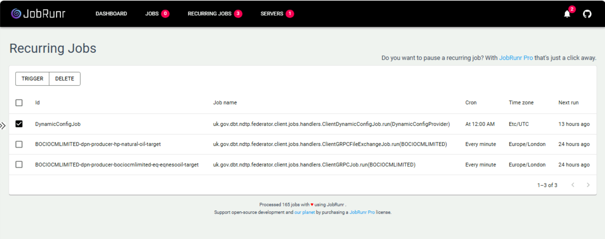
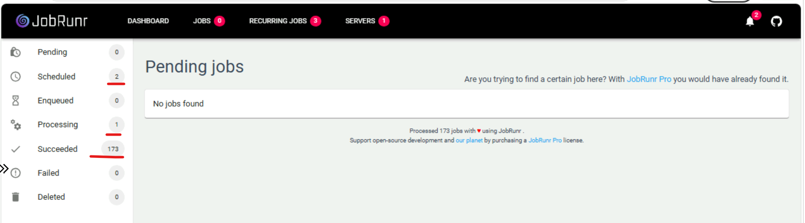
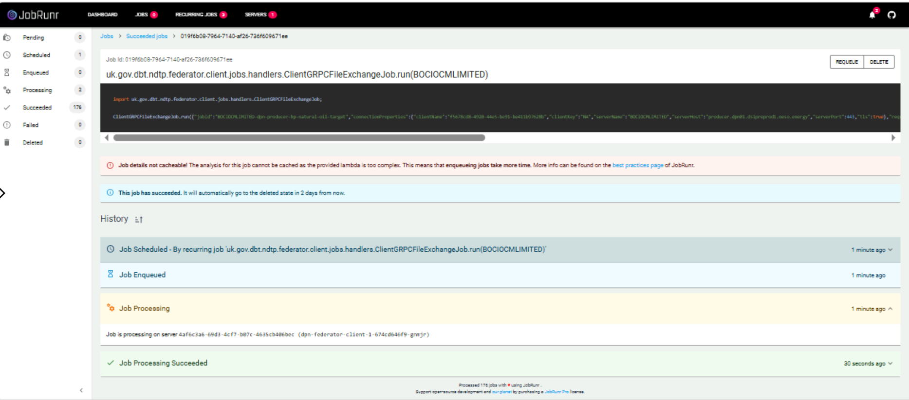

# Federator Client — JobRunr Dashboard User Guide

> **Audience:** Data team and operations members using the JobRunr dashboard to monitor, trigger, and troubleshoot Federator Client consumer jobs.

---

## Table of Contents

1. [What is JobRunr?](#1-what-is-jobrunr)
2. [JobRunr in the DPN Project](#2-jobrunr-in-the-dpn-project)
    - [How the jobs get there](#how-the-jobs-get-there)
    - [Simple flow](#simple-flow)
3. [Accessing the Dashboard](#3-accessing-the-dashboard)
4. [Recurring Jobs Page](#4-recurring-jobs-page)
    - [The Three Job Types](#the-three-job-types)
    - [Triggering a Job On Demand](#triggering-a-job-on-demand)
    - [Reloading Job Configuration from the Management Node](#reloading-job-configuration-from-the-management-node)
    - [Deleting a Job from In-Memory](#deleting-a-job-from-in-memory)
5. [Jobs Page — Job States](#5-jobs-page--job-states)
6. [Job Detail View — Run History and Failure Analysis](#6-job-detail-view--run-history-and-failure-analysis)
7. [Servers Page](#7-servers-page)
8. [Troubleshooting Common Scenarios](#8-troubleshooting-common-scenarios)
9. [Review Notes](#review-notes)

---

## 1. What is JobRunr?

**JobRunr** is an open-source background job scheduling library for Java. It allows an application to enqueue, schedule, and process background jobs (fire-and-forget, delayed, or recurring) using plain Java lambdas, and it persists job state so that jobs survive application restarts and can be distributed across multiple server instances.

JobRunr ships with a built-in **web dashboard** that provides:

- A live view of all **recurring jobs** and their cron schedules.
- A state-by-state breakdown of every job instance (**Scheduled → Enqueued → Processing → Succeeded / Failed**).
- The full **run history** of each job, including which server processed it and, for failures, the complete **stack trace**.
- Controls to **trigger** or **delete** jobs directly from the browser.

No separate installation is required — the dashboard is embedded in the application that hosts JobRunr.

---

## 2. JobRunr in the DPN Project

The **Federator Client** application ships the JobRunr dashboard **out of the box**. It is the operational window into the consumer-side jobs that pull data from a remote Federator Server into the local DPN.

The dashboard gives the team a single place to:

- **View the current list of consumer jobs** together with their cron schedules, time zones, and last/next run times.
- **Trigger jobs on demand** — both the **streaming** job (`ClientGRPCJob`) and the **file transfer** job (`ClientGRPCFileExchangeJob`) — without waiting for the next scheduled run.
- **Reload the job configuration from the Management Node** by triggering the `DynamicConfigJob`, so that newly granted or revoked data shares take effect immediately.
- **Delete jobs from in-memory** storage when a job definition is stale or no longer required.
- **Analyse the run history** of every job execution and inspect the **stack trace of any failed run**.

### How the jobs get there

On start-up (and on every `DynamicConfigJob` run), the Federator Client contacts the **DSI DSM Management Node** (`management_node_base_url` in the Helm values), retrieves the data-share configuration granted to this client, and registers one recurring job per producer/target combination. The job IDs are therefore derived from the producer organisation and target, for example:

```
BOCIOCMLIMITED-dpn-producer-hp-natural-oil-target
BOCIOCMLIMITED-dpn-producer-bociocmlimited-eq-eqnesooil-target
```

### Simple flow

```
Management Node (DSM)
        │  data-share configuration
        ▼
DynamicConfigJob  (daily, or triggered on demand)
        │  registers / refreshes recurring jobs in-memory
        ▼
ClientGRPCJob            — streaming data  ──►  Kafka Target topic
ClientGRPCFileExchangeJob — file transfer  ──►  Client storage account
        │
        ▼
JobRunr Dashboard — schedules, states, history, stack traces
```

---

## 3. Accessing the Dashboard

The JobRunr dashboard is served by the Federator Client on **port 8085**.

Open a browser and navigate to:

```
http://<federator-client-host>:8085/dashboard
```

> **Note:** The dashboard is served over plain HTTP on an internal address. Access is expected to be restricted to the internal network / VPN — do not expose this port publicly.

The top navigation bar shows four pages:

| Page | Purpose |
|---|---|
| **Dashboard** | Overview graphs: jobs processed over time, estimated processing time |
| **Jobs** | Job instances grouped by state (Scheduled, Enqueued, Processing, Succeeded, Failed, Deleted) |
| **Recurring Jobs** | The registered consumer jobs with their cron schedules — the main operational page |
| **Servers** | The background job server instance(s) processing the jobs |

---

## 4. Recurring Jobs Page



This page lists every recurring job currently registered **in-memory** by the Federator Client. For each job you can see:

| Column | Meaning |
|---|---|
| **Id** | Unique job identifier. For data-share jobs this encodes the producer organisation and target (e.g. `BOCIOCMLIMITED-dpn-producer-hp-natural-oil-target`) |
| **Job name** | The fully qualified handler method that runs, e.g. `uk.gov.dbt.ndtp.federator.client.jobs.handlers.ClientGRPCJob.run(BOCIOCMLIMITED)` |
| **Cron** | The schedule, e.g. `Every minute` or `At 12:00 AM` |
| **Time zone** | Time zone the cron expression is evaluated in (e.g. `Europe/London`, `Etc/UTC`) |
| **Next run** | When the job will next fire (or how long ago the schedule last applied) |

### The Three Job Types

| Job | Handler | Typical schedule | What it does |
|---|---|---|---|
| **Dynamic configuration reload** | `ClientDynamicConfigJob.run(DynamicConfigProvider)` | Daily at 12:00 AM (UTC) | Contacts the Management Node, pulls the latest data-share configuration, and registers/refreshes the consumer jobs below |
| **Streaming (gRPC)** | `ClientGRPCJob.run(<PRODUCER>)` | Every minute | Connects to the remote Federator Server over gRPC/mTLS and streams topic data into the local Kafka target topic |
| **File transfer (gRPC)** | `ClientGRPCFileExchangeJob.run(<PRODUCER>)` | Every minute | Connects to the remote Federator Server and transfers files into the Client's storage account |

### Triggering a Job On Demand

You do not need to wait for the next scheduled run — any job can be fired immediately:

1. Tick the **checkbox** on the left of the job row (multiple jobs can be selected at once).
2. Click **TRIGGER** at the top of the table.
3. The job is enqueued straight away. Follow its progress on the **Jobs** page (it moves through *Enqueued → Processing → Succeeded/Failed*).

Typical reasons to trigger on demand:

- Re-run a **file transfer** or **streaming** pull immediately after fixing an upstream issue.
- Verify end-to-end connectivity to the remote Federator Server after a certificate rotation or deployment.

### Reloading Job Configuration from the Management Node

The **`DynamicConfigJob`** runs automatically once a day, but when a data share has just been granted, changed, or revoked in the Management Node, trigger it manually:

1. Select the **`DynamicConfigJob`** row.
2. Click **TRIGGER**.
3. Once the run succeeds, refresh the Recurring Jobs page — newly granted shares appear as new `ClientGRPCJob` / `ClientGRPCFileExchangeJob` entries, and revoked shares are removed.

### Deleting a Job from In-Memory

Recurring jobs are held in the Federator Client's **in-memory** job storage. If a job definition is stale (for example, a share was revoked but the entry lingers) it can be removed:

1. Tick the checkbox on the job row.
2. Click **DELETE**.

> **Warning:** Deleting removes the recurring job definition from memory — it will no longer run on schedule. Note that the next successful `DynamicConfigJob` run (scheduled or manual) re-registers whatever the Management Node currently grants, so a deleted job will **reappear** if it is still part of the active configuration. A restart of the Federator Client pod has the same effect.

---

## 5. Jobs Page — Job States



The **Jobs** page shows individual job *executions* (instances), grouped by state in the left-hand sidebar:

| State | Meaning |
|---|---|
| **Pending** | Awaiting a precondition before it can be scheduled (rarely used here) |
| **Scheduled** | Instance created by a recurring job and waiting for its scheduled time |
| **Enqueued** | Ready to run and waiting for a free worker thread |
| **Processing** | Currently being executed by a background job server |
| **Succeeded** | Completed successfully (the running total is shown, e.g. `173`) |
| **Failed** | Threw an exception — open the job to read the stack trace |
| **Deleted** | Removed either manually or automatically after the retention period |

**How to use it**

- Click any state in the sidebar to list the job instances in that state.
- With per-minute schedules, it is normal to always see a small number in **Scheduled** and occasionally **1–2 in Processing**.
- A growing **Enqueued** count with nothing in **Processing** suggests the background job server is down — check the **Servers** page.
- Anything in **Failed** deserves investigation — see the next section.

> **Note:** Succeeded jobs are kept for a limited time (see the banner on the job detail page — they move to *Deleted* automatically after ~2 days), so the Succeeded list is a rolling window, not a permanent audit log. Use OpenSearch / Jaeger for long-term history.

---

## 6. Job Detail View — Run History and Failure Analysis

Click any job instance (from the Succeeded or Failed list) to open its detail view:



The detail page contains:

**Header**
- The **Job Id** (a unique UUID for this execution).
- The **handler and arguments** that were invoked, e.g. `ClientGRPCFileExchangeJob.run(BOCIOCMLIMITED)`.
- A code panel showing the exact job payload, including the connection properties used for the run (`jobId`, `clientName`, `serverName`, `serverHost`, `serverPort`, `tls`, …). This is extremely useful for confirming *which remote server and port* the client actually connected to.

**Action buttons**
- **REQUEUE** — run this exact job instance again with the same parameters.
- **DELETE** — remove this job instance.

**Informational banners**
- *"Job details not cacheable"* — an advisory from JobRunr that the job lambda is too complex to cache; it only means enqueueing takes marginally longer and can be ignored operationally.
- *"This job has succeeded. It will automatically go to the deleted state in 2 days from now."* — the retention notice for succeeded jobs.

**History**

The History section is an ordered audit trail of the instance's lifecycle, with timestamps:

1. **Job Scheduled** — which recurring job created it.
2. **Job Enqueued** — when it became ready to run.
3. **Job Processing** — which background job server picked it up (server ID and pod name, e.g. `dpn-federator-client-1-…`). Expanding this entry shows processing details.
4. **Job Processing Succeeded** — or **Job Processing Failed**.

**Analysing a failed run**

For a **Failed** job, the history includes the failure entry — expand it to see the **full Java stack trace** of the exception that caused the failure. Use it to identify the root cause, for example:

- gRPC / TLS handshake errors → certificate or trust-store issue with the remote Federator Server.
- Connection refused / timeout → remote server host/port unreachable (check `serverHost`/`serverPort` in the job payload).
- Kafka errors → target topic or broker connectivity problem on the local side.

JobRunr automatically **retries failed jobs** (with exponential back-off) before marking them permanently failed, so the history of a failed instance may show several Processing/Failed cycles. After fixing the underlying issue you can click **REQUEUE** to re-run the instance immediately.

---

## 7. Servers Page

The **Servers** page (top navigation) lists the background job server instances that poll for and execute jobs — for the Federator Client this is normally **one** server, corresponding to the running pod.

**How to use it**

- Confirm the server is **up** and its *last heartbeat* is recent.
- The worker count shows how many jobs can be processed in parallel.
- If no server is listed (Servers badge shows `0`), no jobs will be processed — restart / check the Federator Client pod.

---

## 8. Troubleshooting Common Scenarios

**A new data share was granted but no job appears for it.**
→ Trigger **`DynamicConfigJob`** from the Recurring Jobs page, wait for it to succeed, then refresh. If it still does not appear, open the DynamicConfigJob run in the Jobs page and check its history for errors contacting the Management Node.

**A job I deleted has come back.**
→ Expected. The daily `DynamicConfigJob` (or a pod restart) re-registers every job that is still granted in the Management Node. Revoke the share at the source if it must not run.

**Jobs are stuck in Enqueued and nothing is Processing.**
→ Check the **Servers** page. If no background job server is registered, the Federator Client pod is unhealthy — check its Kubernetes logs and restart if necessary.

**A file transfer / streaming job keeps failing.**
→ Open the failed instance, expand the failed history entry, and read the stack trace. Cross-check the `serverHost`, `serverPort`, and `tls` values in the job payload against the expected remote Federator Server. For TLS errors, verify the keystore/truststore mounted at `/tls` are current.

**I need to prove a transfer ran at a specific time.**
→ Succeeded instances are retained for ~2 days in the dashboard. For anything older, correlate via the OpenSearch **DPN Monitoring** dashboard or Jaeger traces (see the [OpenSearch](05-opensearch-dashboard-ui-operations.md) and [Jaeger](06-jaeger-dashboard-ui-operations.md) guides).

**The dashboard shows "Job details not cacheable".**
→ Informational only — no action required.

---

## Review Notes

| Review Date | Last Reviewed By | Status | Version |
|-------------|------------------|--------|---------|
| 15-May-2026 | DSI Assurance    | Draft  | V0.1.0 |