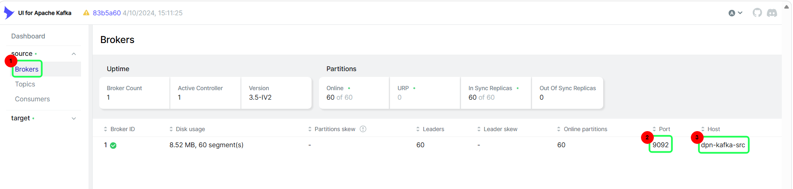
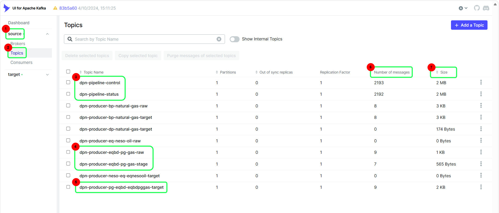
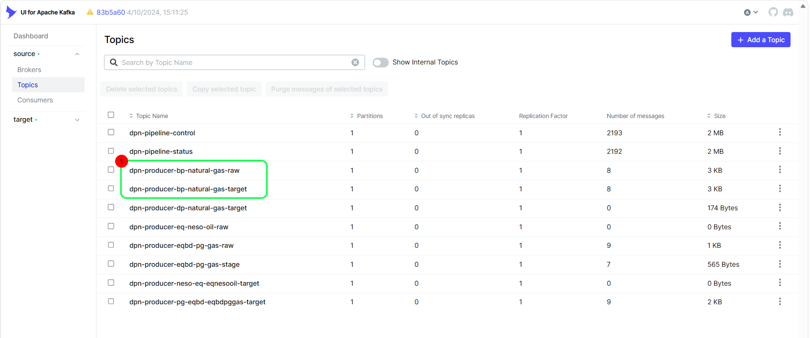
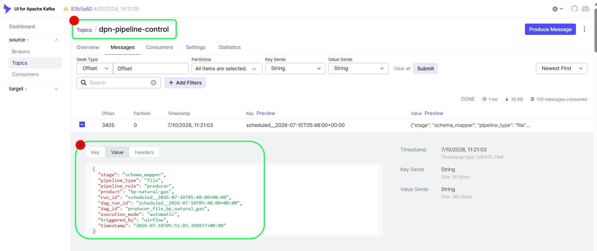
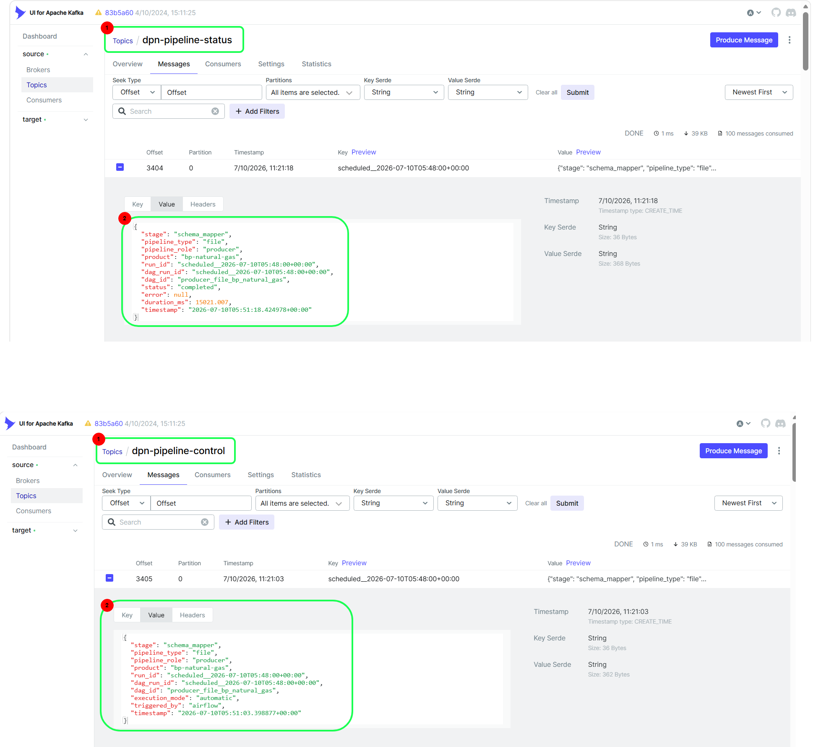
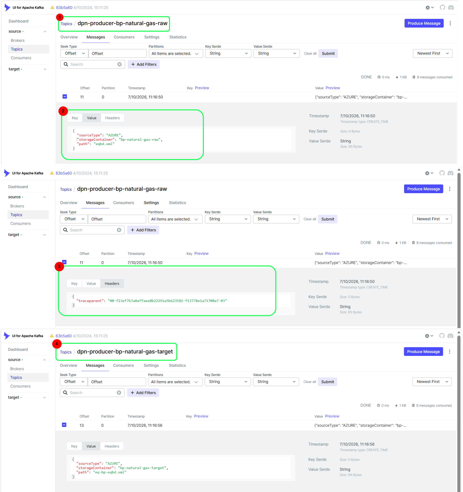
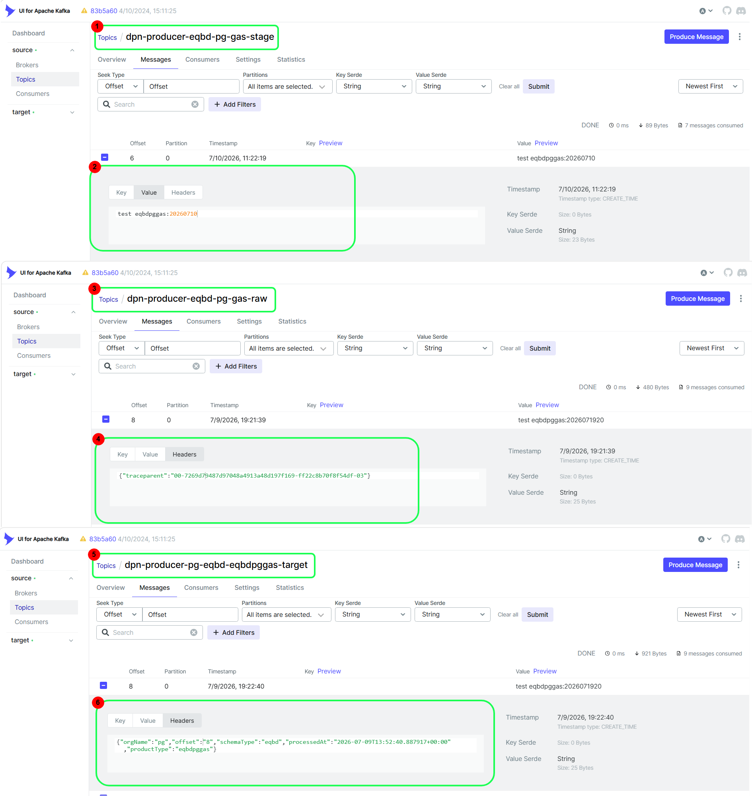
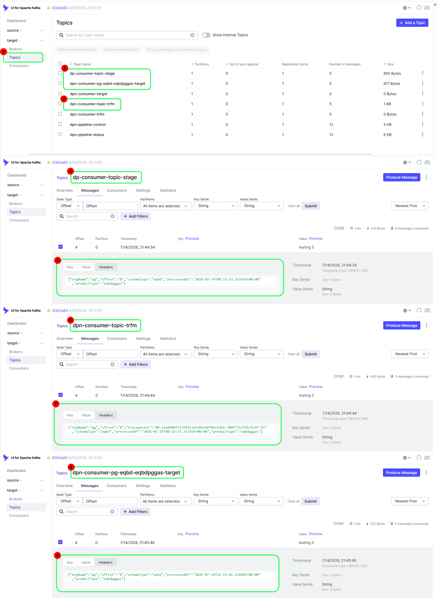
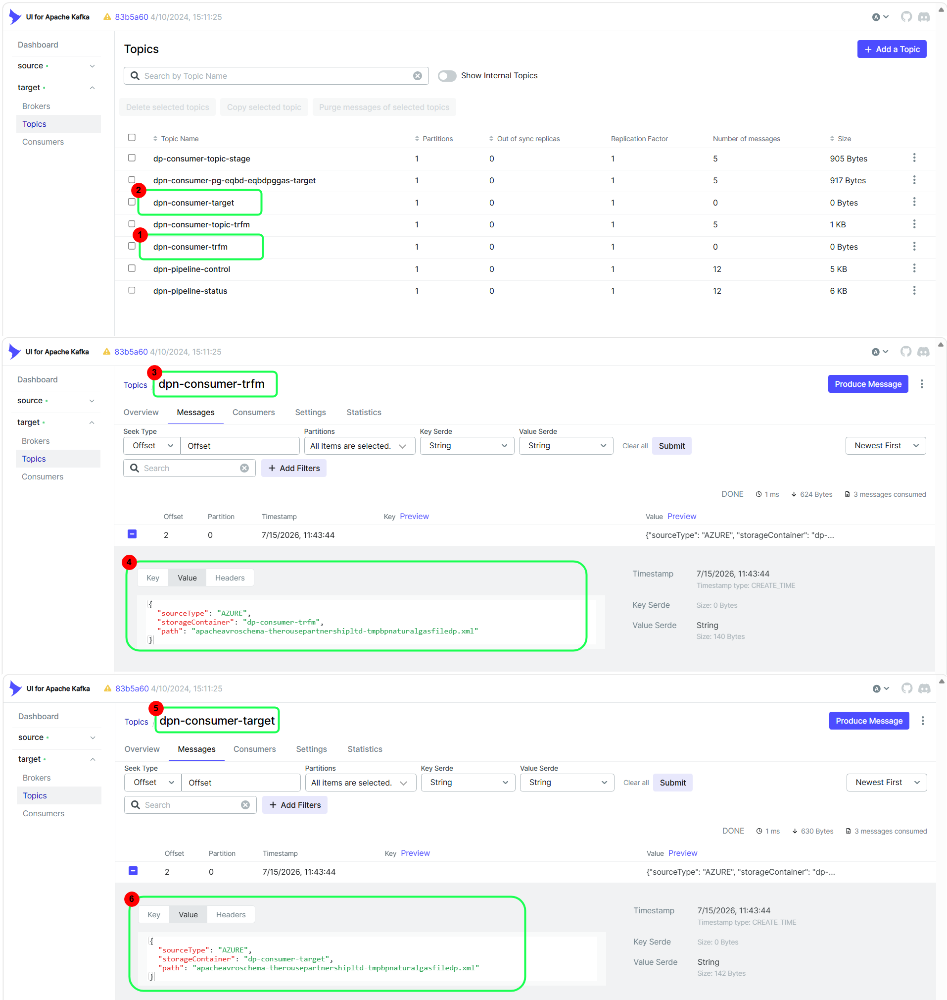

# Kafka UI User Interface Guidance for DPN Pipelines

## Table of Contents

- [Purpose](#purpose)
- [Figure 1: Kafka Broker Monitoring](#figure-1-kafka-broker-monitoring)
  - [Purpose](#purpose-1)
  - [Figure 1 - Point 1: Brokers](#figure-1---point-1-brokers)
  - [Figure 1 - Point 2: Broker Port](#figure-1---point-2-broker-port)
  - [Figure 1 - Point 3: Broker Host](#figure-1---point-3-broker-host)
- [Figure 2: Kafka Topics Overview](#figure-2-kafka-topics-overview)
  - [Purpose](#purpose-2)
  - [Figure 2 - Point 1: Orchestration Topics](#figure-2---point-1-orchestration-topics)
  - [Figure 2 - Point 2: Topics](#figure-2---point-2-topics)
  - [Figure 2 - Point 3: Stream-Based Producer Topics](#figure-2---point-3-stream-based-producer-topics)
  - [Figure 2 - Point 4: Number of Messages](#figure-2---point-4-number-of-messages)
  - [Figure 2 - Point 5: Topic Size](#figure-2---point-5-topic-size)
- [Figure 3: Kafka Topic Categories](#figure-3-kafka-topic-categories)
  - [Purpose](#purpose-3)
  - [Figure 3 - Point 1: File Based Producer Topics](#figure-3---point-1-file-based-producer-topics)
- [Figure 4: Pipeline Control Topic](#figure-4-pipeline-control-topic)
  - [Purpose](#purpose-4)
  - [How the DPN Pipeline Works](#how-the-dpn-pipeline-works)
  - [Figure 4 - Point 1: Pipeline Control Topic](#figure-4---point-1-pipeline-control-topic)
  - [Figure 4 - Point 2: Control Message Payload](#figure-4---point-2-control-message-payload)
- [Figure 5: Pipeline Status Topic](#figure-5-pipeline-status-topic)
  - [Purpose](#purpose-5)
  - [How the DPN Pipeline Works](#how-the-dpn-pipeline-works-1)
  - [Figure 5 - Point 1: Pipeline Status Topic](#figure-5---point-1-pipeline-status-topic)
  - [Figure 5 - Point 2: Status Message](#figure-5---point-2-status-message)
- [Figure 6: File-Based Producer Pipeline Validation](#figure-6-file-based-producer-pipeline-validation)
  - [How the DPN File-Based Pipeline Works](#how-the-dpn-file-based-pipeline-works)
  - [Pipeline Execution](#pipeline-execution)
  - [Topic Naming Convention](#topic-naming-convention)
  - [Figure 6 - Point 1: Raw Topic](#figure-6---point-1-raw-topic)
  - [Figure 6 - Point 2: Raw Topic Message](#figure-6---point-2-raw-topic-message)
  - [Figure 6 - Point 3: Message Header](#figure-6---point-3-message-header)
  - [Figure 6 - Point 4: Target Topic](#figure-6---point-4-target-topic)
- [Figure 7: Stream-Based Producer Pipeline Validation](#figure-7-stream-based-producer-pipeline-validation)
  - [How the DPN Stream-Based Pipeline Works](#how-the-dpn-stream-based-pipeline-works)
  - [Pipeline Execution](#pipeline-execution-1)
  - [Topic Naming Convention](#topic-naming-convention-1)
  - [Figure 7 - Point 1: Stage Topic](#figure-7---point-1-stage-topic)
  - [Figure 7 - Point 2: Stage Topic Message](#figure-7---point-2-stage-topic-message)
  - [Figure 7 - Point 3: Raw Topic](#figure-7---point-3-raw-topic)
  - [Figure 7 - Point 4: Raw Topic Header](#figure-7---point-4-raw-topic-header)
  - [Figure 7 - Point 5: Target Topic](#figure-7---point-5-target-topic)
  - [Figure 7 - Point 6: Target Topic Header](#figure-7---point-6-target-topic-header)
- [Troubleshooting Workflow](#troubleshooting-workflow)
  - [Step 1: Verify Kafka Health](#step-1-verify-kafka-health)
  - [Step 2: Verify Pipeline Trigger](#step-2-verify-pipeline-trigger)
  - [Step 3: Verify Processing Status](#step-3-verify-processing-status)
  - [Step 4: Verify Topic Processing](#step-4-verify-topic-processing)
    - [File-Based Pipeline](#file-based-pipeline)
    - [Stream-Based Pipeline](#stream-based-pipeline)
- [Quick Validation Checklist](#quick-validation-checklist)
- [Consumer Pipeline Validation](#consumer-pipeline-validation)
  - [Purpose](#purpose-6)
- [Figure 8: Stream-Based Consumer Pipeline Validation](#figure-8-stream-based-consumer-pipeline-validation)
  - [Purpose](#purpose-7)
  - [How the DPN Stream-Based Consumer Pipeline Works](#how-the-dpn-stream-based-consumer-pipeline-works)
  - [Topic Naming Conventions](#topic-naming-conventions)
  - [Pipeline Execution](#pipeline-execution-2)
  - [Figure 8 - Point 1: Topics](#figure-8---point-1-topics)
  - [Figure 8 - Point 2: Consumer Target Topic](#figure-8---point-2-consumer-target-topic)
  - [Figure 8 - Point 3: Consumer Stage Topic](#figure-8---point-3-consumer-stage-topic)
  - [Figure 8 - Point 4: Consumer Stage Topic Details](#figure-8---point-4-consumer-stage-topic-details)
  - [Figure 8 - Point 5: Consumer Stage Topic Header](#figure-8---point-5-consumer-stage-topic-header)
  - [Figure 8 - Point 6: Consumer Transformation Topic](#figure-8---point-6-consumer-transformation-topic)
  - [Figure 8 - Point 7: Consumer Transformation Topic Header](#figure-8---point-7-consumer-transformation-topic-header)
  - [Figure 8 - Point 8: Dynamically Generated Consumer Target Topic](#figure-8---point-8-dynamically-generated-consumer-target-topic)
  - [Figure 8 - Point 9: Consumer Target Topic Header](#figure-8---point-9-consumer-target-topic-header)
- [Figure 9: File-Based Consumer Pipeline Validation](#figure-9-file-based-consumer-pipeline-validation)
  - [Purpose](#purpose-8)
  - [How the DPN File-Based Consumer Pipeline Works](#how-the-dpn-file-based-consumer-pipeline-works)
  - [Pipeline Execution](#pipeline-execution-3)
  - [Figure 9 - Point 1: Consumer Transformation Topic](#figure-9---point-1-consumer-transformation-topic)
  - [Figure 9 - Point 2: Consumer Target Topic](#figure-9---point-2-consumer-target-topic)
  - [Figure 9 - Point 3: Consumer Transformation Topic](#figure-9---point-3-consumer-transformation-topic)
  - [Figure 9 - Point 4: Consumer Transformation Topic Message](#figure-9---point-4-consumer-transformation-topic-message)
  - [Figure 9 - Point 5: Consumer Target Topic](#figure-9---point-5-consumer-target-topic)
  - [Figure 9 - Point 6: Consumer Target Topic Message](#figure-9---point-6-consumer-target-topic-message)
- [Review Notes](#review-notes)

---

## Purpose

This playbook explains how to use Kafka UI to:

- Monitor Kafka infrastructure.
- Verify Producer and Consumer pipeline execution.
- Validate message movement between topics.
- Monitor orchestration activities from Airflow.
- Troubleshoot file-based and stream-based data pipelines.

In addition to explaining Kafka UI usage, this document also provides high-level context on how DPN pipelines use Kafka topics.

---

# Figure 1: Kafka Broker Monitoring



## Purpose

Use this page to verify Kafka broker availability and connectivity before troubleshooting any pipeline issues.

### Figure 1 - Point 1: Brokers

The **Brokers** menu displays all Kafka brokers configured in the selected cluster.

#### Kafka UI Usage

Use this section to:

- View available brokers.
- Verify broker registration.
- Confirm Kafka cluster accessibility.

#### Verification

Expected:

- Brokers are listed.
- Broker information is accessible.

---

### Figure 1 - Point 2: Broker Port

Displays the communication port used by the Kafka broker.

Example:

```text
9092
```

#### Kafka UI Usage

Use this field when:

- Validating connectivity.
- Troubleshooting connection failures.
- Confirming broker configuration.

---

### Figure 1 - Point 3: Broker Host

Displays the broker hostname.

Example:

```text
dpn-kafka-src
```

#### Kafka UI Usage

Use this value to identify the broker hosting the Kafka cluster.

---

# Figure 2: Kafka Topics Overview



## Purpose

This screen provides an overview of all Kafka topics available within the selected Kafka cluster. It is typically the first location users access when validating pipeline execution, monitoring message activity, or troubleshooting data processing issues.

Use this screen to:

- Identify available topics.
- Open a topic for message inspection.
- Monitor topic activity.
- Verify data movement through DPN pipelines.
- Navigate to orchestration, file-based, and stream-based topics.

---

## Figure 2 - Point 1: Orchestration Topics

Examples:

```text
dpn-pipeline-control
dpn-pipeline-status
```

### What Is It?

These topics are used by Airflow to orchestrate and monitor both Producer and Consumer pipelines.

#### dpn-pipeline-control

This topic is the entry point for pipeline execution.

When Airflow triggers a Producer or Consumer pipeline, a control message is written to this topic. Based on the values contained in the message, the appropriate component starts processing.

Components that can be triggered include:

- Adaptor
- Schema Mapper
- Extractor
- Consumer

#### dpn-pipeline-status

This topic is used to report processing results.

After processing completes, the executing component writes a status message to this topic. Airflow reads the message and updates the corresponding task status within the Airflow UI.

### Kafka UI Usage

Use these topics to:

- Verify Airflow invocation.
- Verify pipeline execution.
- Monitor processing progress.
- Troubleshoot failed executions.

### Verification

Expected:

- Messages exist in `dpn-pipeline-control` when Airflow starts a process.
- Messages exist in `dpn-pipeline-status` after processing completes.

---

## Figure 2 - Point 2: Topics
```text
It's a tap to see the list of topic in the Kafka-UI
```

## Figure 2 - Point 3: Stream-Based Producer Topics

Examples:

```text
dpn-producer-eqbd-pg-gas-stage
dpn-producer-eqbd-pg-gas-raw
dpn-producer-pg-eqbd-eqbdpggas-target
```

### What Is It?

These topics are used by Stream-Based Producer pipelines.

#### Stage Topic

Naming convention:

```text
dpn-producer-<data_product>-stage
```

Example:

```text
dpn-producer-eqbd-pg-gas-stage
```

This is the user-configured input topic for streaming data.

When Airflow invokes the Stream Adaptor, data is read from this topic.

#### Raw Topic

Naming convention:

```text
dpn-producer-<data_product>-raw
```

Example:

```text
dpn-producer-eqbd-pg-gas-raw
```

The Stream Adaptor processes Stage topic messages and writes the output to the Raw topic.

After the Stream Adaptor reports successful execution through `dpn-pipeline-status`, Airflow invokes the Schema Mapper through `dpn-pipeline-control`.

The Raw topic acts as the input for the Stream-Based Schema Mapper.

#### Target Topic

Naming convention:

```text
dpn-producer-<org_name>-<schema_type>-<data_product>-target
```

Example:

```text
dpn-producer-pg-eqbd-eqbdpggas-target
```

The Schema Mapper reads messages from the Raw topic and writes processed output to the Target topic.

This topic is also consumed by downstream Consumer services.

### Kafka UI Usage

Use these topics to:

- Verify incoming stream data.
- Validate adaptor processing.
- Verify schema mapping.
- Confirm final producer output.

### Verification

Expected:

- Stage topic contains source messages.
- Raw topic contains adaptor output.
- Target topic contains processed messages and headers.
- Status updates exist in `dpn-pipeline-status`.

---

## Figure 2 - Point 4: Number of Messages

### What Is It?

Displays the total number of messages currently stored in a topic.

### Kafka UI Usage

Use this value to:

- Confirm data is arriving.
- Verify active processing.
- Compare activity between related topics.
- Detect inactive pipelines.

### Verification

Expected:

- Message count increases during active processing.
- Related topics show corresponding message growth.

---

## Figure 2 - Point 5: Topic Size

### What Is It?

Displays the amount of storage currently used by a topic.

### Kafka UI Usage

Use this value to:

- Monitor topic growth.
- Identify large message backlogs.
- Investigate retention-related issues.
- Support storage capacity planning.

### Verification

Expected:

- Topic size aligns with message activity.
- Unexpected growth is investigated to prevent storage issues.

# Figure 3: Kafka Topic Categories



## Purpose

This screen provides visibility into the various topic categories used by DPN pipelines.

### Figure 3 - Point 1: File Based Producer Topics

Examples:

```text
dpn-producer-bp-natural-gas-raw
dpn-producer-bp-natural-gas-target
```

### What Is It?

These topics are used by File-Based Producer pipelines.

#### Raw Topic

Naming convention:

```text
dpn-producer-<product_type>-raw
```

Example:

```text
dpn-producer-bp-natural-gas-raw
```
When the File Adaptor is invoked through `dpn-pipeline-control`, it:

1. Processes the source file.
2. Moves the file to the destination location.
3. Writes processing information to the Raw topic.
4. Sends a status update to `dpn-pipeline-status`.
5. Airflow reads the status message and updates the pipeline status.
6. Airflow invokes the Schema Mapper through `dpn-pipeline-control`.

#### Target Topic

Naming convention:

```text
dpn-producer-<product_type>-target
```

Example:

```text
dpn-producer-bp-natural-gas-target
```
After Airflow receives a successful status update from the File Adaptor, it invokes the Schema Mapper through `dpn-pipeline-control`.

The Schema Mapper:

1. Reads messages from the Raw topic.
2. Transforms the data.
3. Writes processed data to the Target topic.
4. Writes metadata into Kafka headers.
5. Writes execution status to `dpn-pipeline-status`.

### Kafka UI Usage

Use these topics to:

- Verify File Adaptor execution.
- Verify Schema Mapper execution.
- Validate file processing.
- Confirm data transformation.

### Verification

Expected:

- Raw topic contains adaptor output.
- Target topic contains processed data.
- Corresponding status updates exist in `dpn-pipeline-status`.

---

# Figure 4: Pipeline Control Topic



## Purpose

The `dpn-pipeline-control` topic is the orchestration topic used by Airflow for both Producer and Consumer pipelines.

---

## How the DPN Pipeline Works

```text
Airflow
   │
   ▼
dpn-pipeline-control
   │
   ▼
Adaptor / Schema Mapper / Extractor / Consumer
```

Whenever Airflow starts a process, a control message is written to this topic.

---

### Figure 4 - Point 1: Pipeline Control Topic

```text
dpn-pipeline-control
```

#### Kafka UI Usage

Open this topic to determine whether Airflow successfully triggered a process.

#### Verification

Expected:

- New messages appear when Airflow initiates processing.

---

### Figure 4 - Point 2: Control Message Payload

Contains processing instructions and execution information.

Typical values include:

- Pipeline role
- Pipeline type
- Product
- Run ID
- DAG ID
- Processing stage

#### Kafka UI Usage

Verify that:

- Correct product is being processed.
- Correct pipeline stage was triggered.
- Airflow generated the control message.

#### Troubleshooting

If no message exists:

- Verify Airflow execution.
- Check Airflow logs.
- Confirm Kafka connectivity.

---

# Figure 5: Pipeline Status Topic



## Purpose

The `dpn-pipeline-status` topic is used by Producer and Consumer services to report processing results.

Airflow reads this topic and updates workflow status.

---

## How the DPN Pipeline Works

```text
Processing Service
       │
       ▼
dpn-pipeline-status
       │
       ▼
Airflow UI
```

---

### Figure 5 - Point 1: Pipeline Status Topic

```text
dpn-pipeline-status
```

#### Kafka UI Usage

Use this topic to verify processing completion.

---

### Figure 5 - Point 2: Status Message

Displays processing results.

Typical values include:

- Status
- Stage
- Product
- Duration
- Error details

#### Kafka UI Usage

Verify:

- Processing completed successfully.
- Error field is empty.
- Execution details are populated.

#### Troubleshooting

If status messages are missing:

- Verify service execution.
- Review application logs.
- Confirm Kafka connectivity.

---

# Figure 6: File-Based Producer Pipeline Validation



## How the DPN File-Based Pipeline Works

```text
Airflow
   │
   ▼
dpn-pipeline-control
   │
   ▼
File Adaptor
   │
   ├──► dpn-producer-bp-natural-gas-raw
   │
   └──► dpn-pipeline-status
            │
            ▼
         Airflow

Airflow
   │
   ▼
dpn-pipeline-control
   │
   ▼
Schema Mapper
   │
   ├──► dpn-producer-bp-natural-gas-target
   │
   └──► dpn-pipeline-status
            │
            ▼
         Airflow
```

### Pipeline Execution

1. Airflow writes a control message to `dpn-pipeline-control`.
2. The File Adaptor is invoked.
3. The File Adaptor processes the source file.
4. The File Adaptor writes processing information to `dpn-producer-bp-natural-gas-raw`.
5. The File Adaptor writes execution status to `dpn-pipeline-status`.
6. Airflow reads the status message and updates the File Adaptor task status.
7. Airflow writes a new control message to `dpn-pipeline-control`.
8. The Schema Mapper is invoked.
9. The Schema Mapper reads data from `dpn-producer-bp-natural-gas-raw`.
10. The Schema Mapper transforms the data and writes output to `dpn-producer-bp-natural-gas-target`.
11. The Schema Mapper writes execution status to `dpn-pipeline-status`.
12. Airflow reads the status message and updates the Schema Mapper task status.

### Topic Naming Convention

Raw Topic:

```text
dpn-producer-<product_type>-raw
```

Example:

```text
dpn-producer-bp-natural-gas-raw
```

Target Topic:

```text
dpn-producer-<product_type>-target
```

Example:

```text
dpn-producer-bp-natural-gas-target
```

---

### Figure 6 - Point 1: Raw Topic

```text
dpn-producer-bp-natural-gas-raw
```

#### Kafka UI Usage

Use this topic to verify that the File Adaptor successfully processed the source file.

#### Verification

Expected:

- Messages exist in the topic.
- New messages appear after pipeline execution.

---

### Figure 6 - Point 2: Raw Topic Message

Displays metadata generated by the File Adaptor.

#### Kafka UI Usage

Verify:

- Source file information.
- Storage location information.
- Processing metadata.

#### Expected Information

Examples include:

- Source container
- File path
- File identifier

---

### Figure 6 - Point 3: Message Header

Displays Kafka message headers.

Example:

```json
{
  "traceparent":"00-xxxx"
}
```

#### Kafka UI Usage

Used for end-to-end message tracking and troubleshooting.

#### Verification

Expected:

- Header exists.
- Trace value is populated.

---

### Figure 6 - Point 4: Target Topic

```text
dpn-producer-bp-natural-gas-target
```

#### Kafka UI Usage

Use this topic to verify successful Schema Mapper processing.

#### Verification

Expected:

- Processed message exists.
- Message appears after corresponding Raw topic message.

---

# Figure 7: Stream-Based Producer Pipeline Validation



## How the DPN Stream-Based Pipeline Works

```text
Airflow
   │
   ▼
dpn-pipeline-control
   │
   ▼
Stream Adaptor
   │
   ├──► dpn-producer-eqbd-pg-gas-raw
   │
   └──► dpn-pipeline-status
            │
            ▼
         Airflow

Airflow
   │
   ▼
dpn-pipeline-control
   │
   ▼
Schema Mapper
   │
   ├──► dpn-producer-pg-eqbd-eqbdpggas-target
   │
   └──► dpn-pipeline-status
            │
            ▼
         Airflow
```

### Pipeline Execution

1. Airflow writes a control message to `dpn-pipeline-control`.
2. The Stream Adaptor is invoked.
3. The Stream Adaptor reads messages from `dpn-producer-eqbd-pg-gas-stage`.
4. The Stream Adaptor processes the message.
5. The Stream Adaptor writes output to `dpn-producer-eqbd-pg-gas-raw`.
6. The Stream Adaptor writes execution status to `dpn-pipeline-status`.
7. Airflow reads the status message and updates the Stream Adaptor task status.
8. Airflow writes a new control message to `dpn-pipeline-control`.
9. The Schema Mapper is invoked.
10. The Schema Mapper reads data from `dpn-producer-eqbd-pg-gas-raw`.
11. The Schema Mapper transforms the data and writes output to `dpn-producer-pg-eqbd-eqbdpggas-target`.
12. The Schema Mapper writes execution status to `dpn-pipeline-status`.
13. Airflow reads the status message and updates the Schema Mapper task status.

### Topic Naming Convention

Stage Topic:

```text
dpn-producer-<data_product>-stage
```

Raw Topic:

```text
dpn-producer-<data_product>-raw
```

Target Topic:

```text
dpn-producer-<org_name>-<schema_type>-<data_product>-target
```

---

### Figure 7 - Point 1: Stage Topic

```text
dpn-producer-eqbd-pg-gas-stage
```

#### Kafka UI Usage

This is the user-configured input topic for stream-based processing.

Use it to verify incoming source data.

---

### Figure 7 - Point 2: Stage Topic Message

Displays the original message received by the pipeline.

Example:

```text
test eqbdpggas:20260710
```

#### Verification

Expected:

- Message exists.
- Message content is correct.

---

### Figure 7 - Point 3: Raw Topic

```text
dpn-producer-eqbd-pg-gas-raw
```

#### Kafka UI Usage

Use this topic to verify that the Stream Adaptor successfully processed the Stage message.

---

### Figure 7 - Point 4: Raw Topic Header

Example:

```json
{
  "traceparent":"00-7269d794..."
}
```

#### Kafka UI Usage

Used for tracing the message through the pipeline.

#### Verification

Expected:

- Trace header exists.
- Trace value is populated.

---

### Figure 7 - Point 5: Target Topic

```text
dpn-producer-pg-eqbd-eqbdpggas-target
```

#### Kafka UI Usage

Use this topic to verify successful Schema Mapper processing.

This topic is also consumed by downstream consumers.

---

### Figure 7 - Point 6: Target Topic Header

Example:

```json
{
  "orgName":"pg",
  "offset":"8",
  "schemaType":"eqbd",
  "processedAt":"2026-07-09T13:52:40Z",
  "productType":"eqbdpggas"
}
```

#### Kafka UI Usage

These header values are used by consumers to classify and process data.

#### Verification

Confirm that the following values are populated:

- orgName
- schemaType
- productType
- processedAt
- offset

---

# Troubleshooting Workflow

## Step 1: Verify Kafka Health

Open:

**Figure 1 – Kafka Broker Monitoring**

Check:

- Broker visibility
- Host information
- Port information

---

## Step 2: Verify Pipeline Trigger

Open:

**Figure 4 – Pipeline Control Topic**

Check:

- Control message exists
- Product is correct
- Stage is correct

---

## Step 3: Verify Processing Status

Open:

**Figure 5 – Pipeline Status Topic**

Check:

- Status message exists
- No error information
- Successful completion status

---

## Step 4: Verify Topic Processing

### File-Based Pipeline

Use:

**Figure 6**

Check:

- Raw Topic
- Headers
- Target Topic

### Stream-Based Pipeline

Use:

**Figure 7**

Check:

- Stage Topic
- Raw Topic
- Headers
- Target Topic

---

# Quick Validation Checklist

- [ ] Kafka broker is accessible.
- [ ] Pipeline control message exists.
- [ ] Pipeline status message exists.
- [ ] Message count is increasing.
- [ ] Trace headers are populated.
- [ ] Raw topic contains messages.
- [ ] Target topic contains processed messages.
- [ ] Airflow reflects the correct execution status.

---

# Consumer Pipeline Validation

## Purpose

The Consumer services are deployed on the Target Kafka Cluster.

Consumer pipelines process data after Producer pipeline execution has completed. Airflow orchestrates Consumer processing through the `dpn-pipeline-control` topic and monitors execution using the `dpn-pipeline-status` topic.

The following sections describe how to validate Consumer pipeline execution using Kafka UI.

The screenshots are documented in the same order in which the topics appear within Kafka UI:

1. Stream-Based Consumer Pipeline
2. File-Based Consumer Pipeline

---

# Figure 8: Stream-Based Consumer Pipeline Validation



## Purpose

This screen provides visibility into the Kafka topics used by Stream-Based Consumer pipelines.

In a Stream-Based Consumer pipeline, the Extractor reads data from a Kafka source topic, processes the message, and passes the output through the Consumer processing stages.

---

## How the DPN Stream-Based Consumer Pipeline Works

```text
Airflow
   │
   ▼
dpn-pipeline-control
   │
   ▼
Extractor
   │
   ├──► dpn-consumer-topic-trfm
   │
   └──► dpn-pipeline-status
            │
            ▼
         Airflow

Airflow
   │
   ▼
dpn-pipeline-control
   │
   ▼
Schema Mapper
   │
   ├──► dpn-consumer-<orgName>-<schemaType>-<dataProduct>-target
   │
   └──► dpn-pipeline-status
            │
            ▼
         Airflow
```

### Topic Naming Conventions

Stage Topic:

```text
dpn-consumer-topic-stage
```

Transformation Topic:

```text
dpn-consumer-topic-trfm
```

Target Topic:

```text
dpn-consumer-<orgName>-<schemaType>-<dataProduct>-target
```

Example:

```text
dpn-consumer-pg-eqbd-eqbdpggas-target
```

---

### Pipeline Execution

1. Airflow writes a control message to `dpn-pipeline-control`.
2. The Extractor is invoked.
3. The Extractor reads messages from `dpn-consumer-topic-stage`.
4. The Extractor processes the message and writes output to `dpn-consumer-topic-trfm`.
5. The Extractor writes processing status to `dpn-pipeline-status`.
6. Airflow reads the status message and updates the Extractor task status.
7. Airflow writes a new control message to `dpn-pipeline-control`.
8. The Schema Mapper is invoked.
9. The Schema Mapper reads data from `dpn-consumer-topic-trfm`.
10. The Schema Mapper dynamically creates the target topic using the Kafka header values.
11. The Schema Mapper writes processed output to the target topic.
12. The Schema Mapper writes processing status to `dpn-pipeline-status`.
13. Airflow reads the status message and updates the Schema Mapper task status.

---

## Figure 8 - Point 1: Topics

### What Is It?

The Topics menu displays all Kafka topics available within the Target Kafka Cluster.

### Kafka UI Usage

Use this section to:

- View Consumer topics.
- Open topics for validation.
- Monitor Consumer processing activity.

---

## Figure 8 - Point 2: Consumer Target Topic

Example:

```text
dpn-consumer-pg-eqbd-eqbdpggas-target
```

### What Is It?

This topic represents the final output generated by the Consumer Schema Mapper.

The topic name is created dynamically using values contained within the Kafka message headers.

### Topic Naming Convention

```text
dpn-consumer-<orgName>-<schemaType>-<dataProduct>-target
```

### Kafka UI Usage

Use this topic to:

- Verify successful Schema Mapper execution.
- Validate Consumer output generation.
- Confirm dynamic topic creation.
- Troubleshoot Consumer processing failures.

### Verification

Expected:

- Topic exists.
- Messages are present.
- Topic naming follows the expected convention.

---

## Figure 8 - Point 3: Consumer Stage Topic

```text
dpn-consumer-topic-stage
```

### What Is It?

This topic acts as the source topic for the Consumer Extractor.

Incoming messages are read and processed by the Extractor.

### Kafka UI Usage

Use this topic to:

- Verify incoming source messages.
- Confirm data availability.
- Validate the initial Consumer input.

### Verification

Expected:

- Messages exist in the topic.
- Message count increases as new source messages arrive.

---

## Figure 8 - Point 4: Consumer Stage Topic Details

```text
dpn-consumer-topic-stage
```

### Kafka UI Usage

Open this topic to inspect source messages before Extractor processing.

### Verification

Expected:

- Message content is visible.
- Source information is populated.

---

## Figure 8 - Point 5: Consumer Stage Topic Header

Example:

```json
{
  "orgName":"pg",
  "offset":"0",
  "schemaType":"eqbd",
  "processedAt":"2026-07-14T08:52:53Z",
  "productType":"eqbdpggas"
}
```

### What Is It?

Displays the metadata used for Consumer classification and routing.

### Kafka UI Usage

Verify:

- orgName
- schemaType
- productType
- offset
- processedAt

### Verification

Expected:

- Header values are populated.
- Values are valid.
- Processing can be successfully classified.

---

## Figure 8 - Point 6: Consumer Transformation Topic

```text
dpn-consumer-topic-trfm
```

### What Is It?

This topic contains the output generated by the Extractor.

The Schema Mapper uses this topic as its input source.

### Kafka UI Usage

Use this topic to:

- Verify Extractor execution.
- Validate extracted data.
- Troubleshoot Extractor failures.

### Verification

Expected:

- Messages exist after Extractor processing.
- New messages appear following successful execution.

---

## Figure 8 - Point 7: Consumer Transformation Topic Header

Example:

```json
{
  "orgName":"pg",
  "offset":"0",
  "traceparent":"00-a3e0409f31398913a5202e46f06cb566...",
  "schemaType":"eqbd",
  "processedAt":"2026-07-14T08:52:53Z",
  "productType":"eqbdpggas"
}
```

### What Is It?

Displays tracing and routing information associated with the transformed message.

### Kafka UI Usage

Use these values for:

- End-to-end tracing.
- Message correlation.
- Consumer troubleshooting.

### Verification

Expected:

- Traceparent exists.
- Header values are populated.
- Metadata is preserved during processing.

---

## Figure 8 - Point 8: Dynamically Generated Consumer Target Topic

Example:

```text
dpn-consumer-pg-eqbd-eqbdpggas-target
```

### What Is It?

This is the final output topic generated by the Consumer Schema Mapper.

The topic is dynamically created using Kafka message header information.

### Kafka UI Usage

Use this topic to verify final Consumer output generation.

### Verification

Expected:

- Topic exists.
- Messages are successfully written.
- Dynamic topic creation is successful.

---

## Figure 8 - Point 9: Consumer Target Topic Header

Example:

```json
{
  "orgName":"pg",
  "offset":"4",
  "schemaType":"eqbd",
  "processedAt":"2026-07-14T16:15:46Z",
  "productType":"eqbdpggas"
}
```

### What Is It?

Displays the header values used to create and classify the target topic.

### Kafka UI Usage

Verify:

- orgName
- schemaType
- productType
- offset
- processedAt

### Verification

Expected:

- Header values are populated.
- Topic classification is correct.
- Output has been successfully generated.

---

# Figure 9: File-Based Consumer Pipeline Validation



## Purpose

This screen provides visibility into the Kafka topics used by File-Based Consumer pipelines.

The Consumer pipeline consists of two stages:

- Extractor
- Schema Mapper

Each stage reports execution results through `dpn-pipeline-status`.

---

## How the DPN File-Based Consumer Pipeline Works

```text
Airflow
   │
   ▼
dpn-pipeline-control
   │
   ▼
Extractor
   │
   ├──► dpn-consumer-trfm
   │
   └──► dpn-pipeline-status
            │
            ▼
         Airflow

Airflow
   │
   ▼
dpn-pipeline-control
   │
   ▼
Schema Mapper
   │
   ├──► dpn-consumer-target
   │
   └──► dpn-pipeline-status
            │
            ▼
         Airflow
```

### Pipeline Execution

1. Airflow writes a control message to `dpn-pipeline-control`.
2. The Extractor is invoked.
3. The Extractor writes processing information to `dpn-consumer-trfm`.
4. The Extractor writes processing status to `dpn-pipeline-status`.
5. Airflow updates the Extractor task status.
6. Airflow writes a new control message to `dpn-pipeline-control`.
7. The Schema Mapper is invoked.
8. The Schema Mapper reads data from `dpn-consumer-trfm`.
9. The Schema Mapper writes the final output to `dpn-consumer-target`.
10. The Schema Mapper writes processing status to `dpn-pipeline-status`.
11. Airflow updates the Schema Mapper task status.

---

## Figure 9 - Point 1: Consumer Transformation Topic

```text
dpn-consumer-trfm
```

### What Is It?

This topic contains the output generated by the Consumer Extractor.

The Schema Mapper uses this topic as its input source.

### Kafka UI Usage

Use this topic to:

- Verify Extractor execution.
- Validate processing results.
- Troubleshoot processing issues.

### Verification

Expected:

- Messages exist after Extractor execution.
- Message count increases after successful processing.

---

## Figure 9 - Point 2: Consumer Target Topic

```text
dpn-consumer-target
```

### What Is It?

This topic represents the final output generated by the Consumer Schema Mapper.

### Kafka UI Usage

Use this topic to:

- Verify Schema Mapper execution.
- Confirm successful processing.
- Validate generated output.

### Verification

Expected:

- Messages exist after Schema Mapper execution.
- Output data has been successfully generated.

---

## Figure 9 - Point 3: Consumer Transformation Topic

```text
dpn-consumer-trfm
```

### Kafka UI Usage

Open this topic to inspect messages generated by the Extractor.

### Verification

Expected:

- Message payload contains processing information.
- Data corresponds to the executed pipeline.

---

## Figure 9 - Point 4: Consumer Transformation Topic Message

Example:

```json
{
  "sourceType":"AZURE",
  "storageContainer":"dp-consumer-trfm",
  "path":"apacheavroschema-therousepartnershipltd-tmpbnaturalgasfiledp.xml"
}
```

### Kafka UI Usage

Verify:

- Source type.
- Storage container.
- Generated file path.
- Processing metadata.

### Verification

Expected:

- Payload values are populated.
- File path information exists.

---

## Figure 9 - Point 5: Consumer Target Topic

```text
dpn-consumer-target
```

### Kafka UI Usage

Use this topic to verify output generated by the Schema Mapper.

### Verification

Expected:

- Messages exist in the topic.
- Output is generated after successful processing.

---

## Figure 9 - Point 6: Consumer Target Topic Message

Example:

```json
{
  "sourceType":"AZURE",
  "storageContainer":"dp-consumer-target",
  "path":"apacheavroschema-therousepartnershipltd-tmpbnaturalgasfiledp.xml"
}
```

### Kafka UI Usage

Verify:

- Output location.
- Generated file path.
- Processing completion.

### Verification

Expected:

- Payload values are populated.
- Output information is available.
- Data corresponds to the processed output.

---

# Review Notes

| Review Date | Last Reviewed By | Status | Version |
|-------------|-----------------|--------|---------|
| 31-July-2026 | DSI Assurance | Final | V1.0.0 |
