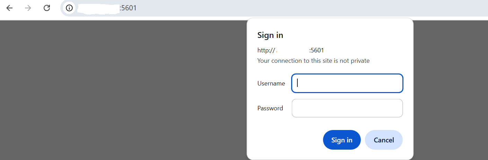
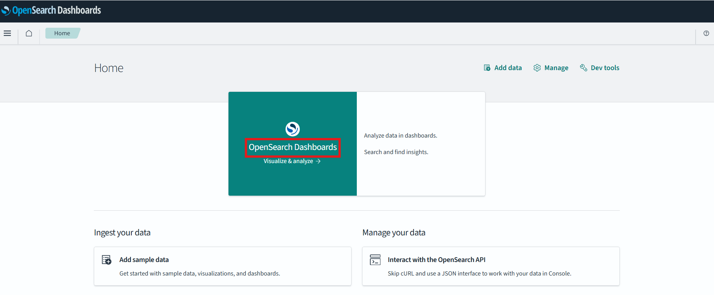
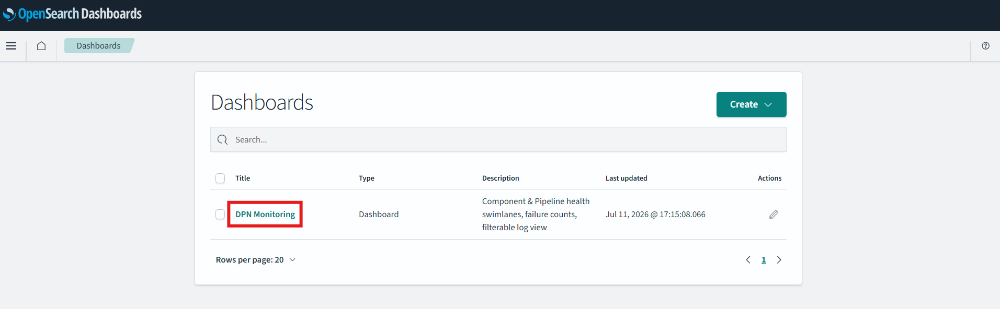
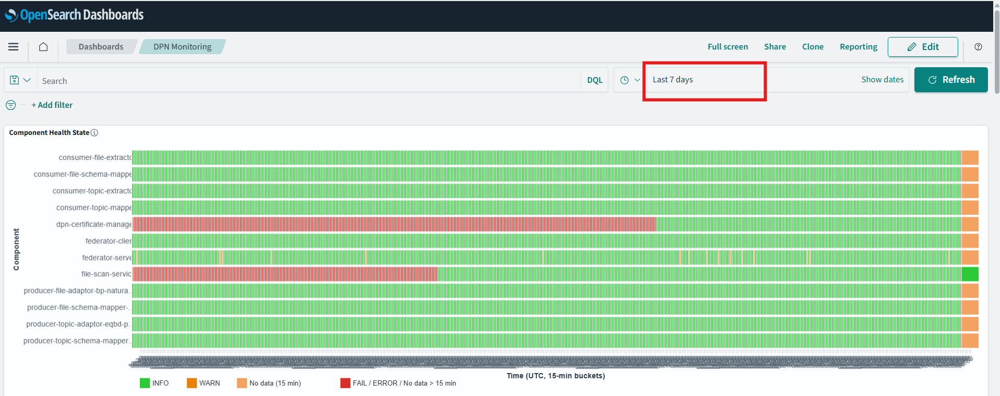
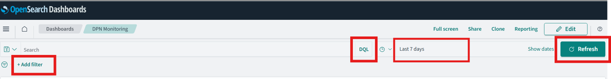
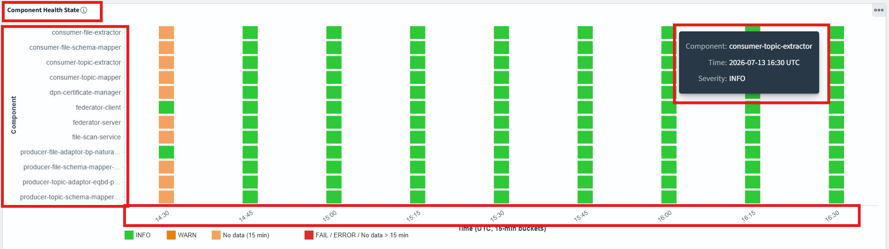
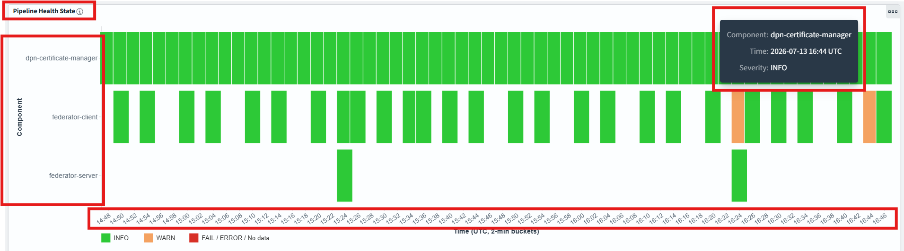
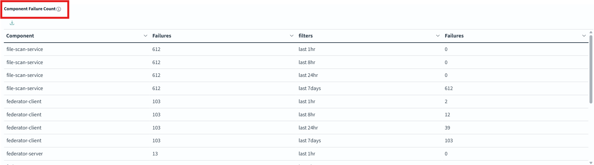
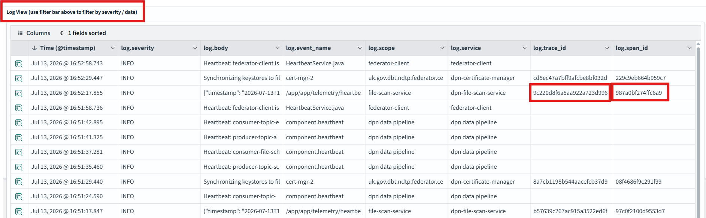
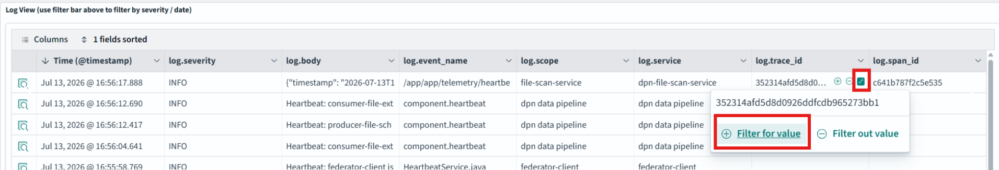

# DPN Monitoring — OpenSearch Dashboard User Guide

> **Audience:** Data team members using the DPN-Monitoring dashboard to monitor pipeline health and investigate log events.

---

## Table of Contents

1. [What is OpenSearch?](#1-what-is-opensearch)
2. [OpenSearch in the DPN Project](#2-opensearch-in-the-dpn-project)
3. [Accessing the Dashboard](#3-accessing-the-dashboard)
4. [Dashboard Controls](#4-dashboard-controls)
5. [Panel Reference](#5-panel-reference)
   - [Panel 1 — Component Health State](#panel-1--component-health-state)
   - [Panel 2 — Pipeline Health State](#panel-2--pipeline-health-state)
   - [Panel 3 — Component Failure Count](#panel-3--component-failure-count)
   - [Panel 4 — Log View](#panel-4--log-view)
6. [Saved Searches](#6-saved-searches)
7. [Querying and Filtering](#7-querying-and-filtering)
8. [Troubleshooting Common Scenarios](#8-troubleshooting-common-scenarios)

---

## 1. What is OpenSearch?

**OpenSearch** is an open-source search and analytics platform. It stores large volumes of data (such as application logs and events) and makes them instantly searchable and visualisable in near real time.

The platform has two main parts:

**OpenSearch** : It Stores and indexes the data. Accepts queries and returns results in milliseconds regardless of data volume.
**OpenSearch Dashboards** : The browser-based user interface. Provides charts, tables, saved searches, and a filter bar on top of the data stored in OpenSearch.

Key capabilities relevant to how it is used in this project:

- **Full-text and field-level search** — find any log message or event by keyword, severity, service name, or time range.
- **Aggregations** — count, group, and summarise events across any time window without writing database queries.
- **Real-time visualisations** — charts and tables update automatically as new data arrives.
- **Saved searches and dashboards** — pre-built views can be opened in one click, so users do not need to build queries from scratch every time.
- **Filter bar** — click-to-filter on any field value directly from the UI, without needing to type a query.

---

## 2. OpenSearch in the DPN Project

### What DPN monitors

DPN (Data Pipeline Network) is a distributed set of pipeline components. Each component carries out a role in processing data — ingesting, transforming, routing, or delivering it. The health of each component and the success or failure of every pipeline run are critical signals for the data team.

The **DPN-Monitoring** dashboard gives the data team a single place to answer questions such as:

- Are all pipeline components currently active and healthy?
- Has any component reported a warning or error recently?
- Which pipeline runs succeeded, and which failed?
- What was the exact log message for a given failure event?

### How data reaches OpenSearch

Each DPN component emits structured log events as it runs. Those events travel through an ingestion pipeline and are stored in OpenSearch under daily indices (for example `otel-logs-2025.07.14`). By the time an event appears in the dashboard, it has been parsed, had key fields extracted — such as severity, component name, event type, and log message — and stored in a searchable form.

The fields you see in the dashboard are:

| Field | Description |
|---|---|
| `@timestamp` | When the event occurred (UTC) |
| `log.severity` | Severity level: `TRACE`, `DEBUG`, `INFO`, `WARN`, `ERROR`, `FATAL` |
| `log.body` | The human-readable log message |
| `log.event_name` | The event type, e.g. `component.heartbeat`, `kafka_trigger.starting` |
| `log.component` | The name of the pipeline component that emitted the event |
| `log.service` | The service name as registered by the component |
| `log.scope` | The logger / instrumentation scope name |
| `log.trace_id` | Distributed trace identifier (when available) |
| `log.span_id` | Span identifier within a trace (when available) |

### Simple data flow

```
DPN pipeline components
        │  emit log events
        ▼
Ingestion pipeline
        │  parses and extracts fields
        ▼
OpenSearch  (indices: otel-logs-YYYY.MM.DD)
        │
        ▼
OpenSearch Dashboards — DPN Monitoring dashboard
```

---

## 3. Accessing the Dashboard

The DPN-Monitoring dashboard is served by OpenSearch Dashboards on **port 5601**.

Open a browser and navigate to:

```
http://<your-host>:5601
Use your credential (to be allocated by Admin) to login
```


Once the Dashboards home page loads:


1. Click **Dashboards** in the left-hand navigation menu.
2. Find and open **DPN Monitoring**.


The dashboard opens directly to the pre-built view with last 7 days of log in panels visible


> **Tip:** Bookmark the direct dashboard URL after your first visit — it will include the dashboard ID in the path and return you straight to this view next time.

---

## 4. Dashboard Controls

Before exploring individual panels, it helps to understand the controls at the top of every dashboard page.


### Time picker

Located at the **top-right** corner of the page. It controls the time window that all panels display data for.

- The default range is **Last 7 days**.
- Click it to open a date/time selector. You can choose quick options (Last 1 hour, Last 24 hours, etc.) or enter a custom absolute date range.
- All four panels update instantly when you change the time range.

### Auto-refresh

Next to the time picker is a refresh control. The dashboard is pre-configured to **refresh every 30 seconds**, so panels automatically show the latest data without you needing to reload the page. You can pause or adjust this from the same control.

### Filter bar

The horizontal bar directly below the toolbar (labelled **Filters**) shows any active filters. You can:

- **Add a filter** by clicking **+ Add filter**, then choosing a field, operator, and value.
- **Click a field value** in the Log View panel to instantly add it as a filter.
- **Disable a filter** temporarily by clicking the toggle on the filter chip.
- **Remove a filter** by clicking the × on the filter chip.
- **Invert a filter** (show everything *except* a value) by clicking the filter chip and selecting **Exclude results**.

Filters apply to all panels simultaneously.

### KQL query bar

The search box at the top of the page accepts **Kibana Query Language (KQL)** expressions. This is useful for more precise filtering — see [Section 7](#7-querying-and-filtering) for ready-to-use examples.

### Panels at a glance

| # | Panel name | Type | Primary purpose |
|---|---|---|---|
| 1 | Component Health State | Swimlane chart | Shows the health status of each component over time based on heartbeat events |
| 2 | Pipeline Health State | Swimlane chart | Shows the health of pipeline execution events over time |
| 3 | Component Failure Count | Table | Shows failure counts per component across four time windows |
| 4 | Log View | Filterable log table | Shows individual log entries; supports drill-down and filtering |

---

## 5. Panel Reference

### Panel 1 — Component Health State



**What it shows**

This swimlane chart displays the health of every DPN component over time, using **heartbeat events** as the signal. A heartbeat is a regular "I am alive" message emitted by each component at a fixed interval. Gaps or colour changes in this panel are the first indicator that something is wrong.

Each **row** represents one component. Each **column** is a 15-minute time bucket. The colour of a cell reflects the worst severity seen from that component in that 15-minute window.
Hovering over any box displays the component name, time of log and the severity label.

**Colour key**

| Colour | Meaning |
|---|---|
| 🟩 Green | All heartbeats in this window were `INFO` — component is healthy |
| 🟨 Amber / Yellow | At least one `WARN` event was recorded in this window |
| 🟥 Red | At least one `ERROR`, `FAIL`, or `FATAL` event was recorded in this window |
| ⬜ Empty / Grey | No heartbeat received in this window — component may be inactive or not yet started |

**How to use it**

- Scan the chart left-to-right to see how the health of each component has changed over the selected time range.
- A row that turns amber or red at a specific time indicates the component encountered an issue at that point. Note the timestamp and use Panel 3 or Panel 4 to investigate further.
- A row that goes grey (no heartbeats) when you would expect it to be active suggests the component stopped running — check with your platform team.

---

### Panel 2 — Pipeline Health State



**What it shows**

This swimlane chart is similar in layout to Panel 1 but visualises **pipeline execution events** (everything that is *not* a heartbeat) — for example, pipeline trigger starts, stage completions, and step-level events.

Each row is a component, each column is a **15-minute** time bucket, and the same Green / Amber / Red colour scheme applies.

**How it complements Panel 1**

- Panel 1 tells you whether a component is *alive*.
- Panel 2 tells you whether the *work* that component is doing is succeeding or failing.

A component can be alive (green in Panel 1) but still producing pipeline failures (red in Panel 2). This is the most common pattern for a component that is running but processing bad data or encountering a downstream error.

**How to use it**

- Look for red or amber cells that align with the time you know something went wrong.
- Click on a cell — OpenSearch will highlight the relevant time range; then use Panel 4 (Log View) to read the actual log messages.
- Compare Panels 1 and 2 side by side: matching red cells in both panels mean the component is critically unhealthy; red in Panel 2 only means the component is still running but its pipeline work is failing.

---

### Panel 3 — Component Failure Count



**What it shows**

This table lists every component alongside a count of failure-level events (severity `WARN`, `ERROR`, `FAIL`, or `FATAL`) across four rolling time windows. Heartbeat events are excluded so only real pipeline or application failures are counted.

| Column | What it counts |
|---|---|
| **Component** | The name of the pipeline component |
| **last 1hr** | Failure events in the last hour |
| **last 8hr** | Failure events in the last 8 hours |
| **last 24hr** | Failure events in the last 24 hours |
| **last 7days** | Failure events in the last 7 days |

**How to use it**

- **Triage at a glance:** A component with a high `last 1hr` count but a low `last 8hr` count is experiencing a sudden spike — something likely changed recently.
- **Trend detection:** A component with steadily growing counts across all columns may have a slow-building issue.
- **Zero across all windows** means no failures have been recorded for that component in the last 7 days — this is the expected healthy state.
- Click on a component name to add it as a filter, then scroll down to Panel 4 to see its individual log entries.

---

### Panel 4 — Log View



**What it shows**

This is a scrollable, filterable table of individual log records, sorted with the most recent entry at the top. It is the primary tool for reading the actual content of log messages and investigating specific events.

**Columns**

| Column | Field | Description |
|---|---|---|
| Time | `@timestamp` | When the event was recorded (UTC) |
| Severity | `log.severity` | Log level (`INFO`, `WARN`, `ERROR`, etc.) |
| Message | `log.body` | The full log message text |
| Event | `log.event_name` | The event type identifier |
| Scope | `log.scope` | The logger / instrumentation scope |
| Service | `log.service` | The service name |
| Trace ID | `log.trace_id` | Distributed trace identifier |
| Span ID | `log.span_id` | Span identifier |

**How to use it**

- **Expand a row** by clicking the **>** arrow on the left to see all fields for that log entry as a formatted list.
- **Filter from the table** by hovering over any field value in the expanded view — a magnifying glass icon appears. Click it to instantly add that value as a filter on the entire dashboard.
- **Sort** by clicking any column header.
- **Adjust columns** shown by clicking the **Columns** button above the table to add or remove fields.
- Use the filter bar or KQL query bar (see [Section 7](#7-querying-and-filtering)) to narrow the rows to a specific component, severity, or time range.

---

## 6. Saved Searches

OpenSearch Dashboards includes pre-built **saved searches** that open a pre-filtered log view in the Discover app. These are useful for common investigations that you do not want to re-build each time.

To open a saved search:
1. Click **Discover** in the left-hand navigation menu.
2. Click the folder / open icon and select the saved search by name.

### Available saved searches

| Saved search | Best used for |
|---|---|
| Pipeline Run History | Reviewing the lifecycle of pipeline runs |
| Log View – Filterable by Severity & Date | General-purpose log exploration |
| Pipeline Failures – Diagnostics | Investigating WARN and ERROR events |

---

### Pipeline Run History

**Query:** `log.event_name: ("kafka_trigger.starting" OR "kafka_trigger.waiting" OR "component.heartbeat" OR "heartbeat.started")`

**Columns:** `@timestamp`, `log.severity`, `log.body`, `log.event_name`, `log.service`, `log.trace_id`

This search shows the key lifecycle events for pipeline runs — when a pipeline started waiting for input, when it was triggered, and when components sent heartbeats. Use it to trace the sequence of events for a specific pipeline run, or to confirm that a pipeline started and completed as expected.

**When to use it:** You want to check whether a pipeline ran at all during a given time window, or to see the order of events across components.

---

### Log View – Filterable by Severity & Date

**Query:** All logs (no pre-filter — use the filter bar to narrow results)

**Columns:** `@timestamp`, `log.severity`, `log.body`, `log.event_name`, `log.scope`, `log.service`, `log.trace_id`, `log.span_id`

This is the general-purpose log browser. It shows all available log records. Layer filters on top to focus on what you need — for example, filter by `log.service` to a specific component, or by `log.severity` to `ERROR`.

**When to use it:** You want to explore logs freely without a pre-set filter, or you are looking at a specific component and want to see everything it has emitted.

---

### Pipeline Failures – Diagnostics

**Query:** `log.severity: (WARN OR ERROR)`

**Columns:** `@timestamp`, `log.severity`, `log.body`, `log.trace_id`, `log.span_id`, `log.event_name`, `log.service`

This search pre-filters to only warning and error events, making it the fastest way to see what has gone wrong. Results are sorted with the most recent failure first.

**When to use it:** A component is showing amber or red on the dashboard and you want to read the actual error messages quickly.

---

## 7. Querying and Filtering

The KQL (Kibana Query Language) query bar at the top of the dashboard accepts plain-text queries to filter all panels simultaneously. Below are ready-to-use examples covering the most common needs.

> **Important — exact-match requirement:** All text fields (severity, event name, component, service, etc.) are stored as exact-match `keyword` fields. Queries are **case-sensitive** and must match the stored value exactly. For example, `log.severity: error` will return no results; you must write `log.severity: ERROR`.

### Example queries

**Filter to a specific severity level**
```
log.severity: ERROR
```

**Show warnings and errors together**
```
log.severity: (WARN OR ERROR)
```

**Filter to a specific component**
```
log.component: "consumer-topic-extractor"
```

**Filter to a specific service**
```
log.service: "dpn-file-scan-service"
```

**Filter to a specific event type**
```
log.event_name: "kafka_trigger.starting"
```

**Show all pipeline trigger events**
```
log.event_name: ("kafka_trigger.starting" OR "kafka_trigger.waiting")
```

**Combine conditions — errors from one specific component**
```
log.severity: ERROR AND log.component: "consumer-topic-extractor"
```

**Search for a keyword in the log message body**
```
log.body: "timeout"
```

### Filter bar tips

- **Add a filter without typing:** Expand any row in the Log View (Panel 4), hover over a field value, and click the **+** magnifying glass. The filter is added automatically.

- **Temporarily disable a filter** without deleting it: click the filter chip and toggle it off. The filter turns grey and is no longer active.
- **Invert a filter** (exclude a value): click the filter chip and select **Exclude results** to flip it into a "NOT" filter.
- **Stack multiple filters:** each filter you add narrows results further (AND logic). You can mix filter-bar filters with a KQL query in the query bar at the same time.
- **Clear all filters:** click the **×** on each filter chip, or use **Actions > Clear all** in the filter bar.

---

## 8. Troubleshooting Common Scenarios

### "The dashboard shows no data — all panels are blank"

**What it means:** OpenSearch has no records matching the current time window, or the index pattern has no indices yet.

**What to try:**
1. Check the **time picker** (top-right). If it is set to a very narrow range (e.g. "Last 15 minutes") when no recent data exists, widen it to "Last 7 days" or a custom range that covers a time when the pipelines were known to be running.
2. Check whether any **filters are active** in the filter bar. An accidental filter on a field that matches nothing will suppress all results. Clear any filters and check again.
3. If you have recently been redirected to the dashboard for the first time, the index may still be initialising. Wait a few minutes and refresh the page.

---

### "A component row is showing red or amber in Panel 1"

**What it means:** That component emitted at least one `WARN`, `ERROR`, `FAIL`, or `FATAL` log event during the affected 15-minute window.

**What to try:**
1. Note the component name and the time bucket where the colour changed.
2. Check **Panel 3 (Component Failure Count)** — find the same component and look at how many failures it has accumulated across the time windows. A single event in `last 1hr` is very different from hundreds in `last 7days`.
3. Open the **Pipeline Failures – Diagnostics** saved search (see [Section 6](#6-saved-searches)) and add a filter for that component (`log.component: "<name>"`). Read the `log.body` column to understand the actual error.

---

### "The failure count has spiked suddenly for one component"

**What it means:** Something changed recently that is causing that component to produce more errors or warnings than normal.

**What to try:**
1. In **Panel 3**, compare the `last 1hr` count to the `last 8hr` and `last 24hr` counts. A large `last 1hr` number with much smaller numbers in the other columns confirms the spike is recent.
2. Narrow the **time picker** to the last 1–2 hours.
3. Open **Panel 4 (Log View)** and add a filter for that component. Sort by `@timestamp` descending to read the most recent error messages first.
4. Look at **Panel 2 (Pipeline Health State)** for the same component — if it is red in Panel 2 but green in Panel 1, the component is still alive but its pipeline work is failing (common for bad input data or downstream connectivity issues).

---

### "I cannot find logs older than 7 days"

**What it means:** The dashboard's default time range is the last 7 days. Logs from before that window are stored but not displayed.

**What to try:**
1. Click the **time picker** and select **Absolute** tab.
2. Enter the specific start and end dates you want to look at.
3. Click **Update** — all panels will reload with data from that date range.

> **Note on index rotation:** Logs are stored in daily indices (`otel-logs-YYYY.MM.DD`). Older data is available as long as those indices have not been deleted by a retention policy. If you need data from a date that appears to have no results even with the correct time range set, contact your platform team to confirm whether those indices still exist.

---

### "My filter is not returning the results I expect"

**What it means:** The most common cause is a case mismatch or partial-match attempt on an exact-match field.

**What to try:**
1. Check **capitalisation**. All severity values are stored in upper case (`INFO`, `WARN`, `ERROR`). Component and service names must be typed exactly as they appear in the Log View table.
2. Do not use wildcards in the KQL query bar for `keyword` fields (e.g. `log.component: consumer*` will not work). Type the complete exact value, or use the filter bar click-to-filter approach from Panel 4 to avoid typing errors.
3. If you are unsure of the exact stored value for a field, expand a row in Panel 4, find the field, and use the click-to-add-filter magnifying glass — this guarantees the filter value is correct.

---

*This guide covers the DPN-Monitoring dashboard as provisioned with OpenSearch 2.11.0.*
