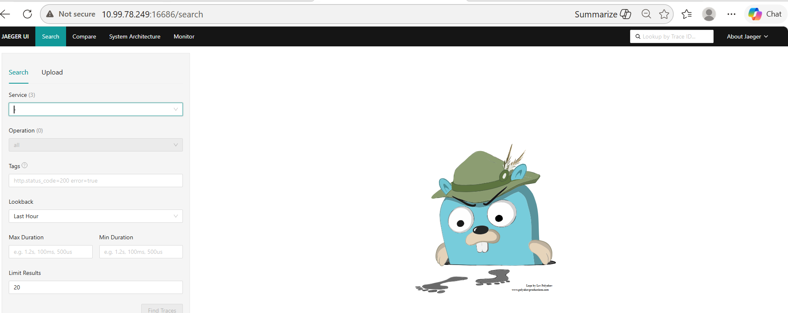
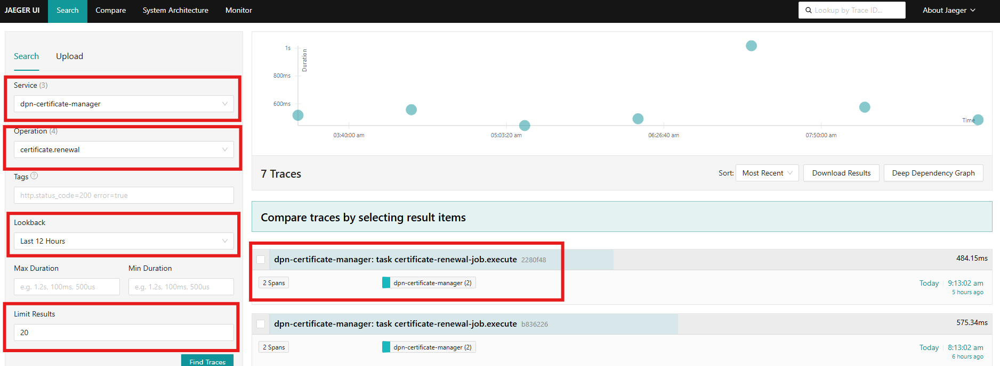
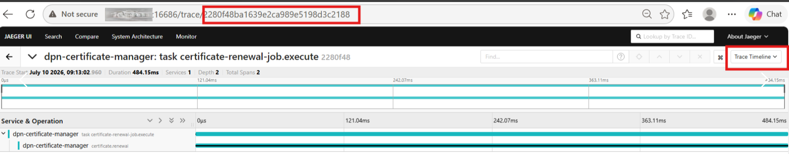
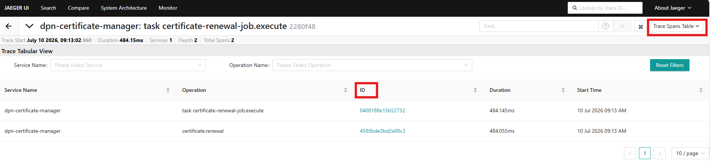
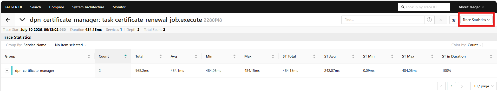
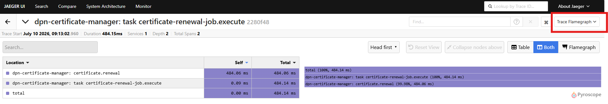
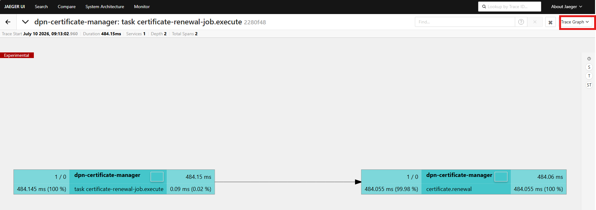
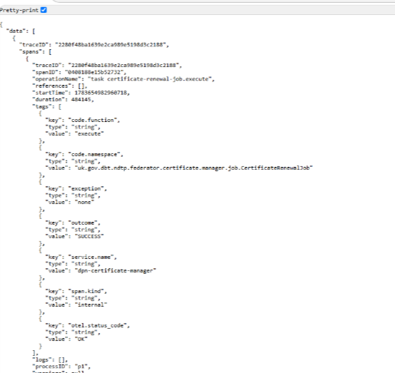

# Jaeger UI — Trace View Reference Guide

*A concise reference for understanding and choosing between the available trace visualisation views.*

---

## What is Jaeger?

Jaeger is an open-source distributed tracing platform originally developed by Uber Technologies and now a graduated project under the Cloud Native Computing Foundation (CNCF). It is used to monitor and troubleshoot microservice-based architectures by tracking requests as they flow through multiple services.

When a request is made, Jaeger captures a **trace** — a record of every operation (called a **span**) that was executed across all participating services. Each span records:

- Which service and operation ran
- When it started and how long it took
- Its relationship to parent and child spans
- Any custom tags, logs, or metadata attached during execution

Jaeger is particularly valuable for:

- **Latency debugging** — finding exactly which service or operation slowed a request down
- **Dependency mapping** — understanding how services call each other
- **Performance analysis** — comparing self-time vs total time across spans
- **Cross-tool correlation** — linking Jaeger span IDs to logs in OpenSearch or other observability tools

---

## How to Access the Jaeger UI

1. **Open your browser** and navigate to the Jaeger UI URL for your environment, for example:
   ```
   http://<jaeger-host>:16686
   Use your credential (to be allocated by Admin) to login
   ```
   

2. **Search for a trace** using the search panel on the left:
   - **Service** — select the microservice you want to investigate (e.g. `producer-file-schema-mapper`)
   - **Operation** — optionally narrow to a specific operation name
   - **Tags** — filter by custom key-value tags (e.g. `http.status_code=500`)
   - **Lookback** — choose a time window (last 1h, 6h, etc.)
   - **Min / Max Duration** — optionally filter by trace duration
   - **Limit Results** — cap the number of traces returned
   

3. **Click "Find Traces"** — the results panel lists matching traces ordered by time, showing service name, operation, duration, spans count, and timestamp.

4. **Click a trace row** to open the full trace detail view, where you can switch between the Timeline, Spans Table, Statistics, Flamegraph, Graph, and Raw JSON views described below.

> **Direct link to a trace:** If you already have a `traceID`, navigate directly to:
> ```
> http://<jaeger-host>:16686/trace/<traceID>
> ```



---

## Trace Header Numbers — What They Mean

`Example trace: producer-file-schema-mapper | trace_id: 7bdc455 | 4 spans | 15.02s`

### Trace Start
Absolute wall-clock time when the root span began. Anchors all relative offsets shown in timelines.

### Duration
Total elapsed time of the entire trace (root span start → root span end). Example: **15.02s**.

### Services
Number of distinct microservices involved. **1** means a single-service trace; higher values indicate cross-service calls.

### Depth
Maximum nesting level of spans. **4** = four levels deep (root → child → grandchild → great-grandchild).

### Total Spans
Count of all spans across all services in this trace. Used to assess instrumentation coverage and complexity.

### Self Time (ST)
Time a span spent doing its *own* work, excluding time spent waiting for child spans. The truest measure of where CPU time was consumed.

---

## View-by-View Comparison

### 1. Trace Timeline *(Default view)*

**What it shows**
Horizontal Gantt/waterfall chart. Each span is a bar; its horizontal position and width show when it started and how long it ran relative to the trace start. Parent–child relationships are shown by indentation on the left.


**Key numbers / signals to read**
- **Bar width** → relative duration of each span
- **Bar position** → start offset from trace start (0µs to 15.02s)
- **Indentation depth** → parent–child nesting level
- **Overlap** → parallel execution (none = fully sequential)
- Innermost (most indented) bar = deepest and longest-running leaf span

**Best used for**
Debugging slow requests. Identifying which span dominates the total duration. First view to open for latency investigations. Confirming sequential vs. parallel execution.

---

### 2. Trace Spans Table

**What it shows**
Flat tabular listing of every span. Columns: Service Name, Operation Name, Span ID, Duration, Start Time. Supports filtering by Service or Operation Name.


**Key numbers / signals to read**
- **Span ID** → cross-reference logs in OpenSearch or other tools
- **Duration** → longest duration often indicates parent/root span
- **Start Time** → minute-level resolution in UI; use Raw JSON for microsecond precision
- **Row count** → equals Total Spans

**Best used for**
Cross-tool correlation. Copying span IDs for OpenSearch queries. Scanning operations. Filtering spans by service or operation.

---

### 3. Trace Statistics

**What it shows**
Aggregated statistical summary grouped by Service Name (or Operation). Columns include Count, Total, Avg, Min, Max, ST Total, ST Avg, ST Min, ST Max, ST in Duration.


**Key numbers / signals to read**
- **Count: 4** → total span instances
- **Total: 60065ms** → sum of span durations (inflated by nesting)
- **Avg: 15016ms** → average span duration
- **ST Total: 3755ms** → actual CPU/work time
- **ST in Duration: 100%** → service owns all trace wall time
- **Min / Max** → execution variability

**Best used for**
Performance analysis. Comparing self-time vs total time. Identifying service contribution to latency. Reporting SLA metrics.

---

### 4. Trace Flamegraph *(Pyroscope-powered)*

**What it shows**
Table (Location, Self Time, Total Time) plus a Flamegraph (stacked bars where width ∝ time consumed).


**Key numbers / signals to read**
- **Self time** → actual work done by the span
- **Total time** → includes child spans
- **Bar width** → relative time consumption
- **% values** → proportion of total trace time
- `< 0.01s self` often indicates orchestration wrappers

**Best used for**
Root cause of CPU/latency. Distinguishing orchestration spans from worker spans. Profiling-style analysis.

---

### 5. Trace Graph *(Experimental)*

**What it shows**
Directed acyclic graph (DAG). Nodes represent spans and arrows represent call flow.


**Key numbers / signals to read**
- **Arrow direction** → caller → callee
- **Top-right label** → duration
- **Bottom label** → self time and percentage
- **Linear chain** → sequential execution
- **Branching nodes** → fan-out / parallel calls

**Best used for**
Architecture understanding. Visualizing dependencies, fan-out patterns, and trace topology.

---

### 6. Raw JSON (API) *(Via URL)*

**What it shows**
Full trace payload from `/api/traces/{traceID}?prettyPrint=true`. Includes traceID, spanID, operationName, references, startTime, duration, tags, logs, processID.


**Key numbers / signals to read**
- `references: []` → root span
- `references[0].refType: "CHILD_OF"` → parent relationship
- `startTime` → epoch microseconds
- `duration` → microseconds
- `tags` → custom attributes
- `logs: []` → no span events

**Best used for**
Programmatic / deep inspection. Parent–child validation, timestamp analysis, automation, exports, and log troubleshooting.

---

## Quick-Pick: Which View for Which Question?

**Why is this request slow?**
→ **Trace Timeline** — look at the widest/deepest bar, which owns the latency.

**Which operation did the actual work vs. just wrapping?**
→ **Trace Flamegraph** — check the Self Time column.

**I need the span ID to search in OpenSearch.**
→ **Trace Spans Table** — copy from the ID column.

**How much of the total time does each service own?**
→ **Trace Statistics** — check the ST in Duration % column.

**How do services call each other? Any fan-out?**
→ **Trace Graph** — follow the node arrows and look for branching.

**Which span is the parent of another span?**
→ **Raw JSON** or **Trace Timeline** — check `references[].spanID` or the indentation level.

**Why does a span appear in Jaeger but not in OpenSearch logs?**
→ **Raw JSON** — `logs: []` indicates no emitted log records were attached to the span.

**Are there parallel spans or is execution purely sequential?**
→ **Trace Timeline** or **Trace Graph** — look for overlapping bars or branching edges.

**What custom attributes/tags were set on a span?**
→ **Raw JSON** or **Trace Timeline** — check the `tags[]` array or the tag panel on the span.

---

# Review Notes

| Review Date | Last Reviewed By | Status | Version |
|-------------|-----------------|--------|---------|
| 31-July-2026 | DSI Assurance | Final | V1.0.0 |

