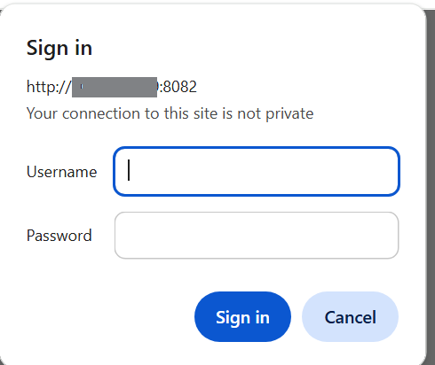
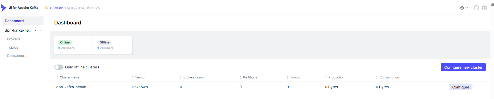

# Kafka User Guide — DPN Health Monitoring Service

---
## Table of Contents

1. [What is Kafka?](#1-what-is-kafka)
2. [Kafka in the DPN Health Monitoring Service](#2-kafka-in-the-dpn-health-monitoring-service)
   - [Topics and their consumers](#topics-and-their-consumers)
3. [Accessing the Kafka UI](#3-accessing-the-kafka-ui)
   - [Steps](#steps)
4. [Validation from Kafka UI](#4-validation-from-kafka-ui)
   - [4.1 Broker Health](#41-broker-health)
   - [4.2 Topic Existence and Configuration](#42-topic-existence-and-configuration)
   - [4.3 Message Flow (Telemetry is Being Produced)](#43-message-flow-telemetry-is-being-produced)
   - [4.4 Consumer Group Lag](#44-consumer-group-lag)
   - [4.5 Topic Throughput (Produce / Consume Rate)](#45-topic-throughput-produce--consume-rate)
   - [4.6 Message Content Inspection](#46-message-content-inspection)
5. [Additional Reference](#5-additional-reference)
   - [Listener Addresses](#listener-addresses)
   - [Message Retention](#message-retention)
6. [Review Notes](#review-notes)

---

## 1. What is Kafka?

Apache Kafka is a distributed, high-throughput **message streaming platform**. It acts as a
central hub that receives streams of data from producers, durably stores them in ordered
**topics**, and delivers them to one or more consumers — all without either side needing to
know about the other.

Key characteristics relevant to end users:

| Property | What it means |
|---|---|
| **Topics** | Named channels; each category of data lives in its own topic |
| **Partitions** | Topics are split into partitions for parallelism and throughput |
| **Consumer Groups** | Multiple consumers share the workload; each message is processed once per group |
| **Retention** | Messages are kept for a configurable period (7 days in this stack) even after being consumed |
| **Ordering** | Messages within a partition are strictly ordered |

---

## 2. Kafka in the DPN Health Monitoring Service

Kafka is the **central transit layer** for all three observability signal types: logs, traces,
and metrics. The OTel Collector receives telemetry from applications and publishes it to Kafka;
downstream consumers read from Kafka and store the data in the appropriate backend.

```
Applications (dpn-data-pipelines)
    │  OTLP (gRPC :4317 / HTTP :4318)
    ▼
OpenTelemetry Collector
    │
    ├─ otel-logs    ──► Data Prepper ──► OpenSearch  (log search & dashboards)
    ├─ otel-traces  ──► Jaeger Ingester ► OpenSearch  (trace visualisation)
    └─ otel-metrics ──► Telegraf      ──► Prometheus → Thanos (metrics & alerting)
```

### Topics and their consumers

| Topic | Partitions | Consumer | Destination |
|---|---|---|---|
| `otel-logs` | 3 | Data Prepper (`data-prepper-logs-group-v2`) | OpenSearch index `otel-logs-YYYY.MM.DD` |
| `otel-traces` | 3 | Jaeger Ingester (`jaeger-ingester`) | OpenSearch (Jaeger storage) |
| `otel-metrics` | 3 | Telegraf (`telegraf-metrics-dpn01`) | Prometheus → Thanos |

---

## 3. Accessing the Kafka UI

Kafka UI is available on **port 8082**.

```
http://<your-host>:8082
Use your credential (to be allocated by Admin) to login
```

The UI is protected by HTTP Basic Auth via the Nginx reverse proxy. Credentials are
administered by DPN Admin.

### Steps

1. Open a browser and navigate to **http://<your-host>:8082**.


2. Enter your credentials when prompted.

3. The dashboard loads automatically with the cluster named **`dpn-kafka-health`**.


---

## 4. Validation from Kafka UI

### 4.1 Broker Health

**Menu: Brokers**

- Confirm **1 broker** is online (Broker ID 1, single-node local deployment).
- Check that the broker is active and no under-replicated partitions are reported.

### 4.2 Topic Existence and Configuration

**Menu: Topics**

Verify all three OTel topics are present:

| Topic |
|---|
| `otel-logs` |
| `otel-traces` |
| `otel-metrics` |


### 4.3 Message Flow (Telemetry is Being Produced)

**Menu: Topics → [topic name] → Messages**

- Select a topic (e.g. `otel-logs`).
- Click the **Messages** tab.
- Set **Seek Type** to `Latest` and press **Submit**.
- New messages should appear as applications send telemetry.

What to look for:

| Observation | Meaning |
|---|---|
| Messages appear in real time | OTel Collector is publishing successfully |
| No messages for a long time | OTel Collector may be down, or no apps are sending telemetry |
| Message count increasing | Pipeline is healthy end-to-end |

### 4.4 Consumer Group Lag

**Menu: Consumer Groups**

Consumer lag is the number of messages a consumer **has not yet processed**. A healthy
pipeline has near-zero lag.

| Consumer Group | Topic | Expected Lag |
|---|---|---|
| `data-prepper-logs-group-v2` | `otel-logs` | Near zero |
| `jaeger-ingester` | `otel-traces` | Near zero |
| `telegraf-metrics-dpn01` | `otel-metrics` | Near zero |

**Interpreting lag:**

- **0–100** — Normal; consumer is keeping up.
- **100–10 000** — Consumer may be slow or briefly offline; watch for trend.
- **> 10 000 and growing** — Consumer is down or significantly behind. Check the relevant
  container logs.

### 4.5 Topic Throughput (Produce / Consume Rate)

**Menu: Topics → [topic name] → Overview**

The overview tab shows bytes-per-second in/out and messages-per-second charts. Use these to:

- Confirm telemetry is flowing at the expected rate.
- Spot traffic spikes or complete drops.

### 4.6 Message Content Inspection

**Menu: Topics → [topic name] → Messages**

Messages are encoded as **OTLP JSON** (`otlp_json` encoding). You can inspect individual
messages to:

- Verify the `resourceLogs`, `scopeLogs`, or `resourceMetrics` envelope is well-formed.
- Confirm sensitive fields have been redacted (you should see `[REDACTED_API_KEY]`,
  `[REDACTED_TOKEN]`, etc. in place of actual secrets).
- Check that `service.name` and other resource attributes are present.

---

## 5. Additional Reference

### Listener Addresses

| Listener | Address | Used By |
|---|---|---|
| Container-to-container | `dpn-kafka-health:29092` | OTel Collector, Data Prepper, Jaeger Ingester, Telegraf |
| Host machine | `localhost:9092` | Scripts (`create-otel-topics.*`) run from your terminal |
| Inter-broker | `dpn-kafka-health:19092` | Internal Kafka use only |

### Message Retention

Messages are retained for **7 days** (`KAFKA_LOG_RETENTION_HOURS: 168`). Each log segment
rolls at **1 GB** (`KAFKA_LOG_SEGMENT_BYTES: 1 073 741 824`). After 7 days messages are
deleted automatically — this is not a data store, it is a transit buffer.

---

# Review Notes

| Review Date | Last Reviewed By | Status | Version |
|-------------|-----------------|--------|---------|
| 31-July-2026 | DSI Assurance | Final | V1.0.0 |
